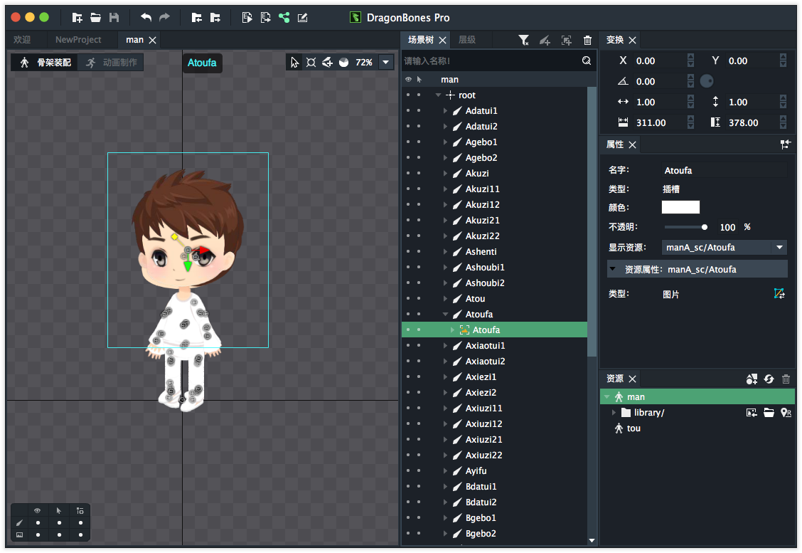
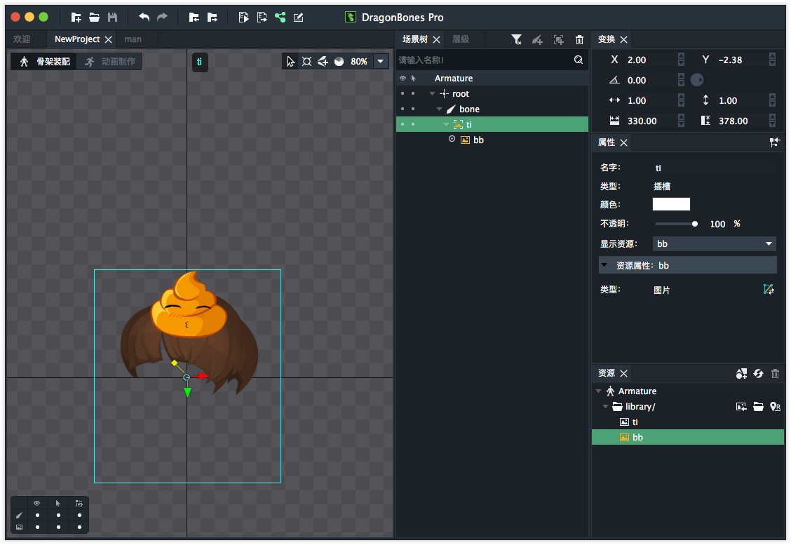
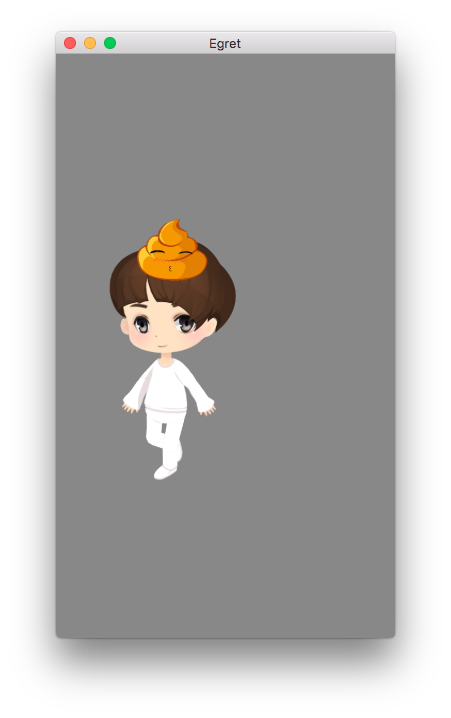

### Local change

The original replacement program can replace the picture in the corresponding slot, but the picture position dislocation problem exists. New version partial replacement function, DragonBones can be pre - set replacement content to achieve this function.

The original animation is as follows:



We can replace its hair content, create a new DragonBones project, add new hair to its resource pool, and then put it into the scene.

The reason for creating a new project is to get the relative position of the image axis point and the bone origin.

After adjusting the hair position in the new project, export the data.



Add the following code to the above code.

```
this.factory.parseDragonBonesData(RES.getRes("new_json"));
this.factory.parseTextureAtlasData(RES.getRes("new_texture_json"), RES.getRes("new_texture_png"));
this.factory.replaceSlotDisplay( "NewProject", "Armature", "ti", "bb", ar.armature.getSlot("Atoufa"));
```

Through `replaceSlotDisplay`method to replace the hair content, one of the first parameter to DragonBonesName,If you don't add in analytic DragonBones data when its parameters, then fill in `null` or fill in the project name.

The last three parameters are data source tokens, and the last parameter is the target slot to be replaced.

The running effect after compilation is shown in the figure:



You can place multiple textures to be replaced in a new project, and then select the texture you want for partial replacement.

###  Global change

Global repackage enables the replacement of all the textures in the skeleton of a bone animation. If global repackage is used, the new bone animation texture set must be the same size as the original bone animation texture set and the internal element size.

 You can use the following code to do a global swap.

```
ar.armature.replaceTexture(RES.getRes("new_db_texture_png"));
```