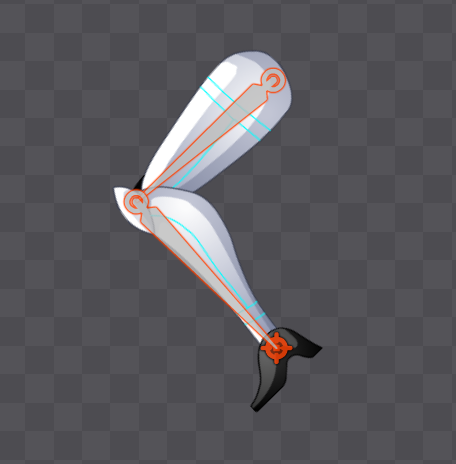
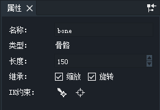
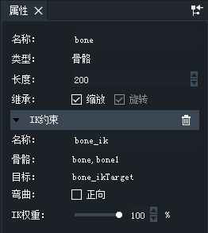
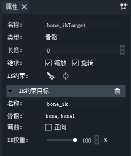

#### Intro
IK is an abbreviation for Inverse Kinematics.

DragonBones Pro supports IK constraint from 4.5.0

FK is an abbreviation for forward Kinematics Normally, the parent bone bring child bone to move together, we call it forward Kinematics. For example, the big arm drives the lower arm and the thigh drives the lower leg.
IK, in contrast to FK, is used to drive bottom-up drives. For example, when doing push-ups, the hand supports the ground and supports the body.

The picture below is an example of a typical IK constraint.
The thigh is the parent bone and the calf is the child bone. The two bones are constrained by IK on the red constraint target.
It’s important to note that the red bone is note the child bone of the calf. It is the bone of the same level as the thigh bone.

Drag the red constraint target bone, the IK constraint will constantly adjust the rotation value of the parent and child bones, so that the end of the child bone is fixed on the constraint target bone.

#### Add IK constraint
Once the bone is selected, you can see two IK constraint buttons in the property panel, and click it to create an IK constraint.

- Create a constraint target at the end: auto create a constraint target bone at the end of the bone of the selected bone and bind the IK constraint.
- Custom pick constraint target: manually specify the bone as the constraint target, and bind the IK constraint.

#### IK Constraint Feature：
- Bone frame that’s bound with IK constraints is displayed in red
- The bone that’s as the target of the IK constraint is displayed in red as a whole
- Single bone can be bound to IK constraints
- Two consecutive parent-child bones can be bound to IK constraints
- Two or more bones cannot bind IK constraints
- Non-continuous parent-child bone cannot bind IK constraints
- Non-parent bone cannot bind IK constraints
- The direct or indirect child bones of the selected bone cannot be manually specified as IK constraint target bones.
- Turn off “inverted” inherited bones, you cannot bind IK constraints
- Bones that’s bound with IK constraints cannot turn of “inverted” inheritance

The property panel that’s added IK constraint bone are shown as follow:

The IK constraint properties part includes:
- Name: IK constraint name, auto named by default, also can be renamed.
- Bone: bone with IK constraint bound
- Target: bone name as constraint target
- Bending：the direction of IK bending
- IK weights: IK constraints affect the weight of bones

*Bending and IK constraint value change in animation playback are not yet supported in the current verison.*

The property panel of the constraint targets are shown as below:

The IK constraint target property is the same with the IK constraint property, except that there is no target item, because the constraint target is the constraint target bone itself.