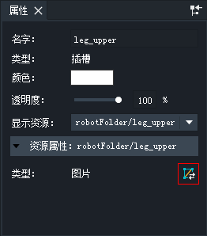
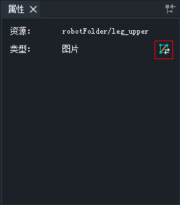
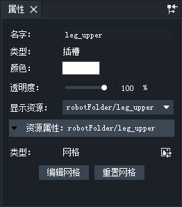
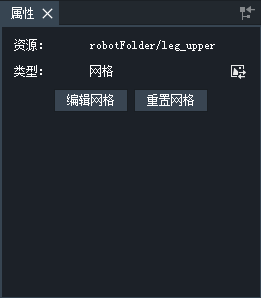
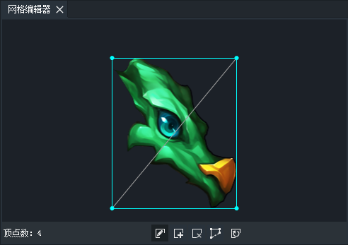
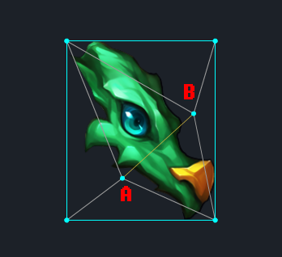

#### Intro
Grid can be used to implement arbitrary transformation and distortion of images.
DragonBones Pro supports grid creation and editing starting from 4.5.0.

#### Grid Creation
Select the slot or the image within the slot, and click the Convert to Grid button in the property panel.

After the image is converted to a grid, slot and image’s property panel is shown as follow:

Click “edit grid ” button to open grid editor panel, and you are able to edit grid.
Click the “Rest Grid” button, the correspondence between the image and the grid vertices in the grid will be reset, and the image will restore its original shape.
Click “convert to image” button, you can reconvert the grid back to the image.

#### Grid Editor

The functions from left to right of the toolbar are shown below:
- Vertex number: display vertex number of grid
- Edit tool: used to move the vertices (shortcut Q)
- Add tool: used to add vertices (shortcut W)
- Delete tool: used to delete vertices (shortcut E)
- Edge tool: a tool for sketching grid edges. Note that when using this tool, the original vertices and edges will be cleared.
- Rest tool: vertex will be reset to the default state and quantity. (four vertices are separated into four corners of the square)

Use the add tool to add vertices, and you can also add customized wires through drag and drop. 
It’s shown as below:

The line between point A and point B and the apex of the four corners is gray, which is an automatically generated connection.
The line between A and B is yellow, which is a custom connection generated by dragging.

#### Grid features
- the maximum size of the mesh stretched image cannot exceed 2048X2048
- The edges of the grid must be closed. If the drawn edges are not drawn manually, the edges are automatically closed.
- The rotation center of the grid is the rotation center of the original image, and will not change due to the redrawing of the grid edges or stretching of the image.
- The current version does not support grid vertices bound to the specified bones based on weights.
- In animation mode, the grid has separate layers on the timeline, and the displacement operation on the vertices can add keyframes on the timeline.