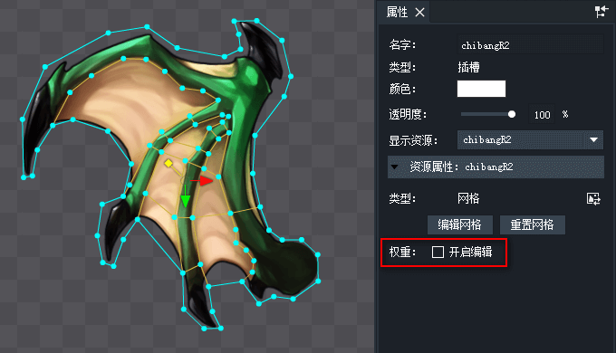
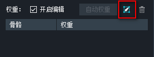
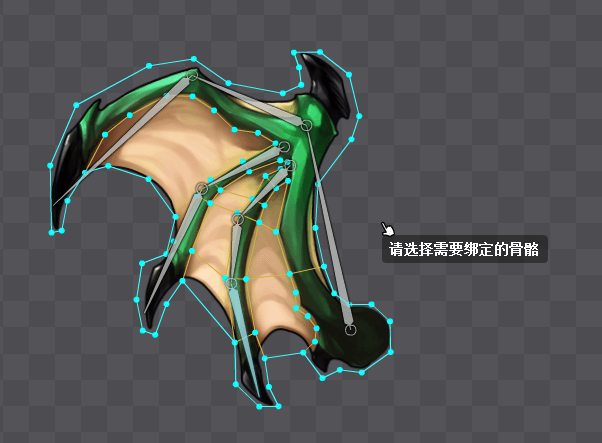
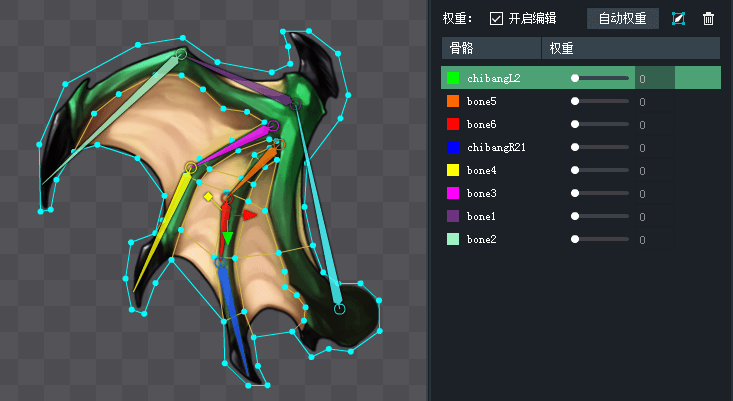
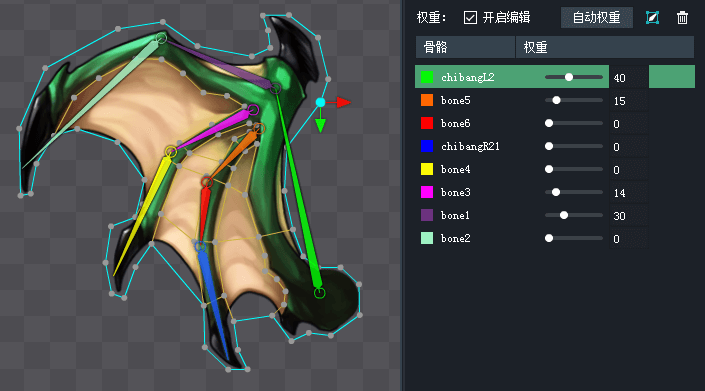
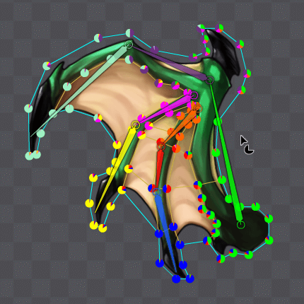
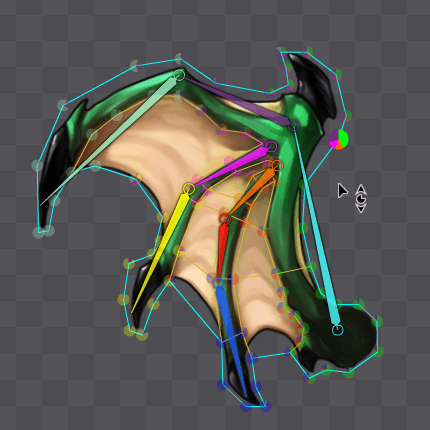

### Intro
Skinning refers to binding a mesh point to a specified bone. Based on the weight assigned when binding, the mesh point moves with the bone’s movement. Skinning enable us to implement the complex mesh point operation with simple bone operation.

### Binding Method

1. First we need to convert the image to mesh and add mesh points. For the specified method please refer to [Mesh](../../../../DB/dbPro/advancedFeatures/grid/README.md)
2. Select mesh and check “Open Edit” on the property panel. (Or switch to the weight tool!，Directly select the mesh, and it will auto open the weight editing)

3. When the editing mode is enabled, click “Bind Bone” button and then click the bones that need to be weighted. The selected bones will be auto assigned to a color to distinguish them from other bond bones.

4. After we complete the bone bound operation, right click the blank spot and then it will auto calculate the weight assignment based on bone and mesh’s relative position. (If you add a new bound bone to the list after the initial binding operation, it will not auto calculate the weight, this time you can click the “auto weight” button on property panel to calculate the weight again). Bond binding and after the weight calculating is shown as the following picture. At this point the weight of each bone is 0, because we selected the entire mesh.

If we select just one mesh point, we are able to see the weight ratio of each bound bone of this mesh point assigned from the property panel. We can adjust the weight ratio of each bone by dragging the slider. It’s shown as below:

### Weight Tool
In the aforementioned binding method, we selected mesh point after the binding, and adjusted the weight ratio of bound bone on the property panel. A more convenient method is to use the weight tool to adjust.
When we select weight tool from the tool bar, Now we select the mesh, and we are able to visually see the weight of different bound bones in each mesh point. The weight are displayed in a pie chart, and the colors in the pie chart correspond to the colors of the bones.

We just select one bound bone, then select a mesh point (if we do not, it will prompt you to select a mesh point), then hold down the left mouse button and drag up and down, we are able to change the weight ratio of the selected bone in selected mesh point.

By selecting different mesh point in order, we are able to adjust the weight ratio in different mesh points.
If you are required to quick assign 100% weight ratio of a mesh point to the selected bone, all you need to do is selecting the bone and holding the Alt button in the same time, then click the mesh point in order that’s needed to fully assign weight.

We are able to control the form change of mesh through adjusting bone after we completed the binding and weight assigning operation.

### Note
> This method can only be used in webgl rendering mode due to the skinning will cause large performance consumption.
