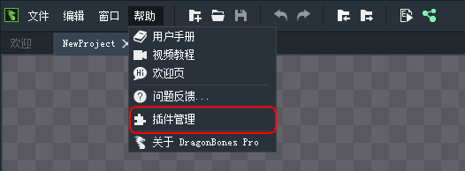
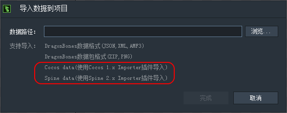
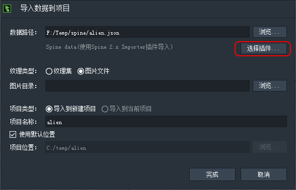

Add plugin system, make DragonBones Pro have better extensibility by plugin system. Plug-ins can be developed by third parties based on the plugin specification for DragonBones Pro.

Select "plug-in management" in the help menu to open the plug-in management window.

The plug-in management window is as follows

The buttons in the upper right corner are: open the plug-in directory, install the plug-in, and uninstall the selected plug-in.

- Open the plugin directory: click the button to open the plugin directory of DragonBones Pro. Directly copy the plugin folder (not.expl files) into the plugin directory, and launch DragonBones Pro to automatically install the plugin.
- Install plugins: click the button, the system window will pop up and specify the plugin package (expl for DragonBones Pro) to install the plugin.
- Uninstall selected plug-ins: select the plug-ins to be removed from the list of plug-ins, and then click the uninstall button to uninstall the corresponding plug-ins.

Once installed, plug-ins can be set to "on" or "disabled" in the Settings column of the list.

DragonBones Pro 4.2 has an import plug-in for Cocos 1.x and Spine 2.x installed by default. When these plug-ins are installed and enabled, you can see the support for importing the Cocos and spine projects in the import interface.

In the case of the Spine project, selecting the json file for the Spine project will automatically use the Spine import plug-in. You can also manually specify which import plug-in to use by clicking the select plug-in button.

The plug-in selection window is shown below
"DragonBones Pro" is the default built-in plug-in import, will not be displayed in the plug-in management window. (if you import the project with the wrong plug-in, you will be prompted to replace the correct plug-in)