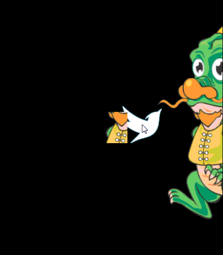

Sometimes, for a fun game, it's not enough to play pre-set skeletal animations, we need characters with dynamic and controllable movements.The nice thing about DragonBones is that they provide a way to access and control every bone in the skeleton frame, allowing your character to move around freely in the game.
The following example controls the skeleton by moving the mouse around in the scene. We created a small bird that followed the mouse movement, and the little dragon kept a certain distance from the bird.At the same time, the head and arms of the little dragon people will follow the movements of birds and make different positions, which is very interesting. The complete project code can be downloaded from the sample center.

[program controls bone movement](http://edn.egret.com/cn/index.php/article/index/id/691)

Let's look at the key code snippets that implement this functionality.

```
this.head = this.armature.getBone("head");
this.head.offset.rotation = r;
```

We can see from the above code, through the methods As you can see from the code above, by methoddragonBones. Armature. GetBone _name: (String) : ipads to obtain a skeleton.Take a bone. Offset in the skeleton is a DBTransform object, which is specially used to set the superimposed transform information to the developer, including translation, rotation, scaling, and so on.We can set these parameters according to the need of game logic, so as to achieve the effect of dynamic control of the skeleton.

>Note that the offset value is superimposed on the existing transform on the bone, rather than replacing the existing transform on the bone.


