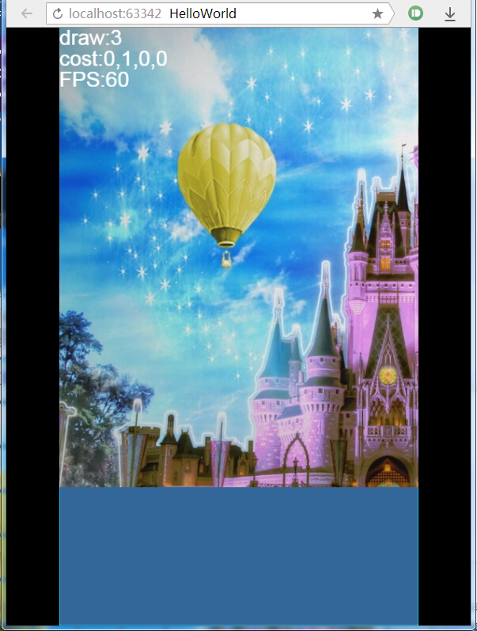

The use of bitmaps requires texture support. in Egret, by default the operation of texture is hidden and all operations are for the display object.But the display of bitmap is still based on textures.When displaying an image, you need to use the `Bitmap` class, which is the image class in egret, and the texture comes from the loaded resource image.Normally, with a single image as the texture, a large number of texture will be used for rendering.

## 1. Create
Use the `Bitmap` class to create an image object, with the code as follows:

```
private img:egret.Bitmap = new egret.Bitmap();
```

At this point, a bitmap object is obtained. Add it to the display list and no content will be seen.Because the bitmap object is just an "empty object", no texture has been specified for it.

Assign a texture for the bitmap object and display the rendered file on the screen.

The way to specify a texture is to set the `texture` attribute in `Bitmap`.

```
img.texture = RES.getRes("Image ID");
```

## 2. Resource configuration
The above line of code adds texture to the bitmap, which has an input parameter: "Image ID".

All the loaded resources will have a unique ID, most of which originate from the image file name. Some resources will define some other IDs.The organization of these images are described by a json file.

The following is a standard resource configuration file:

```
{
    "resources":
    [
        {"name":"bgImage","type":"image","url":"assets/bg.jpg"},
        {"name":"egretIcon","type":"image","url":"assets/egret_icon.png"},
        {"name":"description","type":"json","url":"config/description.json"}
    ],
    "groups":
    [
        {"name":"preload","keys":"bgImage,egretIcon"}
    ]
}
```

In a json resource configuration file, it should contain two parts, one is the group and the other is the resource.

### 2.1. Resources

Resources are included in "resources", and all resources used in the game should be included. Each resource has three attributes.

1. name: the unique ID number of the corresponding resource

2. type: resource type

3. url: the path of the current resource

### 2.2. Group

"Groups are included in ""groups"". The concept of groups is to classify different resources. When the logical boot is loaded, you can choose to load in groups. "

## 3. Example

The sample code is as follows:

```
class BitmapTest extends egret.DisplayObjectContainer{

    public constructor()

    {

        super();

        this.addEventListener(egret.Event.ADDED_TO_STAGE,this.onAddToStage,this);

    }

    private onAddToStage(event:egret.Event) {

        RES.addEventListener(RES.ResourceEvent.GROUP_COMPLETE, this.onGroupComplete, this);

        RES.loadConfig("resource/default.res.json", "resource/");

        RES.loadGroup("preload");

    }

    private onGroupComplete()

    {

        var img:egret.Bitmap = new egret.Bitmap();

        img.texture = RES.getRes("bgImage");

        this.addChild(img);

    }

}
```

After compiling and running, the effect is as follows:




