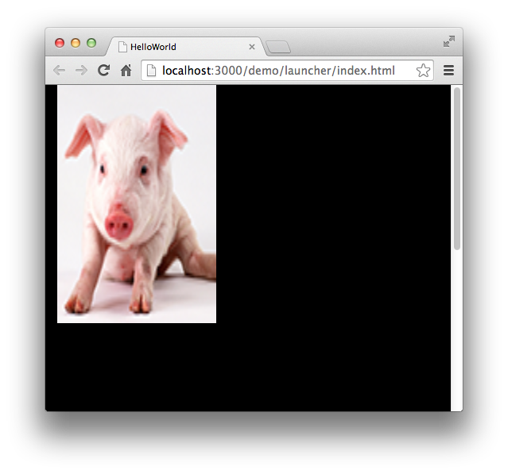
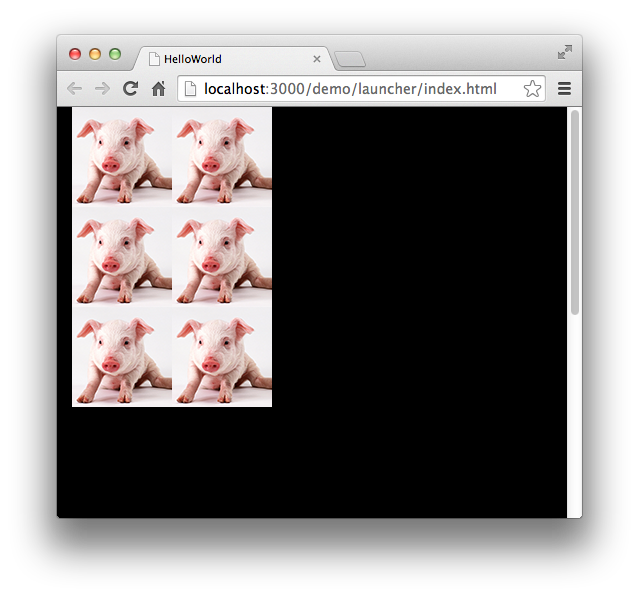


There are two ways to fill the bitmap,

* Stretch the image to fill the area

* Repeat the image to fill the area 

### 1. Stretch the image to fill
When you create a `Bitmap` object, the first type of fill will be selected by default.

In the following example, fill method is used by default.The texture image used is a 100*100 picture.The image width is set to 2 times and the height is set to 3 times.

```
class BitmapTest extends egret.DisplayObjectContainer{
    public constructor()
    {
        super();
        this.addEventListener(egret.Event.ADDED_TO_STAGE,this.onAddToStage,this);
    }
    private onAddToStage(event:egret.Event) {
        RES.addEventListener(RES.ResourceEvent.GROUP_COMPLETE, this.onGroupComp, this);
);
);
    }
    private onGroupComp()
    {
        var img:egret.Bitmap = new egret.Bitmap();
);
        img.width *= 2;
        img.height *= 3;
        this.addChild(img);
    }
}
```


Operate after it is compiled, with the effect shown as below:




### 2. Repeat the image fill

Setting the fill method requires changing the `fillMode` attribute in `Bitmap`.

```
img.fillMode = egret.BitmapFillMode.REPEAT
```

The specific sample code is as follows:

```
class BitmapTest extends egret.DisplayObjectContainer{
    public constructor()
    {
        super();
        this.addEventListener(egret.Event.ADDED_TO_STAGE,this.onAddToStage,this);
    }
    private onAddToStage(event:egret.Event) {
        RES.addEventListener(RES.ResourceEvent.GROUP_COMPLETE, this.onGroupComp, this);
        RES.loadConfig("resource/resource.json", "resource/");	);
        RES.loadGroup("preload");	);
    }
    private onGroupComp()
    {
        var img:egret.Bitmap = new egret.Bitmap();
);
        img.fillMode = egret.BitmapFillMode.REPEAT;
        img.width *= 2;
        img.height *= 3;
        this.addChild(img);
    }
}
```

Operate after it is compiled, with the effect shown as below:



