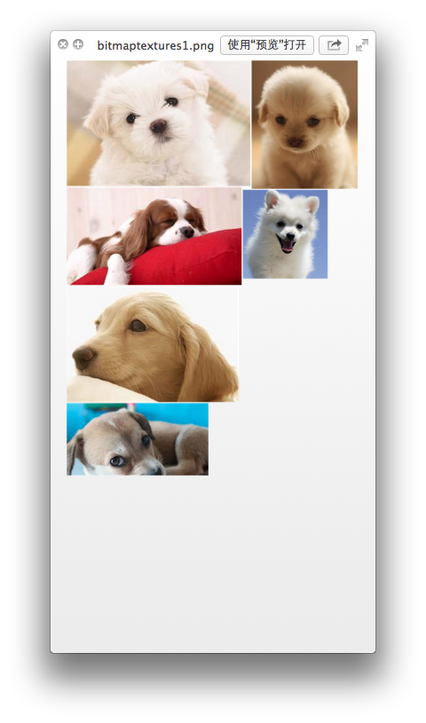
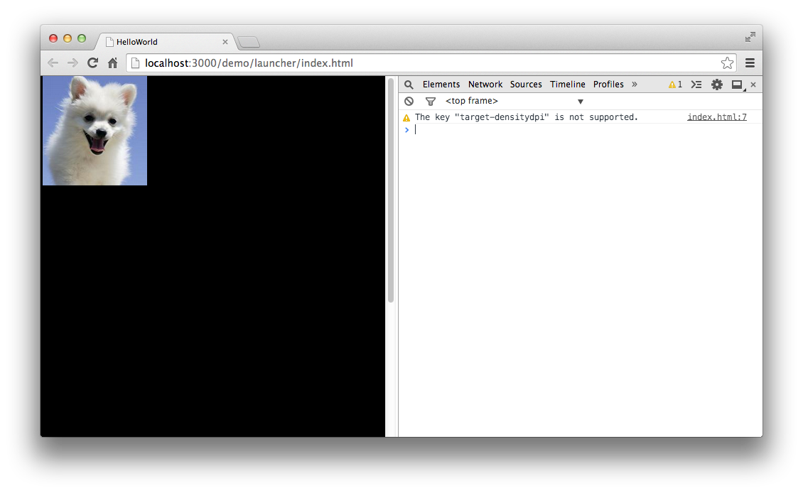

The texture set is to set some small pieces of images into a big image. Texture set is often used in the games.

Benefits of using the texture set:

* Combine a large number of images into one image, thus reducing network requests.The image resource that was loaded several times is now loaded once. 
* There will be less IO read in the engine rendering, thereby improving performance.

Egret has built-in texture set support. Before the writing of code, you need to make a texture set. For specific tool to be used, please select the Texture Merger that is very popular in the industry. For details, refer to [Texture Merger] (../../../tools/TextureMerger/manual/README.md).

## Steps for usage

* First make a texture set, and the making effect is as follows:

  


Also the generated corresponding json file is as follows:
  	  
```
{
    "file": "dogs.png",	,
    "frames": {	: {
        "dog1": {	: {
            "x": 322,	: 322,
            "y": 2,	: 2,
            "w": 184,	: 184,
            "h": 222,	: 222,
            "offX":0,	:0,
            "offY":0,	:0,
            "sourceW":184,	:184,
            "sourceH":222	:222
        },	        },
        "dog2": {	: {
            "x": 307,	: 307,
            "y": 226,	: 226,
            "w": 147,	: 147,
            "h": 154,	: 154,
            "offX":0,	:0,
            "offY":0,	:0,
            "sourceW":147,	:147,
            "sourceH":154	:154
        },	        },
        "dog3": {	: {
            "x": 2,	: 2,
            "y": 2,	: 2,
            "w": 318,	: 318,
            "h": 217,	: 217,
            "offX":0,	:0,
            "offY":0,	:0,
            "sourceW":318,	:318,
            "sourceH":217	:217
        },	        },
        "dog4": {	: {
            "x": 2,	: 2,
            "y": 393,	: 393,
            "w": 298,	: 298,
            "h": 201,	: 201,
            "offX":0,	:0,
            "offY":0,	:0,
            "sourceW":298,	:298,
            "sourceH":201	:201
        },	        },
        "dog5": {	: {
            "x": 2,	: 2,
            "y": 221,	: 221,
            "w": 303,	: 303,
            "h": 170,	: 170,
            "offX":0,	:0,
            "offY":0,	:0,
            "sourceW":303,	:303,
            "sourceH":170	:170
        },	        },
        "dog6": {	: {
            "x": 2,	: 2,
            "y": 596,	: 596,
            "w": 245,	: 245,
            "h": 125,	: 125,
            "offX":0,	:0,
            "offY":0,	:0,
            "sourceW":245,	:245,
            "sourceH":125	:125
        }
    }
}
```


* Copy the resource file to the `resource/assets/` directory in the project folder and modify the resource configuration file `default.des.json`.

The resource configuration file is as follows:

```
{
"resources":	:
    [
        {"name":"dogs","type":"sheet","url":"assets/dogs.json"}	}
    ],
"groups":	:
    [
        {"name":"preload","keys":"dogs"}	}
    ]
}
```

* Write code:

```
class BitmapTest extends egret.DisplayObjectContainer{
    public constructor()
    {
        super();
        this.addEventListener(egret.Event.ADDED_TO_STAGE,this.onAddToStage,this);
    }
    private onAddToStage(event:egret.Event) {
        RES.addEventListener(RES.ResourceEvent.GROUP_COMPLETE, this.onGroupComplete, this);
        RES.loadConfig("resource/resource.json", "resource/");	);
        RES.loadGroup("preload");	);
    }
    private onGroupComplete()
    {
        var txtr:egret.Texture = RES.getRes( "dogs.dog1" );	 );
        var img:egret.Bitmap = new egret.Bitmap( txtr );	        var img:egret.Bitmap = new egret.Bitmap( txtr );
        this.addChild(img);
    }
}
```

Note one of the lines:

```
var txtr:egret.Texture = RES.getRes( "dogs.dog1" );	 );
```

Where dogs is the texture set, of which id is a resource id.

Operate after the compilation, with the effect as shown below:





