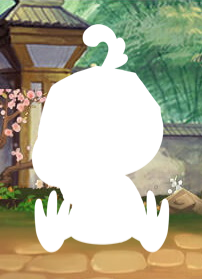

The blending mode refers to how the overlapping regions are rendered when the two display objects in the same display container overlap, that is, how the overlapping regions of the two display objects are mixed to produce the resulting pixels.

## 1.Covering Blending

### Instruction

We express covering blending as "normal", and the display object appears in front of the background. The pixel value of the display object will override the pixcel value of the background. In areas where the display object is transparent, the background is visible.

### Setting
Usually we do not set blending mode, covering blending is the default mode. The code of setting image as covering blending mode are:
```img.blendMode = egret.BlendMode.NORMAL;```    

### Effect
The effect of using covering blending:
   

 

## 2.Override Blending

### Intruction

we express override blending as "add": here we add the primary color value of the display object to its background color, with an upper limit value of 0xFF. This setting is typically used to dissolve the highlighting between two objects, so as to produce animation effect.

### Setting
Set the image as the code of covering mode:
```img.blendMode = egret.BlendMode.ADD;```    

### Effect
The effect of using override blending:    


## 3.Erase Blending

### Instruction
We express erase blending as "erase": It erase the background according to the Alpha value of display background, it means that the opaque area will be completely erased.

### Setting
Set the image as override mode code:    
```img.blendMode = egret.BlendMode.ERASE;```    

### Effect
The effect of using erase blending:    


 