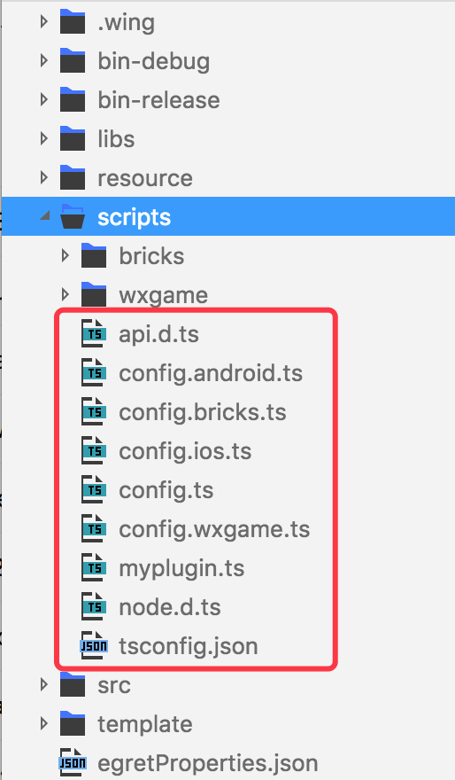
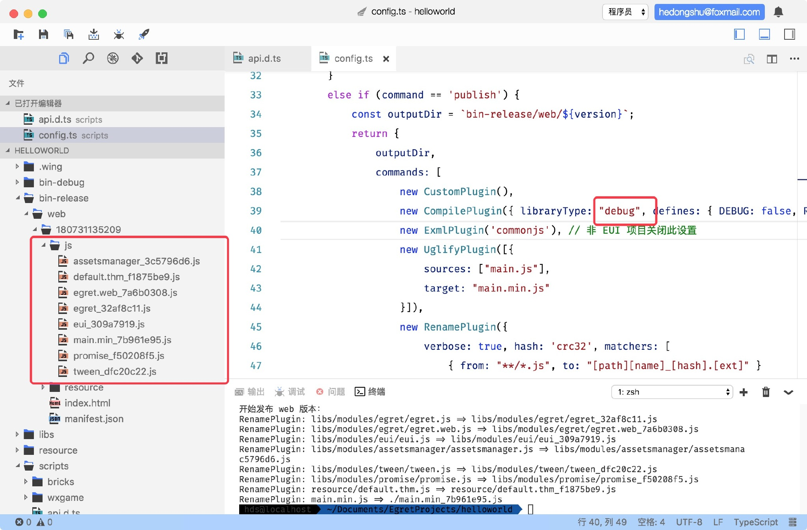
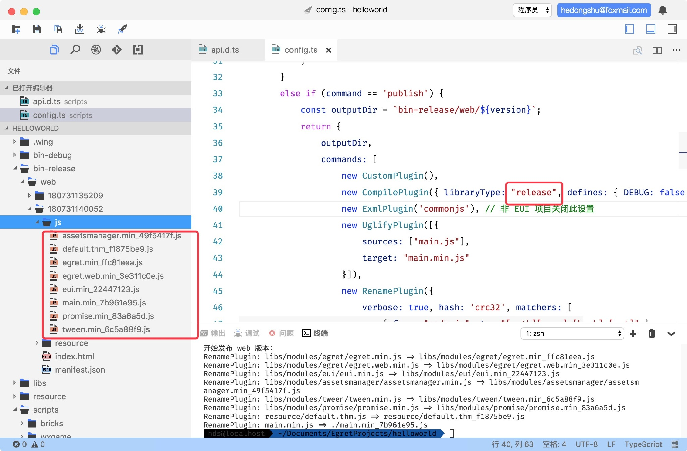
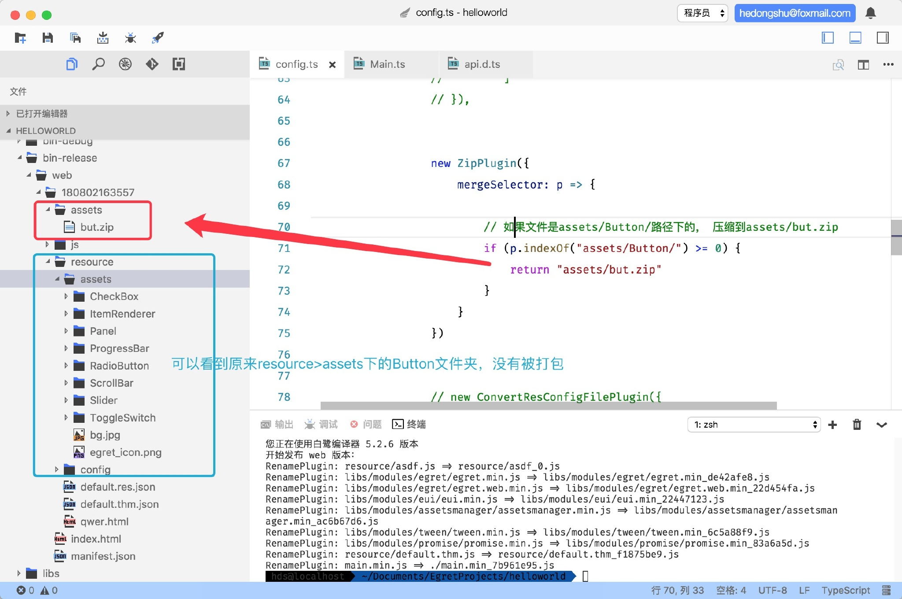
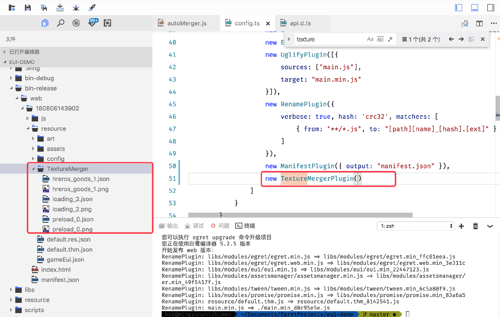

# Command line extension API Documents

## Script plugin directory structure

```
scripts    
	|-- api.d.ts // document    
	|-- config.ts // Build script entry        
	|-- myplugin.ts // Example of developer custom plugin
	|-- node.d.ts // .d.ts file of node
```

## Plugin Operation Mechanism Brief Intro

Developer can execute different plugins when they execute `build` and `pub`.

During project building, it will auto execute `buildConfig` function of ` config.ts` file.

>  The function of this function is to return an object, and the contents of the object will return corresponding output path and will-be-executed plugins according to the executions of different commands. The plugin will be executed after being instantiated in the commands array of the return object.


` config.ts` There are multiple versions for different platforms:



The will-be-executed `config.ts` is different when it publishs to different platforms, such as execution:

```shell
egret publish --target wxgame
```

When it publishes to Wechat mini-game, ` config.wxgame.ts` will be executed.

## Operation and Call

> config.ts

```typescript

else if (command == 'publish') {
            const outputDir = `bin-release/web/${version}`;
            return {
                outputDir,
                
                // ----------Begin to call-----------
                // After instantiation in command array, the plugin will be executed
                commands: [
                    new CustomPlugin(),
                    new CompilePlugin({ libraryType: "release", defines: { DEBUG: false, RELEASE: true } }),
                    new ExmlPlugin('commonjs'), // Shut down this setting if it’s non-EUI project
                    new UglifyPlugin([{
                        sources: ["main.js"],
                        target: "main.min.js"
                    }]),
                    new RenamePlugin({
                        verbose: true, hash: 'crc32', matchers: [
                            { from: "**/*.js", to: "[path][name]_[hash].[ext]" }
                        ]
                    }),
                    new ManifestPlugin({ output: "manifest.json" }),
                ]
                // ----------End to call------------
                
                
            }
        }
```

The plugin is called as the **array order**.

For a convenient use experience to developers, Egret Engine prepared some built-in plugins.

----


## Plugin---ExmlPlugin

### Definition

EXML plugin, used to publish EXML file with different strategies.

### Grammar

```typescript
new ExmlPlugin(publishPolicy: EXML_Publish_Policy)
```

###  Parameter Value

| Parameter | Type | Description |
| ---- | ---- | --- |
| default | string | Use strategy in exmlPublishPolicy of egretProperties.json |
| debug| string | Strategy by default, used to develop environment |
| contents | string | Write EXML content into theme files |
| gjs| string | Write the generated JS file into theme files |
| commonjs | string | Merge EXML into a CommonJS style file |
| commonjs2 | string | Combine EXML into a file that contains parsing methods and skin definition, then extract the skin as a configuration |

### Details

If the current project is a non EUI project, please turn off this setting.


## Plugin---UglifyPlugin

### Definition

Confuse plugins, used to compress obfuscated code.

### Grammar

```typescript
new UglifyPlugin([{
    sources: ["main.js"],
    target: "main.min.js"
}])
```

### Parameter Value

The parameter of UglifyPlugin is an array. The value in the array is a ` UglifyPluginOption` object, and this object properties are shown as follow:

| Parameter    | Type    | Description             |
| ------- | -------- | ---------------- |
| sources | string[] | Need-to-be-compressed files |
| target  | string   | File name after compression   |


## Plugin---RenamePlugin

### Definition

Modify the file name plugin, and use hash algorithm to generate a unique suffix for the file name.

### Grammar

```typescript
new RenamePlugin({
    verbose: true, hash: 'crc32', matchers: [
        { from: "**/*.js", to: "[path][name]_[hash].[ext]" }
    ]
})
```

### Parameter Value

RenamePlugin’s parameter is an object, its property is shown as follow:

| Parameter     | Type      | Description                                                        |
| -------- | --------- | ------------------------------------------------------------ |
| verbose  | boolean   | Whether output the log or not (optional parameter)                                      |
| hash     | string    | The hash algorithm that will be used, currently only crc32 is supported (optional parameter)          |
| matchers | Matcher[] | Set the matching rule, and rename the specified file <br /> this parameter is an array, it allows to set multiple matching rules. Within the array is Matcher object. |

Matcher Object：

Matching mechanism, outputs those files that satisfies ` from ` as ` to ` format file.

` from` uses the glob expression, ` to` contains four variables: ` path` , ` name ` , ` hash ` , ` ext ` .

Example:

```typescript
// Output all files (* indicates wildcard character, match all cases) as to format
{ from:"resource/**.*" , to:"[path][name]_[hash].[ext]" }
```


## Plugin---ManifestPlugin

### Definition

Generate a manifest file which will be used to record the version number of the JavaScript file.

### Grammar

```typescript
new ManifestPlugin({ output: "manifest.json" })
```

### Parameter Value

The ManifestPlugin parameter is an object and its property is:

| Parameter    | Type    | Description                                      |
| ------- | ------- | ----------------------------------------- |
| output  | string  | Output file name, support json and js formats    |
| hash    | string  | the algorithm it used, only support "crc32" now (optional parameter)|
| verbose | boolean | Whether output conversion process or not (optional parameter)               |


## Plugin---CompilePlugin

### Definition

Compile the plugin, and choose different compiling methods according to the parameters.

### Grammar

```typescript
new CompilePlugin({ libraryType: "release", defines: { DEBUG: false, RELEASE: true } })
```

### Parameter value

The parameter of CompilePlugin is an object, its property is:

| Parameter        | Type   | Description                          |
| ----------- | ------ | ----------------------------- |
| libraryType | string | You can choose the value "debug" \| “release" |
| defines     | any    | definition   （optional parameter）           |

### Details

We use libraryType parameter to set the compiling mode.

When we set it as debug, the published js file will not be confusion compressed, and retaining the readability and convenient to debug.




When it set as release, the published js file will be confusion compressed.




## Plugin---IncrementCompilePlugin

### Definition

Incremental compiling, which means recompiling the changed part of the code in the program (usually used in development mode, please use `CompilePlugin` when publishing).

### Grammar

```typescript
new IncrementCompilePlugin()
```

### Details

The JavaScript code generated by this plugin will not be added to build pipeline, and the subsequent plugins will not be able to get the generated js file.

This feature will be replaced by watch mode in the future.


## Plugin---EmitResConfigFilePlugin

### Definition

It used to generate res.json file or res.js file.

### Grammar

```typescript
new EmitResConfigFilePlugin({
    output: "resource/default.res.json",
    
    // typeSelector method，it written below
    typeSelector: config.typeSelector, 
    
    // Generate file name nameSelector: p => { based on the incoming path p
        // Get the file name and replace '.' with '_'
        return path.basename(p).replace(/\./gi, "_")
    },
    
    // Generate group groupSelector: p => { based on the incoming path p
        // The data here is written, and can be customized based on your needs
        return "preload"
    }
})

	//…………Other codes…………
    
// judge file type base on the incoming path typeSelector: (path) => {
    const ext = path.substr(path.lastIndexOf(".") + 1);
    const typeMap = {
        "jpg": "image",
        "png": "image",
        "webp": "image",
        "json": "json",
        "fnt": "font",
        "pvr": "pvr",
        "mp3": "sound",
        "zip": "zip",
        "sheet": "sheet",
        "exml": "text"
    }
    let type = typeMap[ext];
    if (type == "json") {
        if (path.indexOf("sheet") >= 0) {
            type = "sheet";
        } else if (path.indexOf("movieclip") >= 0) {
            type = "movieclip";
        };
    }
    return type;
}

```

### Parameter value

The parameter of EmitResConfigFilePlugin is an object, and its parameter is:

| parameter          | Type     | Description                                                       |
| ------------- | -------- | ---------------------------------------------------------- |
| output        | string   | Generate a path and you can specify to generate *.res.js file or a *.res.json file. |
| typeSelector  | function | a method, determine the file type based on the return value                         |
| nameSelector  | function | A method, determine file name based on return value                         |
| groupSelector | function | A method, determine file group based on the return value                           |

` typeSelector` ,   `nameSelector `,   `groupSelector`  All three methods have a parameter p by default that is the complete path of each file.


### typeSelector

``` typescript
    typeSelector: (path) => {
        const ext = path.substr(path.lastIndexOf(".") + 1);
        const typeMap = {
            "jpg": "image",
            "png": "image",
            "webp": "image",
            "json": "json",
            "fnt": "font",
            "pvr": "pvr",
            "mp3": "sound",
            "zip": "zip",
            "sheet": "sheet",
            "exml": "text"
        }
        let type = typeMap[ext];
        if (type == "json") {
            if (path.indexOf("sheet") >= 0) {
                type = "sheet";
            } else if (path.indexOf("movieclip") >= 0) {
                type = "movieclip";
            };
        }
        return type;
    }
```

Firstly we get the suffix name via the full path, then find the corresponding file type in typeMap, then determine the "sheet" and "movieclip" types, finally return type.

We can customize the return file type based on different requirements from developers, such as we can return json file as text file.

### nameSelector

```typescript
nameSelector: p => {
    return path.basename(p).replace(/\./gi, "_")
}
```

Get the file name, then replace the "." in the file name with "_" and return it.

The naming way of “name” value property of resource in res.json, it’s defined by this method.

###groupSelector

```typescript
groupSelector: p => {
    return "preload"
}
```

The method returns directly preload, this means all files are placed directly in “preload” group.

Developers can customize the grouping way, such as grouping according to the folders where file stored.

```typescript
groupSelector: p => {
	// Here we split p into arrays
    let arr = p.split('/')
    // The second last one in the array is the folder name.
    return arr[arr.length - 2]
}
```

Grouping according to different parent folders.


## Plugin---CleanPlugin

### Definition

Cleaning, it used to reset and clean up the folder.

### Grammar

```typescript
new CleanPlugin({ matchers: ["js", "resource"] })
```

### Parameter value

The parameter of CleanPlugin is an object, its property is:

| Parameter     | Type  | Description                               |
| -------- | ----- | ---------------------------------- |
| matchers | array | Array, within the array are the folder names to clean up |

### Details

The value of matchers is folder name that needs to be cleaned up, this folder name is relative to the outputDir of publish, which is the folder generated after publishing. The instance in the grammar means cleaning up the js and resource folders. Usually we run it as the first plugin, to clean up the last generated resource.


## Plugin---ResSplitPlugin

### Definition

Separate resource directory, and copy specified files to another folder.

### Grammar

```typescript
new ResSplitPlugin({
    verbose: true,
    matchers: [
        { from:"resource/**" , to:"dir" }
        ]
})
```

### Parameter value

The parameter of ResSplitPlugin is an object, and its properties are:

| Parameter     | Type    | Description                              |
| -------- | ------- | --------------------------------- |
| verbose  | boolean | Whether output logs or not                     |
| matchers | array   | An array, within the array are Matcher objects |

`Matcher` has two properties，`from` 、`to` 

> Output the file that satisfies from to “to”

### Details

The ResSplitPlugin plugin is used in `publish`, it can separate the resource directory into other folders.

When we develop WeChat games, we can use this plugin to put resources outside from the initial package and this could reduce the game package size.

：[How to use cache resources](http://developer.egret.com/cn/github/egret-docs/Engine2D/minigame/usingcache/index.html)


## Plugin---ZipPlugin

Compress the plugin, and zip the codes into some kind of format.

### Usage

```typescript
new ZipPlugin({
    mergeSelector: config.mergeSelector
})
      //……other codes
mergeSelector(p) {
  // do something
}
```

### Parameter value

The ZipPlugin parameter is an object, tis properties are:

| Parameter          | Type     | Description                             |
| ------------- | -------- | -------------------------------- |
| mergeSelector | function | A method, select the zip mode based on the return value. |

### Details

Before we sue the ZipPlugin plugin, we need to install cross-zip and cross-zip-cli, now we input the following info in terminal:

```shell
//Global install
npm install cross-zip -g   
npm install cross-zip-cli -g
```

We can only use this plugin after the installation is complete.

```typescript
new ZipPlugin({
    mergeSelector: path => {
        
        // If the file belongs the assets/Button/ path, zip it to assets/but.zip
        if (path.indexOf("assets/Button/") >= 0) {
            return "assets/but.zip"
        }
    }
})
```



（The project in the image is the newly-build EUI project.）


## Plugin---TextureMergerPlugin

### Definition

We use TextureMerger to realize auto merge of texture, usually we use it together with ConvertResConfigFilePlugin.

### Grammar

```typescript
new TextureMergerPlugin({textureMergerRoot:[ 'resource']})
```

### Parameter

| Parameter              | Type | Description                   |
| ----------------- | ---- | ---------------------- |
| textureMergerRoot | Array | The value within the array represents the scan path |

The plugin only merge tmproject of the specified directory in textureMergerRoot parameter.

### Details

The plugin is available on TextureMerger 1.7 and higher version.

We use TextureMergerPlugin to implement image merging operation (you need to shut down the TexttureMerger tool so as to use it) based on `tmproject` file of project, and complete the operation with the control of the command line of TexttureMerger tool.

#### Generate Tmproject file

* After developer made a game with Egret Wing, we suggest that you use the TextureMerger tool to implement the image merging operation. The main purpose to doing so is to enable you to freely set and adjust the final display effect and image merging way according to project’s needs. Use [TextureMerger tool](http://developer.egret.com/cn/github/egret-docs/tools/TextureMerger/update/update172/index.html) to generate `tmproject` file.


* When dealing with those small size and low requirements of resource configuration games, developer can choose to deal and generate `tmproject` file with an automated script.

  The script [autoMerger.js](#autoMerger) is mainly used to implement image merging operation on the groups in the corresponding res.json, and it supports particle, keel, bitmap font filtering, multiple res.json and is able to auto scan the configured res.json. However, considering the resource reference problems, we suggest that you execute this script to generate the corresponding tmproject file after combining all res.json into one file. Here what we deal with is a relatively common condition, so the performance is relatively low. If developer need standard and unified project naming, we suggest you modify the script to improve its performance. What’s more, when using this script developer cannot view the final display effect, and if groups contain too much resources, it may lead to a very large merging image and a lot of idle blank area, **So we recommend you to modify group or use [TextureMerger tool](http://developer.egret.com/cn/github/egret-docs/tools/TextureMerger/manual/index.html) to split**，to achieve the best effect.

  script usage：

  Copy the image merging plugin autoMerger.js to scripts directory of the required project (other directories may damage the publishing process), then modify the two parameters in autoMerger.js.

  ```typescript
  // Res.json file array to be scanned
  var resjsons = ["default.res.json"];
  ```

  ```typescript
  // output directory of tmproject file, and it must be placed under the resource directory
  var targetDir = "resource/TextureMerger";
  ```

  Open the terminal in Egret Wing or use other terminal to enter the root directory of current project:

  ```shell
  node scripts/autoMerger.js
  ```

#### autoMerget script

<a name=“autoMerget”></a>

```typescript
"use strict";
Object.defineProperty(exports, "__esModule", { value: true });
var fs = require("fs");
var path = require("path");
var resjsons = ["resource/default.res.json"]; //Res.json file to be scanned
var targetDir = "resource/TextureMerger"; //Output directory
var pathNor = path.relative(targetDir, "resource"); //Return a relative path 
var tempindex = 0;
//Create a output file folder 
if (resjsons.length > 0) {
    if (!fs.existsSync(targetDir)) {

        // var paths = path.normalize(targetDir).split("\\");   //use in windows 
        var paths = path.normalize(targetDir).split("\/");   //use in mac linux

        var target = ".";
        for (var _i = 0, paths_1 = paths; _i < paths_1.length; _i++) {
            var p = paths_1[_i];

            // target += ("\\" + p);  // use in windows
            target += ("\/" + p);  // use in mac linux

            if (!fs.existsSync(target))
                // Create file folder according to the path 
                fs.mkdirSync(target);
        }
    }
}
var _loop_1 = function (resJson) {
    // Judge whether it’s res.json file or not 
    if (fs.existsSync(resJson) && resJson.indexOf("res.json") > -1) {
        var defaultJson = fs.readFileSync(resJson, "utf-8");
        // Parse the res.json file contents 
        var defaultObject = JSON.parse(defaultJson);
        var groups = defaultObject.groups; // group
        var resources = defaultObject.resources; //resource
        var resourcesHash_1 = {}; // Use to store the resource info of resources 

        // Traverse resources 
        for (var _i = 0, resources_1 = resources; _i < resources_1.length; _i++) {
            var resource = resources_1[_i];
            resourcesHash_1[resource.name] = resource.url;
        }

        // traverse groups
        for (var _a = 0, groups_1 = groups; _a < groups_1.length; _a++) {
            var group = groups_1[_a];
            var tmproject = {}; // Use to store file info of tmproject
            // tmproject file configuration
            tmproject["options"] = {
                "layoutMath": "2",
                "sizeMode": "2n",
                "useExtension": 1,
                "layoutGap": 1,
                "extend": 0
            };
            // projectName
            tmproject["projectName"] = group.name + "_" + tempindex; 
            // version
            tmproject["version"] = 5;
            tempindex++;

            // Get the keys of res.json group and split them into arrays
            var oldkeys = group.keys.split(","); 
            var oldkeysHash = {};
            // Traverse oldkeys
            for (var _b = 0, oldkeys_1 = oldkeys; _b < oldkeys_1.length; _b++) {
                var key = oldkeys_1[_b];
                // Store into oldkeysHash object
                oldkeysHash[key] = true;
            }

            var newKeys = [];
            // Traverse oldkeys
            for (var _c = 0, oldkeys_2 = oldkeys; _c < oldkeys_2.length; _c++) {
                var key = oldkeys_2[_c];
                if (key.indexOf("json") == -1) {
                    if (!oldkeysHash[key.replace("png", "json")]) { //The corresponding map of the particle and dragon bones does not execute image merging operation
                        if (!oldkeysHash[key.replace("png", "fnt")]) //Bitmap font
                            newKeys.push(key);
                    }
                    else if (key.indexOf("jpg") > -1) {
                        newKeys.push(key);
                    }
                }
            }
            oldkeysHash = {};
            oldkeys = [];
            // files path
            var urls = newKeys.map(function (key) {
                return path.join(pathNor, resourcesHash_1[key]);
            });
            tmproject["files"] = urls;
            // Write files based on tmproject
            if (urls.length > 0) {
                fs.writeFileSync(path.join(targetDir, tmproject["projectName"] + ".tmproject"), JSON.stringify(tmproject));
            }
            tmproject = {};
        }
    }
};
//Start scanning operation according to the arrays
for (var _a = 0, resjsons_1 = resjsons; _a < resjsons_1.length; _a++) {
    var resJson = resjsons_1[_a];
    _loop_1(resJson);
}

```


####Call plugin

After publish, it will generate a TextureMerger folder in resource directory in packaged folder, and texture from the merging is in this folder.



At this point the texture has not been added to the res.json configuration, you need to use the[ConvertResConfigFilePlugin](#ConvertResConfigFilePlugin) plugin.


## Plugin---ConvertResConfigFilePlugin

<a name=“ConvertResConfigFilePlugin”></a>

### Definition

Filter the original resources, and delete the small image resource references before the image merging operation, and add reference load to merging image, here we usually use it with TextureMergerPlugin plugin together.

### Grammar

```typescript
new ConvertResConfigFilePlugin({
    resourceConfigFiles: [{ 
        filename: "resource/default.res.json", root: "resource/" }],
        nameSelector: (p) => {
        return path.basename(p).split(".").join("_");
    }
})
```

### Parameter

The parameter of ConvertResConfigFilePlugin is an object, its property is:

| Parameter                | Type    | Description                               |
| ------------------- | ------- | ---------------------------------- |
| resourceConfigFiles | array   | Array, an object within the array             |
| nameSelector        | funcion | One method, determine the file’s name according to the return value |
| TM_Verbose          | boolean | Output warning message or not                       |

In the object properties of the resourceConfigFiles array, filename property is the modified configuration file, root property is the resource path, which should be consistent with the ones in game business logic. At the same time, we only scan the resources under this root file folder when the whole plugin is executing.

### Details

The nameSelector function mainly specifies how the url name of the resource is converted to the name of the corresponding res.json, and the default condition is shown aforementioned. If developer has its own unified specification, the logic can be replaced.

If there is no unified specification of the developer resource name and url name, we suggest that you firstly modify the reference settings of res.json and then call this plugin.

When TM_Verbose prints a warning info, it indicates that there are multiple res.json referring the same image merging result, and it means that this resource is not divided well (however it does not affect the code execution).

### TIP

When the atlas of the file package is in the upper level of the res.json file, it cannot be used. In the res.json, the grammar of the `../` which search resources to the upper level, is not allowed to appear, so if developer want to use image merging plugin, they have to place the tmproject file into res.json or its subset. In addition, there may be a lot of res.json referring to the same merging image, in this condition we need guarantee the place of this merging image is in subsets of all res.json files.


