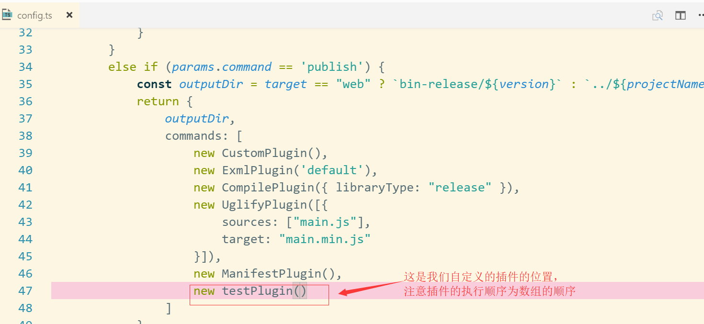
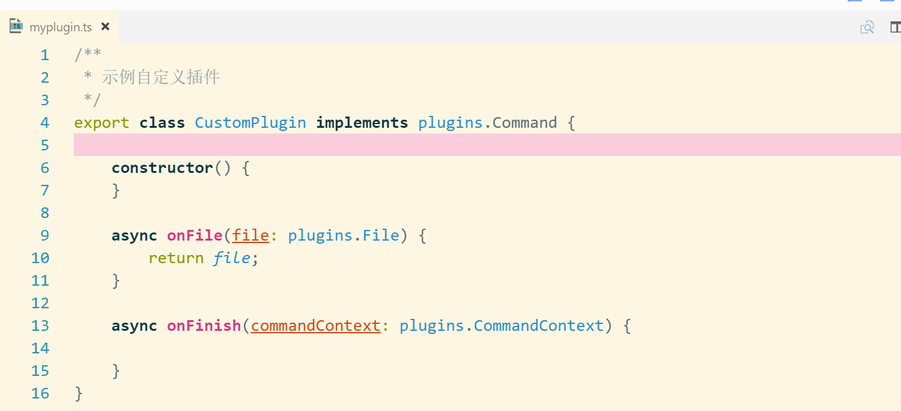

## Command-line Extensions

### Script plug-in directory structure

```
scripts
    |-- api.d.ts // The document
    |-- config.ts // Build script entry
		|-- myplugin.ts // An example of a developer custom plug-in
		|-- node.d.ts // node .d.ts document
```

### Introduction to the plug-in runtime mechanism

Developers can execute custom plugins when building and publish,When the project is built, the buildConfig function in the config.ts file is executed. The function returns an object.The contents of the object return the corresponding output path and the required plug-in based on the different commands executed, which are executed after the plug-in is instantiated in the commands array that returns the object.



### Plug-in authoring specification

The extended plug-in implements the plugins.Command interface, which has two methods.The onFile method executes this function on every file in the project, returns file to indicate that the file is retained, returns null to indicate that the file is removed from the build pipeline, and passes in the type that implements the file interface.



###  Introduction to built-in plug-ins

In addition, for the convenience of developers, we have built several commonly used plug-ins. Please check the API.

### Developing a plug-in example

The functionality we want is very simple, just add the time stamp of this compilation to the js file name after compilation, in order to achieve version control of the js file.
First, create the testplugin.ts file in the scripts file and implement the plugins.Command interface.

```
export class TestPlugin implements plugins.Command {
    constructor() {
    }
    async onFile(file: plugins.File) {
        return file;
    }
    async onFinish(commandContext: plugins.CommandContext) {
    }
}
```

To save the timestamp and the modified js file name, declare these properties to save, and then generate the timestamp in the constructor. The code is as follows:

```
private timeStamp: number; //The time stamp

private modifyInitial: Array<string> = []; //Save the name of the modified library file js file
private modifyGame: Array<string> = []; // Save the modified main js file name

private manifestPath: string; //Save the manifest path

constructor() {
  this.timeStamp = Date.now();
}
```

Next, I will extend the onFile method. First, I will judge the file of type js and use file.extname to judge.We also re-manifest all the modified js files into manifest.json, so we save the manifest path and the name of the modified js file so that we can modify it later and return the file. The code is as follows:

```
async onFile(file: plugins.File) {
  const extName = file.extname;
  if (extName == ".js") {
    const pos = file.path.lastIndexOf(".");
    const prefix = file.path.slice(0, pos);
    const nowName = prefix + this.timeStamp + extName;
    file.path = nowName;

    if (file.basename.indexOf("main.min") >= 0) {
      this.modifyGame.push(file.relative);
    } else {
      this.modifyInitial.push(file.relative);
    }
  }

  if (file.basename.indexOf("manifest.json") >= 0) {
    this.manifestPath = file.relative;
  }
  return file;
}
```

We also need to process the manifest.json file in the onFinish method, first putting all the saved js file names into an object, then converting the object into a json string, and finally modifying the manifest file using the createFile method. The code is as follows:

```
async onFinish(commandContext: plugins.CommandContext) {
  let obj = {
    initial: this.modifyInitial,
    game: this.modifyGame
  };
  const serialize = JSON.stringify(obj);
  commandContext.createFile(this.manifestPath, new Buffer(serialize));
}
```

Now that we've finished this little plug-in, we need to import our plug-in into the config.ts file to use it.Import {testPlugin} from './ testPlugin '. The plug-in is then instantiated in the commands array of the return value of buildConfig: new testPlugin(). Finally, the running result of the egret publish command is shown in the figure:


### Summary

With this document, you can easily write Egret command line plug-in. If you have any questions, please ask at BBS. Egret officials will help you with your questions.