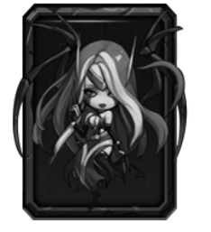
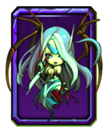

## 1.Glow Filter

### 1.1.Instruction
Use the ‘GlowFilter’ class to apply glow effect on the display object. Glow style options include inside glow, outside glow and hollow mode.   
Here we create a function which is used to implement glow filter process on incoming display object with given parameters.   
In the following demo code, the parameters that will be passed to filter will firstly be defined as local variables, and the meaning of each parameter will be explained in the comments section. Then we fill these parameters into the corresponding position of the filter’s constructor. FYI, for developers having a better understanding on codes with a clear structure, the defined local variables will have a one-to-one correspondence with the filter’s constructor parameters, and the order also will be exactly the same.   

### 1.2.Setting
Now we represent the Egret Bird in the program with a bitmap:   
```var img:egret.Bitmap;```    

Create filter:  
  
```     
var color:number = 0x33CCFF;        /// Halo color, hex, no transparency contained
var alpha:number = 0.8;             /// The color transparency of the halo is the transparency setting for color parameter. The valid values are 0.0 to 1.0. For example, 0.8 means transparency value is 80%.
var blurX:number = 35;              /// Horizontal blur amount. The valid value is 0 to 255.0 (floating point)
var blurY:number = 35;              /// Vertical blur amount. Valid values are 0 to 255.0 (floating point)
var strength:number = 2;            /// For imprint strength, the larger the value, the darker the imprint color, and the contrast between glow and background will be stronger. The valid value is 0 to 255. 
var quality:number = egret.BitmapFilterQuality.HIGH;        /// We suggest you use a constant of BitmapFilterQuality class to represent the times of filter use. not realized yet
var inner:boolean = false;            /// Specify whether the glow is inside glow or not, not realized yet
var knockout:boolean = false;            /// Whether the specified object has hollow effect, not realized yet

var glowFilter:egret.GlowFilter = new egret.GlowFilter( color, alpha, blurX, blurY,
    strength, quality, inner, knockout );
```

Finally we apply glow filter to bitmap object:   
```   
img.filters = [ glowFilter ];
```

### 1.3.Effect
The images below is a comparison of the effects before and after we used the filter:       
![egret-bird-filter-no][]      ![egret-bird-filter-glow][]      

[egret-bird-filter-no]: egret-bird-filter-no.png
[egret-bird-filter-glow]: egret-bird-filter-glow.png

## 2.Color matrix filter

### 2.1.introduction
ColorMatrixFilter--Color matrix filter (egret.ColorMatrixFilter)Provides better color conversion mode of display objects control on particle level.
ColorMatrixFilter is a multi-dimensional matrix of 4 rows and 5 columns (an array of 20 elements). The below figure is the equivalent matrix.
 
 
 
 
### 2.2.Setting
 
The picture below is an example of a graying picture. First we prepare a picture:
 
 
 
Then add a “graying” effect through the color vonversion matrix codes shown below:
 
```
var hero:egret.Bitmap = new egret.Bitmap();
hero.texture = RES.getRes("hero_png");
this.addChild(hero);
//color matrix array
var colorMatrix = [
    0.3,0.6,0,0,0,
    0.3,0.6,0,0,0,
    0.3,0.6,0,0,0,
    0,0,0,1,0
];

var colorFlilter = new egret.ColorMatrixFilter(colorMatrix);
hero.filters = [colorFlilter];
```

In the aforementioned example, first we created a display object, then created a new color conversion matrix `ColorMatrixFilter` and set filter through the display object’s ‘filters’ properties. The `filters` property of the display object contains index array of each filter object that’s associated with current display object.
 
The color conversion matrix setting is the key to achieve the effect. The aforementioned we multiply each color channel by the same factor to achieve the graying effect.

### 2.3.Effect

 
 
> We are able to set color matrix through matrix properties of ColorMatrixFilter. Here you should know that you cannot directly modify color matrix through `colorFlilter.matrix[4] = 100;`, and can only modify after obtaining a array reference, then reset matrix:

```
//obtain array
var test = colorFlilter.matrix;
//modify value of array
test[4] = 100;  
//reset matrix
colorFlilter.matrix = test;
```

### 2.4.matrix data instruction

In the aforementioned example we realized graying image effect, now we introduce the meaning of color matrix:


The actual color value is determined by the following formula:

``` 伪代码
redResult   = (a[0] * srcR)  + (a[1] * srcG)  + (a[2] * srcB)  + (a[3] * srcA)  + a[4];
greenResult = (a[5] * srcR)  + (a[6] * srcG)  + (a[7] * srcB)  + (a[8] * srcA)  + a[9];
blueResult  = (a[10] * srcR) + (a[11] * srcG) + (a[12] * srcB) + (a[13] * srcA) + a[14];
alphaResult = (a[15] * srcR) + (a[16] * srcG) + (a[17] * srcB) + (a[18] * srcA) + a[19];
```

In the fomula, srcR, srcG, srcB, srcA represent the pixel values of the original display object, and a is the color matrix. The new red, green, blue and alpha channels are actually determined by color matrix and the pixel values of the original image in the meantime. The Off in the color matrix can be used to directly set offset value, and this value and the product of the corresponding R G B A is the final color value. So the matrix transformation that’s exactly the same with previous version should be like this: 

```
var colorMatrix = [
    1,0,0,0,0,
    0,1,0,0,0,
    0,0,1,0,0,
    0,0,0,1,0
];
```

Here is a few examples of color matrix settings:

#### Set red offest

To set the offset, you can set the last value in each line directly in the color matrix, and directly set the offset of red channel, then the entire picture will turn red. 

```
var colorMatrix = [
    1,0,0,0,100,
    0,1,0,0,0,
    0,0,1,0,0,
    0,0,0,1,0
];
```

Modify the color matrix array in the code, then compiling and you will get the following effect:


> Here we should note that the offset value corresponding to R G B channel should -255 ~ 255, and the offset of alpha channel should range from -255 to 255. And you should avoid introducing other types of values other than numbers, such as strings.

#### Green double

If you want to double the green channel, make colorMatrix[6] doubled:

```
var colorMatrix = [
    1,0,0,0,0,
    0,2,0,0,0,
    0,0,1,0,0,
    0,0,0,1,0
];
```



#### Red determines the blue value

If you want blue color number in result image to be equal to the red number of the original image, set colorMatrix[10] as 1, and colorMatrix[12] as 0, that is the blue value of result is completely determined by the original red value:

```
var colorMatrix = [
    1,0,0,0,0,
    0,1,0,0,0,
    1,0,0,0,0,
    0,0,0,1,0
];
```


#### Increase brightness

The easiest way to increase brightness is to add same offset to each color value.

```
var colorMatrix = [
    1,0,0,0,100,
    0,1,0,0,100,
    0,0,1,0,100,
    0,0,0,1,0
];
```


You can make complex color adjustments such as contrast, saturation and hue other than brightness and grayscale with the Color Matrix Filter.


## 3.Blur Filter
### 3.1.Setting
Set blur filter through `BlurFilter` in Egret.

```
var hero:egret.Bitmap = new egret.Bitmap();
hero.texture = RES.getRes("hero_png");
this.addChild(hero);

var blurFliter = new egret.BlurFilter( 1 , 1);
hero.filters = [blurFliter];
```

Similar to the color conversion matrix, we instantiate a `BlurFilter` and save it to the `filters` property of the display object. Here the `BlurFilter` instantiation has two parameters, namely the ambiguity in the x and y directions.
The lager the value, the more blurred the effect.


### 3.2.Effect


> We should note that the blur filter consumes a lot of performance and should be used carefully. Normal display objects can be turned on by `cacheAsBitmap` to improve some performance.

> The `filters` property of the display object can save multiple filter effects, such as using hero.filters = [blurFliter,colorFlilter];`, blur and color matrix filter effect in the same time. Multiple effects take effect at the same time.

## 4.Projection filter

### 4.1.introduction
The shadow algorithm uses the same frame filter based on the blur filter. The projection style has several options, including inside or outside shadows and hollow modes.   

### 4.2.Setting
The Egret Bird is represented in the program via a bitmap:  
```var img:egret.Bitmap;```    

Filter creation, and make brief description to the meaning of each parameter in the comments section when we define local variable:   

 
```    
var distance:number = 6;           /// The shadow’s offset distance, take pixel as unit
var angle:number = 45;              /// The shadow angle, 0 – 360 degree
var color:number = 0x000000;        /// The shadow color, not containing transparency
var alpha:number = 0.7;             /// The color transparency of the glow is the transparency setting to the color parameter
var blurX:number = 16;              /// The horizontal blur amount. Valid values are 0 to 255.0 (floating point)
var blurY:number = 16;              /// The vertical blur amount. Valid values are 0 to 255.0 (floating point)
var strength:number = 0.65;                /// For imprint strength, the larger the value, the darker the imprint, and the stronger the contrast between the shadow and the background. Valid values are 0 to 255. Not yet realized.
var quality:number = egret.BitmapFilterQuality.LOW;              /// The times that filter is applied. Not yet realized.
var inner:boolean = false;            /// Specifies whether it’s inside glow or not
var knockout:boolean = false;            /// Specifies whether the object has a hollow effect or not

var dropShadowFilter:egret.DropShadowFilter =  new egret.DropShadowFilter( distance, angle, color, alpha, blurX, blurY,
    strength, quality, inner, knockout );
```   

Finally we apply a projection filter to the bitmap object:     
```  
img.filters = [ dropShadowFilter ];
```

### 4.3.Effect
The following image is the effect comparison before and after using filter:      
![egret-bird-filter-no][]      ![egret-bird-filter-shadow][]      

Comparing the glow filter, we can see that the construction function of the projection filter has exactly two more first parameters than glow filter: `distance` and `angle`. When the properties of `distance` and `angle` are set as 0, the projection filter is very similar to the glow filter.   

[egret-bird-filter-no]: egret-bird-filter-no.png
[egret-bird-filter-shadow]: egret-bird-filter-shadow.png