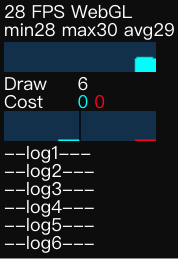

## 1. Use DEBUG to compile parameters
Developers often write code that you want to use only during the development phase to perform data validation, output logs, and so on.

Egret provides the `DEBUG` global variable to implement this functionality.

The following code checks that `value` is not composed of 4 digits, and if not, outputs the specified error message.

```
	if (DEBUG) {
	    var rect = value.split(",");
	    if (rect.length != 4 || isNaN(parseInt(rect[0])) || isNaN(parseInt(rect[1])) ||
	        isNaN(parseInt(rect[2])) || isNaN(parseInt(rect[3]))) {
	        egret.$error(2016, this.currentClassName, toXMLString(node));
	    }
	}
```

During the build process, the Egret command line removes the entire code block of `if (DEBUG) {...}` to keep the release volume thin.

Egret also provides another compiler parameter `RELEASE` corresponding to` DEBUG`, which is used to write the code that runs only in the distribution.


## 2. Use the built-in log output panel

On the PC end, you can use the various method output log provided by `console`, and then view with the developer tool provided by the browser.

But in the mobile end, this way has been limited, and most of the mobile browser does not view the log method.
So, Egret integrates the capability of outputting logs to the screen to facilitate mobile device debugging.



There are the following code blocks in the index.html file:

```
    <div style="margin: auto;width: 100%;height: 100%;" class="egret-player"
         data-entry-class="Main"
         data-orientation="auto"
         data-scale-mode="showAll"
         data-frame-rate="30"
         data-content-width="640"
         data-content-height="1136"
         data-multi-fingered="2"
         data-show-fps="true" data-show-log="false"
         data-show-fps-style="x:0,y:0,size:12,textColor:0xffffff,bgAlpha:0.9"> 
     </div>
```

Through data-show-log: Set whether the log is displayed on the screen. true display, false not displayed.

In the code, `egret.log (message?: Any, ... optionalParams: any [])` can be directly called to output the log.

## 3. Display dirty rectangle and frame rate information

Locate the above code block in the index.html file:

`Set if the redraw area is displayed, when this value is` true`, egret will show the redrawn area with a red box in the stage.

! [Redraw area] (575e943cb6ecc.png)
		

`Set if to display frame rate information, when this value is `true`, Egret will be in the upper left corner of the stage show FPS and other performance indicators
		
* FPS:  60		- Frame frequency

* Draw: 13		- The average times of calling draw method for each frame

* Cost: 0,0	- The time consumption displayed in the periods of Ticker and EnterFrame. When all events of each frame platform are processing the time consumption of matrix, the time consumption  (in ms) of the display object is drawn 

	