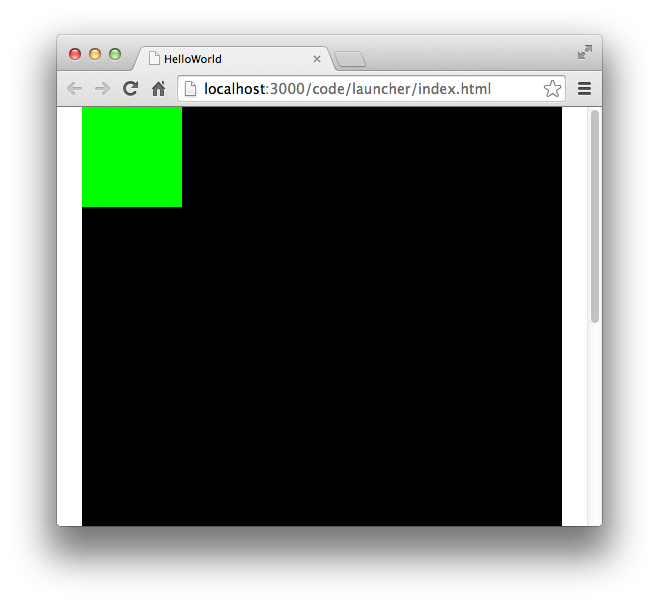
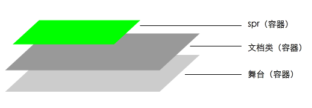
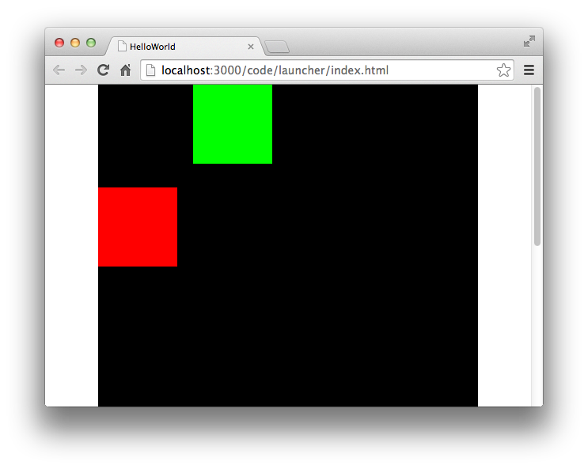
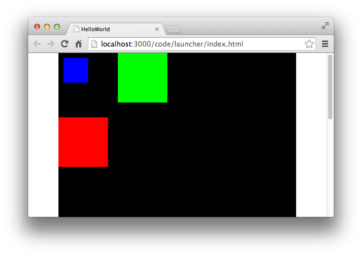
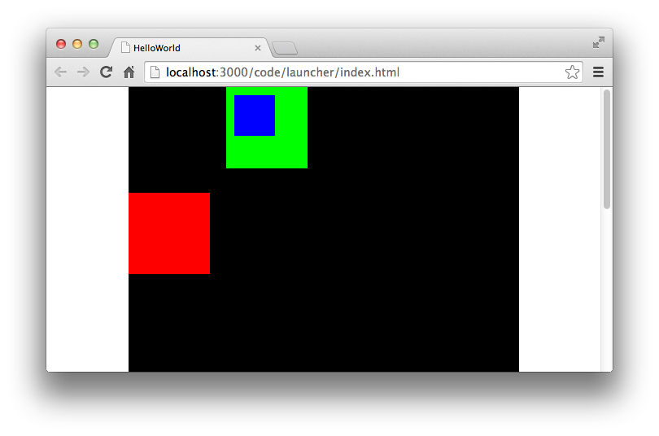
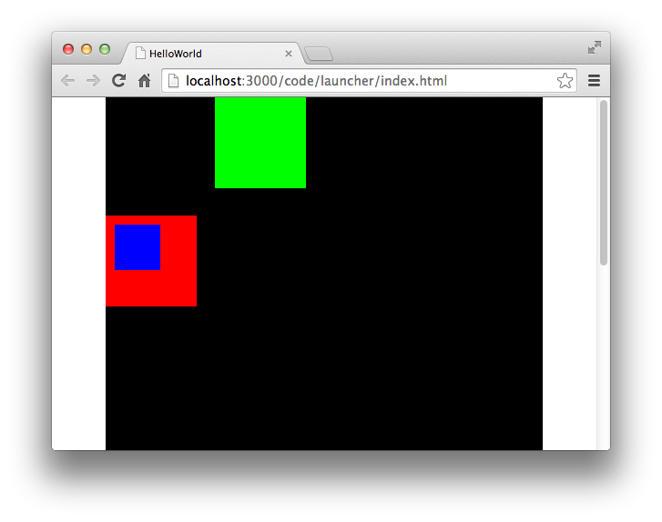

Creating a display object and rendering a display object in Egret are two processes. After a display object is created, the object will be in memory, but won't participate in the rendering process. Only after the display object is placed into the display list will the display object participate in the rendering process. If you want to remove a display object from the rendering process, just remove it from the display list.

## 1. Add the display object to the display list

When you create a display object, you can add it to the display list. First, draw a Sprite, a green square, the width and height of which are 100. 

```
var spr:egret.Sprite = new egret.Sprite();
spr.graphics.beginFill( 0x00ff00 );
spr.graphics.drawRect(0, 0, 100, 100);
spr.graphics.endFill();
```

The above code is to create the process of displaying the object, the test program. No content can be seen in the stage. Add spr to the display list, with the code as follows:

```
this.addChild( spr );
```

After this code is added, the program will be compiled and run. What is seen in the browser are as follows:



The `addChild ()` method in the code adds `spr` to the display list. As mentioned earlier, the display list is a tree structure, where `this` is the upper level of `spr`, which is the document class. The document class is the first subobject of the `stage` stage.

The following is a hierarchical diagram of the current example:



## 2. Delete the display object

Use the `removeChild ()` method to delete the display object, with the code as follows:

```
this.removeChild( spr );
```

The operation of executing the Delete operation is similar to that of adding a display object. The deleted display object is passed to the `removeChild` method as a parameter. In the example, `spr` is the deleted display object, while `this` is the parent of `spr`.

## 3. Display the attention of the object operation

### 3.1. The display object is independent of the display list

Although the display object will be added to or removed from the display list at high frequency during the operation, the display object is independent of the display list. Simple explanation: When creating a display object `Sprite`, the object has its own coordinate properties, rotation angle attributes and so on. These attributes are independently owned by the display object. Once the display object is added to the display list, Egret will be displayed according to the status of the display object.

When the user removes the display object from the display list, these states still exist. When a display object is removed from the display list, the object isn't destroyed in memory. Just do not let the display object to participate in the rendering.

Through the code, you can observe how the operation and status of the object change in the container:

```
// Creates a display object of type Sprite
var spr:egret.Sprite = new egret.Sprite();
spr.graphics.beginFill( 0x00ff00 );
spr.graphics.drawRect(0, 0, 100, 100);
spr.graphics.endFill();
//The object does exist, which is added to the display list and is displayed on the screen
this.addChild( spr );
//The object exists but has been removed from the display list. It is not displayed on the screen
this.removeChild( spr );
//The object exists and resides in memory
```

### 3.2. Relative coordinate system

The coordinate system of the display object is the relative coordinate system instead of the absolute coordinate system.

When the x, y coordinate values of a display object are set to 100, the coordinate value indicates that the current display object is at the position of the parent origin 100, 100.Use the following example to illustrate the specific differences.

First, create two containers. In order to easily see the effect, the width and height of the two containers are set to 100*100, while the two containers are set to red and green respectively.

The green container x axis position is set to 120 pixels.

The red container y axis position is set to 130 pixels

Add both containers to the display list, and their parent classes are document classes. Here is the sample code:

```
var sprcon1:egret.Sprite = new egret.Sprite();
sprcon1.graphics.beginFill( 0x00ff00 );
sprcon1.graphics.drawRect(0, 0, 100, 100);
sprcon1.graphics.endFill();
this.addChild( sprcon1 );
sprcon1.x = 120;

var sprcon2:egret.Sprite = new egret.Sprite();
sprcon2.graphics.beginFill( 0xff0000 );
sprcon2.graphics.drawRect(0, 0, 100, 100);
sprcon2.graphics.endFill();
this.addChild( sprcon2 );
sprcon2.y = 130;
```

At this time, the effect of running is as follows:



Then draw a blue square, of which both the height and width being 50, and the x and y axes are set to 10 pixels. Add this blue square to various containers to view the effect.

Create and draw a blue square code:

```
var spr:egret.Sprite = new egret.Sprite();
spr.graphics.beginFill ( 0x0000ff );
spr.graphics.drawRect( 0, 0, 50, 50 );
spr.graphics.endFill();
spr.x = 10;
spr.y = 10
```

Added to the display container of the document class:

```
this.addChild( spr );
```

Running result:



Added to sprcon1 green container:

```
sprcon1.addChild( spr );
```

Running result:



Added to sprcon2 red container:

```
sprcon2.addChild( spr );
```

Running result:



### 3.3. Add the display object to the display list for multiple times

The same display object is drawn only once on the screen, regardless of how many times the object is added by the code to the display list.

If a display object A is added to the B container, then A is added to the C container. Then, when C.addChild (A) is executed for the second time, A will be automatically removed from the container B, and then added to the container C.

### 3.4. Remove the attention of the operation

The operation that needs to be deleted when a display object is deleted:

`Container object .removeChild (display object);`

"When the Delete operation is executed, the ""display object"" must have a parent. In other words, the deleted display object must exist in the container object."

If the currently deleted display object is not in the container object, the JavaScript console will report an error: `Uncaught Error: [Fatal] child is not added by addChild to the parent:`

The way to avoid this problem is to: make a judgment on the display object to be deleted before the removeChild, so as to determine if it has a parent. The code for judgment is as follows:

```
if( spr.parent ) {
    spr.parent.removeChild( spr );
}
```

