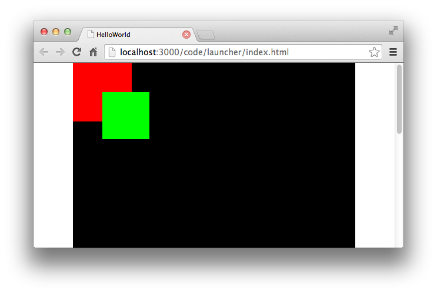
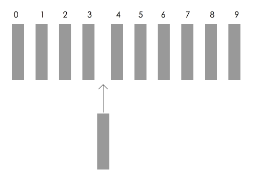
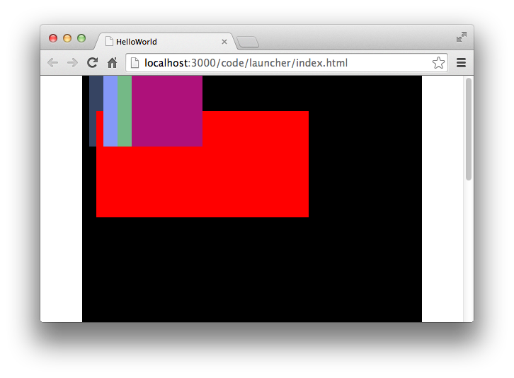
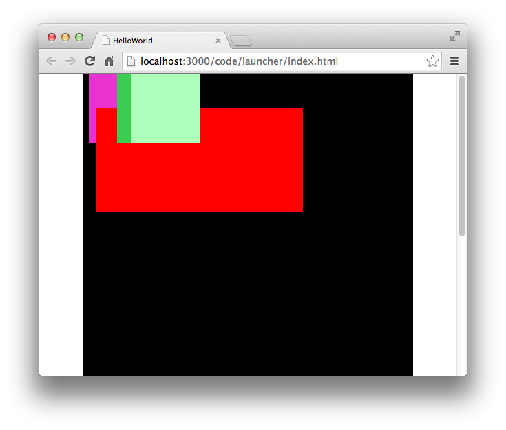

Each container has a deep management function, just like a queue.


Each display object has its own depth value in its parent container, and this value is unique relative to the peer display object. The depth value is actually the order in which a display object is stacked. It can also be called *"z-order"*.

Depth is managed by the list of sub-objects of each container.Each container knows how many sub-objects it has.The `numChildren` attribute of the container can be used to get the number of child objects for the current container.

`Container .numChildren`

In control management of the depth, Egret provides some convenient and effective depth management API.

## 1.  Depth order

The depth of the container in Egret starts at zero. When the first display object is added to the container, its depth value is zero. This display object is at the bottom of the container.When adding the second display object, its depth value is 1, and is above the first display object.If two display objects intersect, it can be visually found that the second display object blocks the first display object.

In the following example, two display objects are created, and they are blocked to each other, and then the depth relationship of the display object is viewed in order.

```
var spr1:egret.Sprite = new egret.Sprite();
spr1.graphics.beginFill( 0xff0000 );
spr1.graphics.drawRect( 0, 0, 100, 100);
spr1.graphics.endFill();
this.addChild( spr1 );

var spr2:egret.Sprite = new egret.Sprite();
spr2.graphics.beginFill( 0x00ff00 );
spr2.graphics.drawRect( 0, 0, 80, 80);
spr2.graphics.endFill();
spr2.x  = 50;
spr2.y = 50;
this.addChild( spr2 );
```

The operating results are as follows:



## 2. Add/remove objects of the specified depth

The `addChild ()` method used will sort by default according to the current sub-object depth, starting at 0, incrementing by 1, and so on.

To add a display object to a specified depth, you need to use the `addChildAt ()` method.



`addChildAt()` The specific use is as follows:

`Container .addChildAt (display object, depth value)`

In the following example, four different colored boxes are randomly drawn, sorted in order. Then, a new display object is created and placed at a place with depth being 1.

```
var sprcon:egret.Sprite = new egret.Sprite();
this.addChild( sprcon );
sprcon.x = 10;

for(var i:number = 0; i<4; i++)
{
    var spr:egret.Sprite = new egret.Sprite();
    spr.graphics.beginFill( 0xffffff * Math.random() );
    spr.graphics.drawRect( 0, 0, 100, 100);
    spr.graphics.endFill();
    spr.x = i*20;
    sprcon.addChild( spr );
}

var sprNew:egret.Sprite = new egret.Sprite();
sprNew.graphics.beginFill( 0xff0000 );
sprNew.graphics.drawRect( 0, 0, 300, 150 );
sprNew.graphics.endFill();
sprNew.x = 10;
sprNew.y = 50;
sprcon.addChildAt( sprNew, 1 );
```

The operation effect is as follows:



It is also possible to control the depth by deleting the display object.

You can use the container .removeChild (the display object) to remove a display object from the display list. Similarly, you can also use the container 

`Container .removeChildAt (depth value)` to delete a display object of the specified depth.

By modifying the above sample code, you can remove the display object with depth value being 2 from the display list.

```
var sprcon:egret.Sprite = new egret.Sprite();
this.addChild( sprcon );
sprcon.x = 10;

for(var i:number = 0; i<4; i++)
{
    var spr:egret.Sprite = new egret.Sprite();
    spr.graphics.beginFill( 0xffffff * Math.random() );
    spr.graphics.drawRect( 0, 0, 100, 100);
    spr.graphics.endFill();
    spr.x = i*20;
    sprcon.addChild( spr );
}

var sprNew:egret.Sprite = new egret.Sprite();
sprNew.graphics.beginFill( 0xff0000 );
sprNew.graphics.drawRect( 0, 0, 300, 150 );
sprNew.graphics.endFill();
sprNew.x = 10;
sprNew.y = 50;
sprcon.addChildAt( sprNew, 1 );

sprcon.removeChildAt( 2 );
```

The operating effect is as follows:



To delete all of the child objects in a container at once, you do not need to use the following code to trace the operation:

```
var numChild:number = sprcon.numChildren;
for(var t:number = 0; t<numChild; t++)
{
    sprcon.removeChildAt( 0 );
}
```

Egret provides a more convenient and quick method, which use the `removeChildren ()` method to remove all the child objects in the current container from the display list.

The usage is as follows:

`Container .removeChildren ();

Go on using the example above and continue writing code later:

`sprcon.removeChildren();`

Compile and run. The stage sprcon does not display any display object.

## 3. Exchange objects with different depths

Egret provides developers with two methods to implement the function of exchanging different object depths.One is the `swapChildren ()` method, and the other is the `swapChildrenAt ()` method.

The specific usage is as follows:

`Container .swapChildren (display object, display object)`

`Container .swapChildrenAt (depth value, depth value)`

In the following example, create an sprcon container and draw two different boxes in it.And then use the above two methods to swap the depth values of the two boxes.

```
var sprcon:egret.Sprite = new egret.Sprite();
this.addChild( sprcon );
sprcon.x = 10;

var spr1:egret.Sprite = new egret.Sprite();
spr1.graphics.beginFill( 0xff0000 );
spr1.graphics.drawRect( 0, 0, 100, 100 );
spr1.graphics.endFill();
spr1.x = 50;
sprcon.addChild( spr1 );

var spr2:egret.Sprite = new egret.Sprite();
spr2.graphics.beginFill( 0x00ff00 );
spr2.graphics.drawRect( 0, 0, 100, 100 );
spr2.graphics.endFill();
spr2.x = 100;
spr2.y = 50;
sprcon.addChild( spr2 );
```

The operation effect is as follows:


Use the first method to swap the depth of two boxes:

sprcon.swapChildren( spr1, spr2 );

Use the second method to swap the depth of two boxes:

sprcon.swapChildrenAt( 0, 1 );


## 4. Reset the child object depth

When a display object is added to the display list, you can manually reset the depth of the display object.

The method for implementing the display object's depth reset is `setChildIndex ()`, with its specific usage as follows:

`Container .setChildIndex (display object, new depth value);`

The sample code is as follows:

```
var sprcon:egret.Sprite = new egret.Sprite();
this.addChild( sprcon );
sprcon.x = 10;

var spr1:egret.Sprite = new egret.Sprite();
spr1.graphics.beginFill( 0xff0000 );
spr1.graphics.drawRect( 0, 0, 100, 100 );
spr1.graphics.endFill();
spr1.x = 50;
sprcon.addChild( spr1 );

var spr2:egret.Sprite = new egret.Sprite();
spr2.graphics.beginFill( 0x00ff00 );
spr2.graphics.drawRect( 0, 0, 100, 100 );
spr2.graphics.endFill();
spr2.x = 100;
spr2.y = 50;
sprcon.addChild( spr2 );

sprcon.setChildIndex( spr1, 1 );
```

In the above code, the green box is masked above the red box by default. You can place it over the green box by resetting the depth (reset to 1) of spr1 (the red box).

The operation effect is as follows:


## 5.  Access the container sub-object

Egret provides two ways to access the container sub-object: `swapChildren ()` and `swapChildrenAt ()` methods.

The specific usage is as follows:

`Container .getChildAt (depth value);`
`Container .getChildByName (display object)`

In the following example code, two boxes are stored in one container. One of the boxes is obtained by depth, and its transparency is adjusted.

```
var sprcon:egret.Sprite = new egret.Sprite();
this.addChild( sprcon );
sprcon.x = 10;

var spr1:egret.Sprite = new egret.Sprite();
spr1.graphics.beginFill( 0xff0000 );
spr1.graphics.drawRect( 0, 0, 100, 100 );
spr1.graphics.endFill();
spr1.x = 50;
spr1.name = "sprite1";
sprcon.addChild( spr1 );

var spr2:egret.Sprite = new egret.Sprite();
spr2.graphics.beginFill( 0x00ff00 );
spr2.graphics.drawRect( 0, 0, 100, 100 );
spr2.graphics.endFill();
spr2.x = 100;
spr2.y = 50;
spr2.name = "sprite2";
sprcon.addChild( spr2 );

var _spr:egret.DisplayObject = sprcon.getChildAt( 1 );
_spr.alpha = 0.5;
```

Compile and run code, with the effect shown as below:


In the example code below, one of the boxes is obtained by depth, and its transparency is adjusted.

```
var sprcon:egret.Sprite = new egret.Sprite();
this.addChild( sprcon );
sprcon.x = 10;

var spr1:egret.Sprite = new egret.Sprite();
spr1.graphics.beginFill( 0xff0000 );
spr1.graphics.drawRect( 0, 0, 100, 100 );
spr1.graphics.endFill();
spr1.x = 50;
spr1.name = "sprite1";
sprcon.addChild( spr1 );

var spr2:egret.Sprite = new egret.Sprite();
spr2.graphics.beginFill( 0x00ff00 );
spr2.graphics.drawRect( 0, 0, 100, 100 );
spr2.graphics.endFill();
spr2.x = 100;
spr2.y = 50;
spr2.name = "sprite2";
sprcon.addChild( spr2 );

var _spr:egret.DisplayObject = sprcon.getChildByName( "sprite2" );
_spr.alpha = 0.5;
```

Compile and run code, with the effect shown as below:


* Comparison of two acquisition methods

Although the role of obtaining the sub-object either by the depth value or `name` attribute is the same, the working principle within Egret is quite different.

When you use a depth value to get a child object, Egret will look for the display object of the specified depth based on the current container's display list and will return it to the user as a return value.This search method is fast and does not require much computation.

When getting the child object through the name attribute, Egret internally will first compile all the sub-objects of the current container, while matching the same `name` attribute value. When the same` name` attribute is found, then the sub-object as a return value will be returned to the user.Although relevant algorithm has been optimized internally in Egret, it still consumes certain performance.

Therefore, the first method is recommended, which obtains sub-objects with depth values.