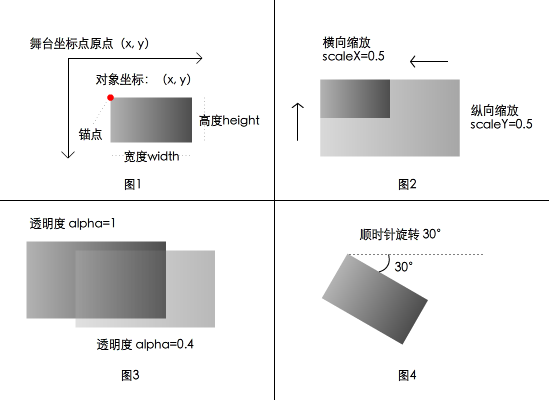
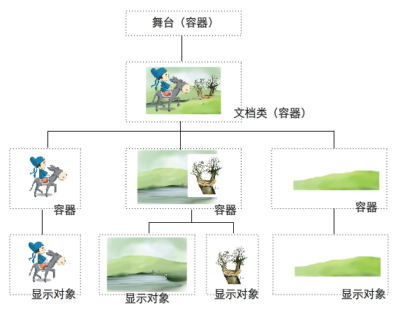

## Display object
### 1. Basic concept
"Display object" refers to the objects that can be displayed on the stage.  Objects that can be displayed include graphics, text, video and images that are visible, as well as display object containers that are invisible but do exist. All visual graphics in Egret consist of display objects and display object containers. 

The DisplayObject class is the parent of all display objects that contain the attributes and methods that are common for the display objects.

### 2. Visual attribute

The visual attribute is used to quantitatively describe the display state of the display object in the stage, and the meaning of the visual attribute is described in the following figure.



As shown in Figure 1 above, the stage coordinate system is defined in Egret

The origin is in the upper left corner of the screen.

The horizontal axis is represented by X and positive to the right.

The vertical axis is represented by Y and is positive downward.

Figure 1 contains a gray rectangle with an "anchor", and Egret uses the coordinates of the point to represent the coordinates of the rectangle.The coordinate position of the display object is modified by the x and y attributes. The sample code is as follows:

```
var shape:egret.Shape = new egret.Shape();
shape.x = 100;
shape.y = 20;
```

Figure 2 shows the zoom function of the display object.Zoom is to scale the width or height of the display object.The scaling function is implemented by the scaleX and scaleY attributes.In the figure, the width and height of the gray rectangle is scaled 0.5 times.The sample code is as follows:

```
var shape:egret.Shape = new egret.Shape();
shape.scaleX = 0.5; 
shape.scaleY = 0.5;
```

> Note: If the bitmap is scaled or stretched, the image will blur.

That is completely opaque. You can visit and modify the transparency through the alpha attribute.The alpha range is 0-1.The sample code is as follows:

```
var shape:egret.Shape = new egret.Shape();
shape.alpha = 0.4;
```

Figure 4 shows the rotation of the display object, and the rotation angle can be modified by the rotation attribute.Rotate the rectangle in the figure by 30°. The sample code is as follows:

```
var shape:egret.Shape = new egret.Shape();
shape.rotation = 30;
```

The figure above shows the visual attributes commonly used in the display object. The following list shows all the visible attributes of the display object.

* alpha: transparency

* width: width

* height：height

* rotation: rotation angle

* scaleX: horizontal zoom

* scaleY: vertical zoom

* skewX: horizontal beveling

* skewY: vertical beveling

* visible: visible or not

* x: X coordinate values

* y: Y coordinate value

* anchorOffsetX: object absolute anchor X

* anchorOffsetY: object absolute anchor Y

### 3. Core display class

Different content correspond to different display objects. Egret encapsulates 8 display-related core classes, as shown in the table below.

| Class | description |
|  --- |  --- |
| DisplayObject | Displays the object base class, all display objects of which are inherited from this class
|  Bitmap |  Bitmap, used to display images |
|  Shape | is used to display vector graphics, which can be used to draw vector graphics |
|  TextField |  Text Class |
|  BitmapText |  Bitmap Text Class |
|  DisplayObjectContainer |  display object container interface, and all display object containers are implemented with this interface |
|  Sprite |  display container with vector drawing function |
|  Stage |  Stage Class |

### 4. Customize the display object class

Custom display object classes need to inherit from a specific subclass of `DisplayObject`, such as` Shape` or `TextField`.

The sample code is as follows:

* Create
Create a class named `MyGrid` and inherit from` Shape`.The specific code is as follows:

```
class MyGrid extends egret.Shape{
    public constructor(){
        super();
        this.drawGrid();
    }

    private drawGrid(){
        this.graphics.beginFill( 0x0000ff );
        this.graphics.drawRect( 0, 0, 50,50 );
        this.graphics.endFill();

        this.graphics.beginFill( 0x0000ff );
        this.graphics.drawRect( 50, 50, 50, 50);
        this.graphics.endFill();

        this.graphics.beginFill( 0xff0000 );
        this.graphics.drawRect( 50, 0, 50,50 );
        this.graphics.endFill();

        this.graphics.beginFill( 0xff0000 );
        this.graphics.drawRect( 0, 50, 50,50 );
        this.graphics.endFill();               
    }
}
```

In the `MyGrid`, draw a red and blue 2*2 lattice, and then modify the document class` Main`. In the document class, create and display `MyGrid` class instance. The specific code is as follows:


```
class Main extends egret.DisplayObjectContainer{
    public constructor(){
        super();
        this.addEventListener(egret.Event.ADDED_TO_STAGE,this.onAddToStage,this);
    }

    private onAddToStage(event:egret.Event){
        var _myGrid:MyGrid = new MyGrid();
        this.addChild( _myGrid );
    }
}
```

* Effect
Compile and test. The effect of the following figure can be seen in the browser.


## Display container
### 1. Basic concept
All display containers are inherited from the `DisplayObjectContainer` class, which inherits from `DisplayObject`.That is, in Egret, all containers are inherited from `DisplayObject`.

In Egret, `DisplayObjectContainer` encapsulates some of the features commonly used in the display list, which will be described in detail later.These commonly used operations are divided into four categories:

* Add, delete child objects

* Access sub-objects

* Detect sub-objects

* Set the stacked sequence

>In Egret, the display object is divided into two categories: one is the display object container that can include other display objects, which is hereinafter referred to as "containers".The other is a simple display object that can't include other display objects except for itself, which is hereinafter referred to as "non-container object."

### 2. Sprite

In Egret, `Sprite` is a commonly used container.

`Sprite` inherits from `DisplayObjectContainer` and is added with the Graphics function.

> More information about Graphics function will be explained in detail in the vector drawing part.

### 3. Customize the container

When customizing container, you can write a class and inherit `DisplayObjectContainer`.If you want to achieve the Graphics drawing function at the same time, you can inherit `Sprite`.

The following is an example of a custom container class that defines a ``GridSprite` class.By default, this class draws a red-and-blue grid.

```
class GridSprite extends egret.Sprite
{
    public constructor()
    {
        super();
        this.drawGrid();
    }

    private drawGrid()
    {
        this.graphics.beginFill( 0x0000ff );
        this.graphics.drawRect( 0, 0, 50,50 );
        this.graphics.endFill();
        
        this.graphics.beginFill( 0x0000ff );
        this.graphics.drawRect( 50, 50, 50, 50);
        this.graphics.endFill();
        
        this.graphics.beginFill( 0xff0000 );
        this.graphics.drawRect( 50, 0, 50,50 );
        this.graphics.endFill();
        
        this.graphics.beginFill( 0xff0000 );
        this.graphics.drawRect( 0, 50, 50,50 );
        this.graphics.endFill();
    }
}
```

In the document class, instantiate the `GridSprite`.

```
var _myGrid:GridSprite = new GridSprite();  
this.addChild( _myGrid );
```

The running effect of the compilation is as follows:


## Display the list
The display list is used to manage and organize container and non-container objects. When a display object is in the display list, you can see it in the screen.When the display object is removed from the display list, the object will disappear from the screen.

In the Egret, a display list is maintained internally. Developers need not to care about how the list is running, instead, they just operate their own display objects accordingly.Here's an example of how the display list works.

Express the scenario shown below


* Clearly display object hierarchy

In the actual operation, you can regard the display list as a tree structure.

In the tree structure, the top level is "stage",  which is a `stage` object in the program. The stage is the most fundamental display container in the Egret. Each Egret application has and only has one stage object. The stage is the root node of this display tree structure. 

The stage also owns a primary container, the container created by the document class. Each Egret will own a document class that must be a display object container. 

In this scene, we include a scene background that consists of a background image and a tree. The other two elements consist of people and lawn.The tree structure is as follows:



The above tree structure is Egret's "display list".