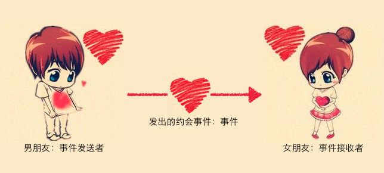

The event mechanism in Egret is an industry-standard event handling framework. The provided event patterns are also very clear, powerful, and efficient.

In Egret, the event model defines a standard way of generating and processing event messages so that objects in a program can interact with one another, communicate, and maintain their state and Egret behavior.In simple terms, the data provider just a data object, just make sure the data object is  `egret.Event` class or subclass instance. This data object, called`Event`. Senders of data objects, called `Event sender `。At the same time, accept the Event object, called `Event listener`.

Here's a simple example.

When we want to date a bf, we usually have a date sponsor and a date. The invitation process, then, is a typical event process.

This process is shown in the figure below:

Boyfriend is the event`sender`，invite date is boyfriend sent `event`。The girlfriend is`event listener `.

This event contains three main contents: the type of event, the target of the event, and the relevant data of the event. The type of event is to invite a date, the girlfriend will according to the event, to perform different tasks. For example, if the event is an "invitation to date," then the girlfriend may perform, dress up, and keep the appointment. If the event is "hungry," then the girlfriend will do the grocery shopping.

`Target`of the event,，is the event of the sender. Without this information, the girlfriend will have no way of knowing who is asking her out or who is hungry once she receives the message.

`Data`of events, is the event of information to include. In the above dating event, the event information can include the event, location, and what to do. Similarly, the "hungry" event contains information about what to eat, at home or out, and so on. Of course, there are also some events that do not contain information, such as "beating on the back". As long as the event receiver receives the event, it can execute it directly.

Based on the example above, we can draw a closer picture of the flow of event execution in Egret.
