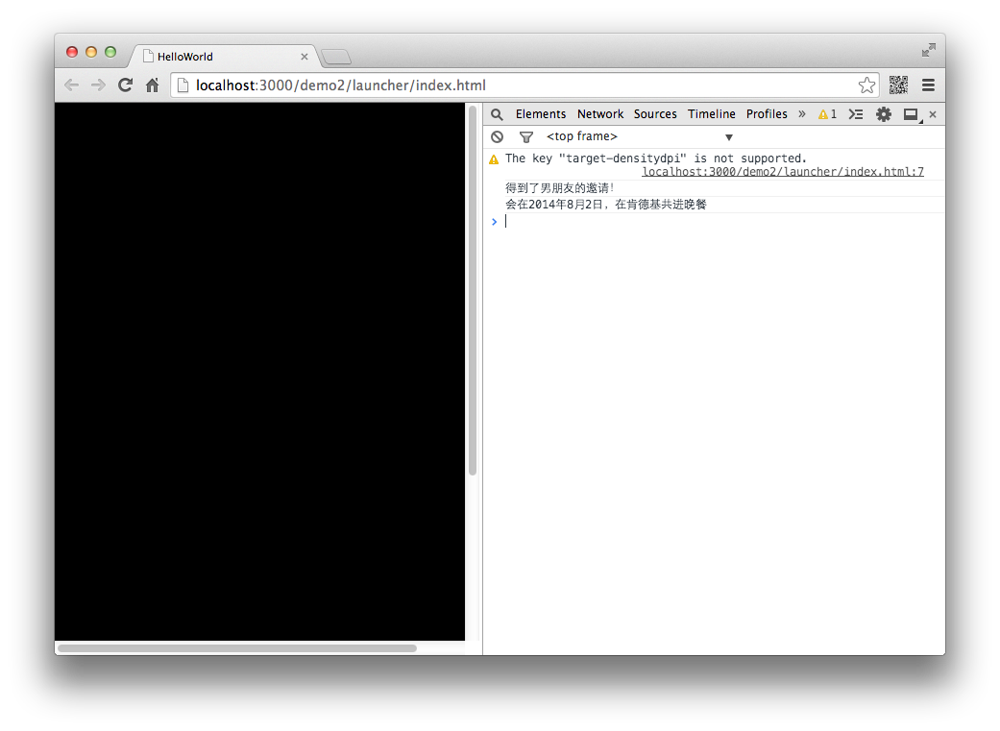

The event mechanism consists of four steps: register the listener, send the event, listen for the event, and remove the listener. These four steps are performed in sequence.

Registers listeners, which specifies which method of which object receives the event. In the previous economy example, we designated the boyfriend to send the event and the girlfriend to receive the event.

A sent event can only be listened on after a listener has been registered. And the event sent must match the type of the listener event. The listener cannot listen for an event until it has been sent.

The following example shows the sending process of "appointment" event and the coding process.

###  Document Class

```
class SampleDate extends egret.DisplayObjectContainer
{
    public constructor()
    {
        super();

        //create a boyfriend
        var boy:Boy = new Boy();
        boy.name = "boy friend";
        //create a girlfriend
        var girl:Girl = new Girl();
        girl.name = "girlfriend";
        //register listeners
        boy.addEventListener(DateEvent.DATE,girl.getDate,girl);
        // boyfriend send request
        boy.order();
        //remove the listener when the appointment invitation is complete
        boy.removeEventListener(DateEvent.DATE,girl.getDate,girl);
    }
}
```

### Boyfriend Class

```
class Boy extends egret.Sprite
{
    public constructor()
    {
        super();
    }
    public order()
    {
        //generate an appointment event object
        var daterEvent:DateEvent = new DateEvent(DateEvent.DATE);
        //add the corresponding appointment information
        daterEvent._year = 2014;
        daterEvent._month = 8;
        daterEvent._date = 2;
        daterEvent._where = "KFC ";
        daterEvent._todo = "have dinner together";
        // Send request event
        this.dispatchEvent(daterEvent);
    }
}
```

### Girlfriend Class

```
class Girl extends egret.Sprite
{
    public constructor()
    {
        super();
    }

    public getDate(evt:DateEvent)
    {
        console.log("got an invitation " + evt.target.name + "！" );
        console.log(" in" + evt._year + "years" + evt._month + "month" + evt._date + "date，在"+ evt._where+ evt._todo);
    }
}
```

### Dating Events

```
class DateEvent extends egret.Event
{
    public static DATE:string = "Date";
    public _year:number = 0;
    public _month:number = 0;
    public _date:number = 0;
    public _where:string = "";
    public _todo:string = "";

    public constructor(type:string, bubbles:boolean=false, cancelable:boolean=false)
    {
        super(type,bubbles,cancelable);
    }
}
```

Compile and run, the effect is as follows：



