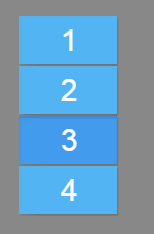

### 1.Touch event
For mobile games, touch events are the most common type of user interaction events.Egret to set up a special touch touch events event classes`egret.TouchEvent`。

The main types of events it contains are:
* TOUCH_BEGIN：This is triggered when the user first touches a touch-enabled device (for example, a mobile phone or tablet with a touch screen)
* TOUCH_CANCEL：Triggered when a touch is cancelled due to an event
* TOUCH_END：Triggered when a user removes contact with a touch-enabled device (for example, by lifting a finger off a mobile phone or tablet with a touch screen)
* TOUCH_MOVE：Triggering occurs when the user touches the device and moves it, and continues until the point of contact is removed
* TOUCH_TAP：When the user touches the device on the same device as when the touch startedDisplayObject Triggered when lifting a contact point on an instance (equivalent to a click event)

When using the touch events in the Egret, need to open the display object touch events switch, is the display object`touchEnabled`attribute is set to`true`.The code example is as follows:

```
class TouchEventTest extends egret.DisplayObjectContainer
{
    public constructor()
    {
        super();
        this.addEventListener(egret.Event.ADDED_TO_STAGE,this.onAddToStage,this);
    }
    private onAddToStage(event:egret.Event)
    {
        //Add display text add display text
        this.drawText();
        //Draws a green rectangle with a transparency of 1 and a width and height of 100*80
        var spr1:egret.Sprite = new egret.Sprite();
        spr1.graphics.beginFill(0x00ff00, 1);
        spr1.graphics.drawRect(0, 0, 100, 80);
        spr1.graphics.endFill();
        spr1.width = 100;
        spr1.height = 80;
        this.addChild( spr1 );
		//Set the display object to respond to touch events
		spr1.touchEnabled = true;
        //Register event
        spr1.addEventListener( egret.TouchEvent.TOUCH_TAP, this.onTouch, this );
        this.addEventListener(egret.TouchEvent.TOUCH_TAP, this.onTouchTap, this);
        this.addEventListener(egret.TouchEvent.TOUCH_TAP, this.onTouchTaps, this, true);
    }
    private onTouch( evt:egret.TouchEvent )
    {
        this.txt.text += "\n Click on the spr1";
    }
    private onTouchTap( evt:egret.TouchEvent )
    {
        this.txt.text += "\n The container listens for bubbling\n---------";
    }
    private onTouchTaps( evt:egret.TouchEvent )
    {
        this.txt.text += "\n Container capture interception";
    }
    // Draw text
    private  txt:egret.TextField;
    private drawText():void
    {
        this.txt = new egret.TextField();
        this.txt.size = 12;
        this.txt.x = 250;
        this.txt.width = 200;
        this.txt.height = 200;
        this.txt.text = "event word";
        this.addChild( this.txt );
    }
}
```

### 2.Cancel touch event

Cancel touch event, triggered when a touch is cancelled due to an event.

Click click event, for example, a process usually triggers 3 touch events:`TouchBegin` ，`TouchEnd` ，`TouchTap` .

In some special cases, such as the EUI  `Scroller` 滚scrolling list, when a finger points after it,First throw a `TouchBegin`，if at this time without scrolling, directly away from the screen, then the same standard of process, throw `TouchEnd` and `TouchTap`。But later, when panning it will throw a `TouchCancel` events, and the subsequent  `TouchEnd` and `TouchTap` events will not be triggered.

Here is a sample code to create a scrolling list and add listeners

~~~
var scroller = new eui.Scroller();
var list = new eui.List();  
list.itemRendererSkinName = `
        <e:Skin states="up,down,disabled" minHeight="50" minWidth="100" xmlns:e="http://ns.egret.com/eui"> <e:Image width="100%" height="100%" scale9Grid="1,3,8,8" alpha.disabled="0.5"
                     source="resource/button_up.png"
                     source.down="resource/button_down.png"/> <e:Label text="{data}" top="8" bottom="8" left="8" right="8"
                     textColor="0xFFFFFF" verticalAlign="middle" textAlign="center"/> </e:Skin>`
var ac = new eui.ArrayCollection([1, 2, 3, 4, 5, 6, 7, 8, 9, 10, 11, 12, 13, 14, 15, 16]);
list.dataProvider = ac;
scroller.viewport = list;
scroller.height = 200;
this.addChild(scroller);

scroller.addEventListener(egret.TouchEvent.TOUCH_BEGIN,()=>{console.log("111 Scroller Begin")},this);
list.addEventListener(egret.TouchEvent.TOUCH_BEGIN,()=>{console.log("111 List Begin")},this);

scroller.addEventListener(egret.TouchEvent.TOUCH_END,()=>{console.log("222 Scroller END")},this);
list.addEventListener(egret.TouchEvent.TOUCH_END,()=>{console.log("222 List END")},this);

scroller.addEventListener(egret.TouchEvent.TOUCH_TAP,()=>{console.log("33 Scroller Tap")},this);
list.addEventListener(egret.TouchEvent.TOUCH_TAP,()=>{console.log("33 List Tap")},this);

scroller.addEventListener(egret.TouchEvent.TOUCH_CANCEL,()=>{console.log("44 Scroller cancel")},this);
list.addEventListener(egret.TouchEvent.TOUCH_CANCEL,()=>{console.log("44 List cancel")},this);
~~~


When there is no scrolling, clicking on the list throws the following events in turn. 

~~~
111 List Begin
111 Scroller Begin
222 List END
222 Scroller END
33 List Tap
33 Scroller Tap
~~~



Above is what it looks like after clicking

When rolling `scroller` ,throws `TouchCancel`，subsequent touch events will not be triggered.

~~~
111 List Begin
111 Scroller Begin
44 List cancel
44 Scroller cancel
~~~


After another`TouchCancel`trigger that touch has been cancelled, this touching article selected option will be back to before the selected state.