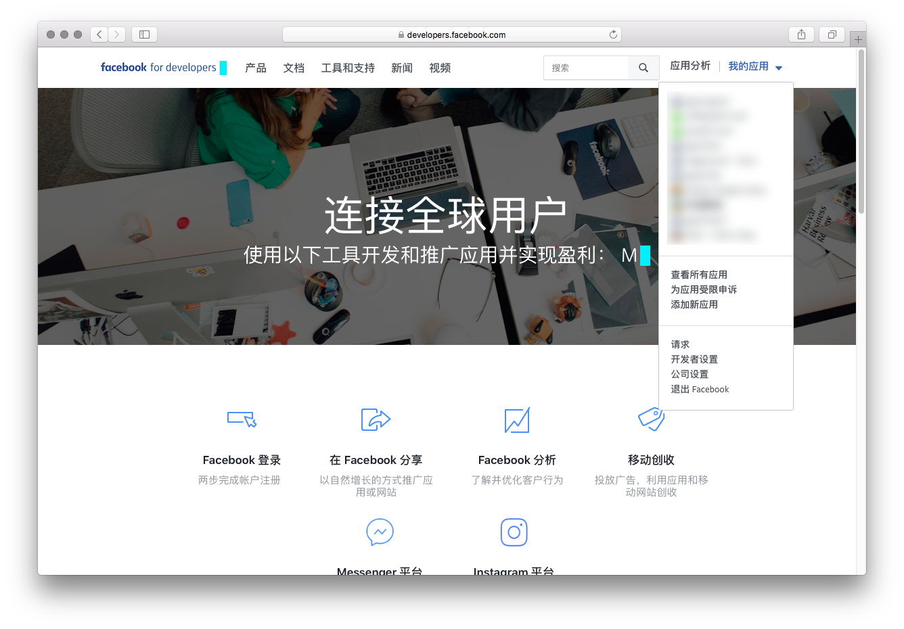
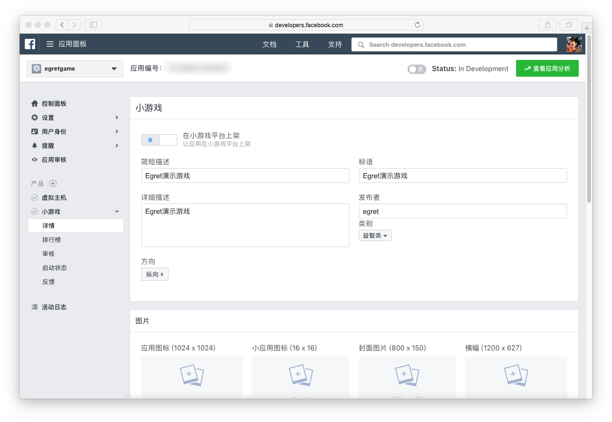
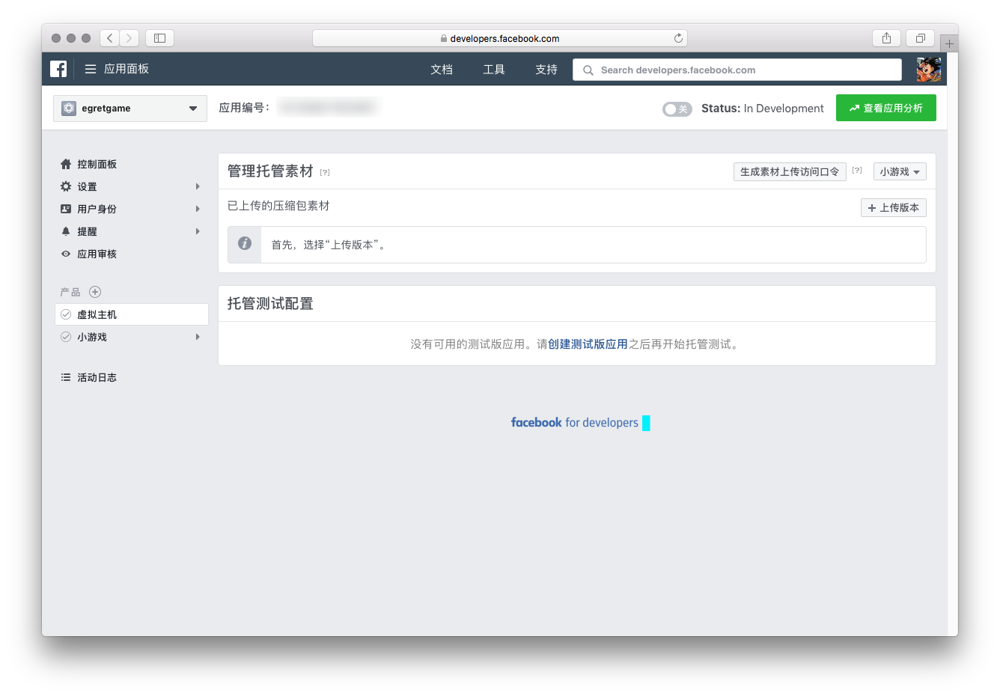
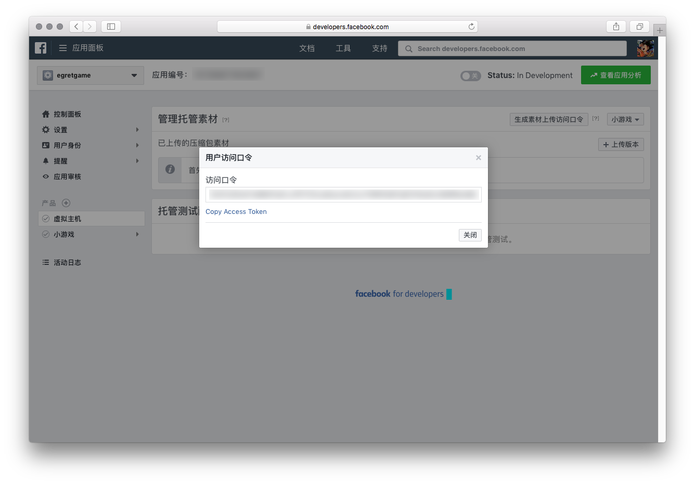
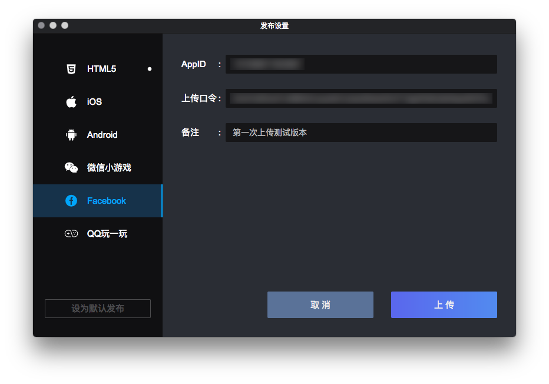
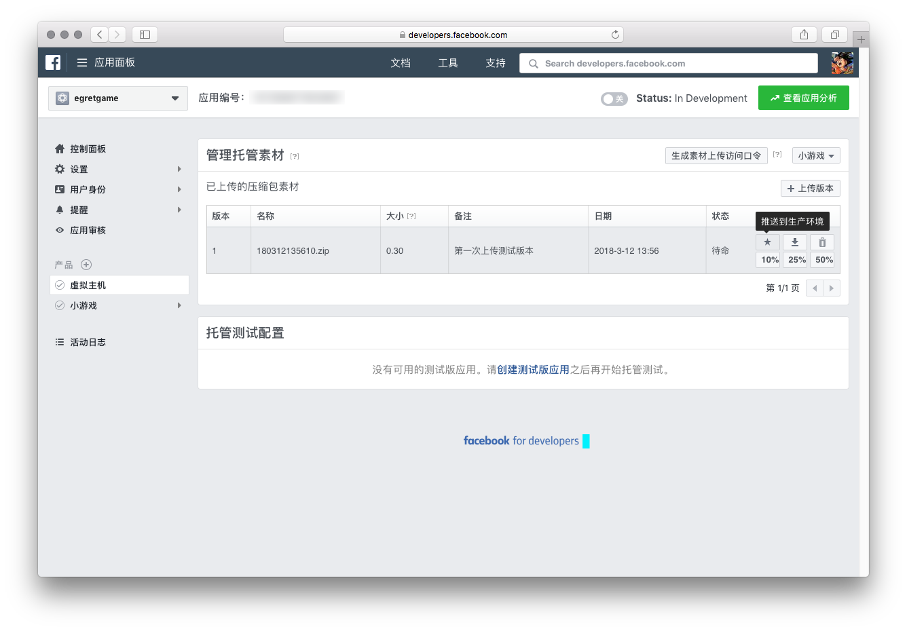
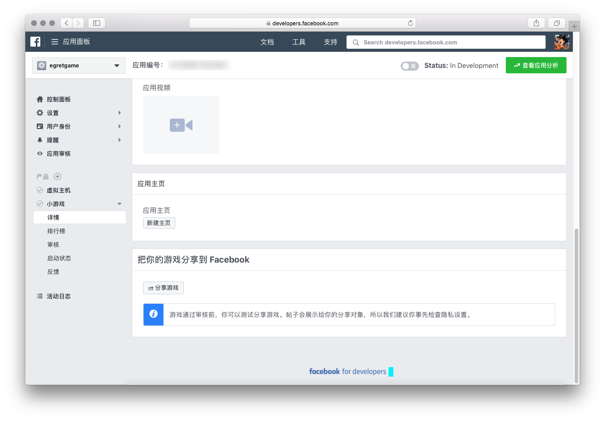
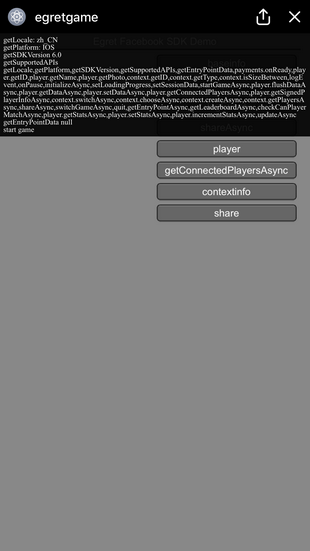

# Facebook Instant Games Development Quick Guide

Developers can choose to migrate the existing Egret HTML5 games to Facebook Instant Games platform, or develop new HTML5 games for Facebook Instant Games platform.

This guide aims to help developers quickly submit and test their games on Facebook Instant Games with the use of Egret Tools, for all involved platform features, restrictions and regulations, please refer to Facebook official documents.

## Create Facebook Instant Games Application

You need to log in your Facebook account via (https://developers.facebook.com]



In “My Apps”, click **Add a New App** and fill in the App’s related information, shown as below:


Then we enter **App Dashboard** of our newly-built app, and select **Facebook Instant Game** from **Add a Product** , shown as following picture:


Fill out basic info in Instant Games details



Then we enter **Web Hosting**, click **Get Asset Upload Access Token** button, and save the token for futher use, shown as following picture:





## Create Egret Project

Create Egret project and select `Facebook Instant Games `from extension library


## Write Codes or Migrate Your Projects

As for API， you can get more detailed instructions referring to  [Egret Developer Center](http://developer.egret.com/cn/apidoc/) 

Here is a demo project with codes shown as below:

##### Button.ts

```
class Button extends egret.Sprite {

    public constructor(label: string) {
        super();
        this.drawText(label);
        this.addEventListener(egret.TouchEvent.TOUCH_BEGIN, this.touch_begin, this);
        this.addEventListener(egret.TouchEvent.TOUCH_END, this.touch_end, this);
        this.addEventListener(egret.TouchEvent.TOUCH_TAP, this.click, this);
        this.draw();
        this.touchEnabled = true;
    }

    private touch_begin(evt: egret.TouchEvent): void {
        this.isUp = false;
        this.draw();
    }
    private touch_end(evt: egret.TouchEvent): void {
        this.isUp = true;
        this.draw();
    }
    private click(evt: egret.TouchEvent): void {
        this.dispatchEvent(new egret.Event("CHAGE_STAGE"));
    }

    private isUp: boolean = true;
    private draw(): void {
        this.graphics.clear();
        this.removeChildren();
        if (this.isUp) {
            this.drawUp();
        } else {
            this.drawDown();
        }
        this.addChild(this.textF);
    }

    private textF: egret.TextField;
    private drawText(label: string): void {
        if (this.textF == null) {
            let text: egret.TextField = new egret.TextField();
            text.text = label;
            text.width = (Context.stageWidth - 30) / 2;
            text.height = 35;
            text.size = 22;
            text.verticalAlign = egret.VerticalAlign.MIDDLE;
            text.textAlign = egret.HorizontalAlign.CENTER;
            this.textF = text;
            this.textF.strokeColor = 0x292b2f;
        }
    }

    private drawUp(): void {
        this.graphics.beginFill(0x666666);
        this.graphics.lineStyle(2, 0x282828);
        this.graphics.drawRoundRect(0, 0, (Context.stageWidth - 30) / 2, 35, 15, 15);
        this.graphics.endFill();

        this.graphics.lineStyle(2, 0x909090, 0.5);
        this.graphics.moveTo(5, 2);
        this.graphics.lineTo((Context.stageWidth - 30) / 2 - 5, 2);
        this.graphics.endFill();

        this.graphics.lineStyle(2, 0x676767, 0.7);
        this.graphics.moveTo(5, 37);
        this.graphics.lineTo((Context.stageWidth - 30) / 2 - 5, 37);
        this.graphics.endFill();

        this.textF.stroke = 0;
    }
    private drawDown(): void {
        this.graphics.beginFill(0x3b3b3b);
        this.graphics.lineStyle(2, 0x282828);
        this.graphics.drawRoundRect(0, 0, (Context.stageWidth - 30) / 2, 35, 15, 15);
        this.graphics.endFill();

        this.graphics.lineStyle(2, 0x313131, 0.5);
        this.graphics.moveTo(5, 2);
        this.graphics.lineTo((Context.stageWidth - 30) / 2 - 5, 2);
        this.graphics.endFill();

        this.graphics.lineStyle(2, 0x676767, 0.7);
        this.graphics.moveTo(5, 37);
        this.graphics.lineTo((Context.stageWidth - 30) / 2 - 5, 37);
        this.graphics.endFill();

        this.textF.stroke = 1;
    }
}
```

##### Context.ts

```
class Context {
    static stageWidth: number = 0;
    static stageHeight: number = 0;

    public static init(_stage: egret.Stage): void {
        Context.stageWidth = _stage.stageWidth;
        Context.stageHeight = _stage.stageHeight;
    }
}
```

##### Menu.ts

```
class Menu extends egret.Sprite {

    public constructor(title: string) {
        super();

        this.graphics.lineStyle(2, 0x282828);
        this.graphics.moveTo(0, 35);
        this.graphics.lineTo(Context.stageWidth, 35);
        this.graphics.endFill();

        this.graphics.lineStyle(2, 0x6a6a6a);
        this.graphics.moveTo(0, 37);
        this.graphics.lineTo(Context.stageWidth, 37);
        this.graphics.endFill();

        this.drawText(title);
        this.addChild(this.textF);
    }

    private textF: egret.TextField;
    private drawText(label: string): void {
        if (this.textF == null) {
            let text: egret.TextField = new egret.TextField();
            text.text = label;
            text.width = Context.stageWidth
            text.height = 35;
            text.size = 22;
            text.verticalAlign = egret.VerticalAlign.MIDDLE;
            text.textAlign = egret.HorizontalAlign.CENTER;
            this.textF = text;
            this.textF.strokeColor = 0x292b2f;
        }
    }

    private viewNum: number = 0;

    public addTestFunc(label: string, callback: Function, target: Object): void {
        let btn: Button = new Button(label);
        
        btn.x = (Context.stageWidth - 30) / 2 + 20;
        btn.y = 48 + this.viewNum* 47;

        this.addChild(btn);
        btn.addEventListener("CHAGE_STAGE", callback, target);
        this.viewNum++;
    }
}
```

##### Main.ts

```
class Main extends egret.DisplayObjectContainer {

    public static menu: any;
    private static _that: egret.DisplayObjectContainer;
    public constructor() {
        super();
        this.once(egret.Event.ADDED_TO_STAGE, this.addStage, this);
    }

    private addStage(evt: egret.Event): void {
        this.initializeAsync();

        FBInstant.startGameAsync().then(() => {
            egret.log("start game");
            Main._that = this;
            Context.init(this.stage);
            Main.menu = new Menu("Egret Facebook SDK Demo")
            this.addChild(Main.menu);
            this.createMenu();
        });
    }

    public static backMenu(): void {
        Main._that.removeChildren();
        Main._that.addChild(Main.menu);
    }

    private createMenu(): void {
        Main.menu.addTestFunc("baseinfo", this.baseinfo, this);
        Main.menu.addTestFunc("quit", this.quit, this);
        Main.menu.addTestFunc("logEvent", this.logEvent, this);
        Main.menu.addTestFunc("shareAsync", this.shareAsync, this);
        Main.menu.addTestFunc("player", this.player, this);
        Main.menu.addTestFunc("getConnectedPlayersAsync", this.getEgretConnectedPlayersAsync, this);
        Main.menu.addTestFunc("contextinfo", this.contextinfo, this);
        Main.menu.addTestFunc("share", this.share, this);
    }

    private initializeAsync(): void {
        FBInstant.initializeAsync().then(function () {
            egret.log("getLocale:", FBInstant.getLocale());
            egret.log("getPlatform:", FBInstant.getPlatform());
            egret.log("getSDKVersion", FBInstant.getSDKVersion());
            egret.log("getSupportedAPIs", FBInstant.getSupportedAPIs());
            egret.log("getEntryPointData", FBInstant.getEntryPointData());
        })

        setTimeout(function () {
            FBInstant.setLoadingProgress(100);
        }, 1000);
    }

    private baseinfo() {
        egret.log("baseinfo");
        egret.log("getLocale:", FBInstant.getLocale());
        egret.log("getPlatform:", FBInstant.getPlatform());
        egret.log("getSDKVersion", FBInstant.getSDKVersion());
        egret.log("getSupportedAPIs", FBInstant.getSupportedAPIs());
        egret.log("getEntryPointData", FBInstant.getEntryPointData());
    }

    private quit(): void {
        egret.log("quit");
        FBInstant.quit();
    }

    private logEvent(): void {
        egret.log("logEvent");
        FBInstant.logEvent("test", 2, { "test": "ta" });
    }


    private shareAsync(): void {
        egret.log("shareAsync");
        let data: FBInstant.SharePayload = {
            intent: "",
            text: "",
            image: "",
        };
        FBInstant.shareAsync(data);
    }


    private player() {
        egret.log("player");
        egret.log("player.getID", FBInstant.player.getID());
        egret.log("player.getName", FBInstant.player.getName());
        egret.log("player.getPhoto", FBInstant.player.getPhoto());
    }

    private async getEgretConnectedPlayersAsync() {
        egret.log("frends info:::");
        let datas: FBInstant.ConnectedPlayer[] = await FBInstant.player.getConnectedPlayersAsync();
        egret.log(datas);
        datas.forEach(element => {
            egret.log("player.getID", element.getID());
            egret.log("player.getName", element.getName());
            egret.log("player.getPhoto", element.getPhoto());
        });
    }

    private contextinfo(): void {
        egret.log("Context.getID", FBInstant.context.getID());
        egret.log("Context.getType", FBInstant.context.getType());
    }

    private share(): void {
        egret.log("share");
        let data: FBInstant.SharePayload = {
            intent: "",
            text: "",
            image: "",
        };
        FBInstant.shareAsync(data);
    }
}
```

## Suggestions

We recommend you to reserve an interface for access in development process. It's OK to ignore Facebook interface in local testing, but you need to reopen the relevant APIs when testing in Facebook development environment.

## Packaging and Uploading

Introduce the js file of sdk in index.html. Note: you must load remotely for this js file like the image shown below and cannot place it at local, otherwise it will not be approved by Facebook.

```
<script src="https://www.facebook.com/assets.php/en_US/fbinstant.6.1.js"></script>
```

You can open the upload panel either by clicking Publish button from Egret Wing latest version, or Publish setting button in project from Egret Launcher.

Select the **Facebook** tab, fill out your APP ID and the token you saved before as well as the version description in comment.



Click Upload button to package current project, and it'll be pushed to Facebook server.

## Testing

You can see the version in Manage Hosted Assets after uploading is successful.



To test this version, clicking **Push to Production**


This version can be tested when the corresponding version status changes from "Standby" to "Production"

Click **Details** in Facebook Instant Games, and share current game to your Facebook stream by clicking the **Share Your Game** button in the bottom.




You can test your game by clicking the game link your just shared in Facebook App.

     