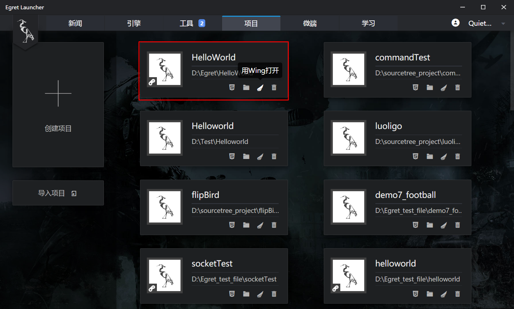
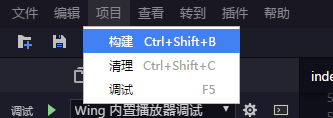

### Engine Installation

Download [Egret Engine](http://www.egret.com/products/engine.html),（You can refer to：[Installation and Deployment](../../../Engine2D/projectConfig/installation/README.md)）。

### Development Tool Installation

Open Egret Launcher and see the login screen, shown as below:

You will see the main interface of Egret Launcher after login.

### Create Project

1、Click the menu `Project` -> `Create Project` to create the project, shown as below:

You can also select `Import Project` to import an existing project.

2、In the new project panel, set the basic configurations of the project, shown as below:

* Project Name
The name of the current project, such as HelloWorld.

* Project Path
The file path of the project is stored.

* Project Type
The project of the project, such as Egret game project, and Egret EUI project.

* Engine Version
  The egret version of the current project use.

* Select extension library.
The required system library of project. For more introduction of extension library selection please refer to:[Extension Library Introduction](../../../Engine2D/projectConfig/extendRepSummary/README.md)

* Stage Size
The height and width of the stage by default, pixel as unit.

* Scaling Mode
  Select showALL mode for screen adaption mode. More introduction on scaling mode you can refer to: [Screen Adaption](../../../Engine2D/screenAdaptation/screenAdaptation/README.md)
	
* Rotation Mode
	Select auto mode for screen rotation mode. More introduction on rotation settings please refer to: [Screen Adaption](../../../Engine2D/screenAdaptation/screenAdaptation/README.md)

Click `Create` to create Hello World project.

You can open an manage the project in Egret Launcher.

### Project Structure

In the left side of Egret Wing, you can see the directory structure of the current project:

Folder function description:
* .wing: it includes task configuration file and startup configuration file of Egret project.
* Egret Wing project configuration file.
* bin-debug：This directory is used to store the files from project debug.
* libs：Library file, includes Egret core library and other extension library are all stored in this directory.
* resource：The project resource files are stored in this directory.
* scripts：The script files of project construction and release are stored in this directory.
* src：Project code file is stored in this directory.
* template：The project template file is stored in this directory.
* egretProperties.json：The configuration file of the project. For specific configuration instructions please refer to: [EgretProperties Instruction](../../../Engine2D/projectConfig/configFile/README.md)
* index.html：Entry file. For specific configuration instructions please refer to：[Entry file instructions](../../../Engine2D/projectConfig/indexFile/README.md)
* manifest.json：Web page list file。
* tsconfig.json：typescript Compile the configuration file.

### Run the project

Click the menu "Project" -> "construct" to compile the project, shown as below:

Click "Project" -> "Debug" in menu after construction completed and run the project, shown as below:

