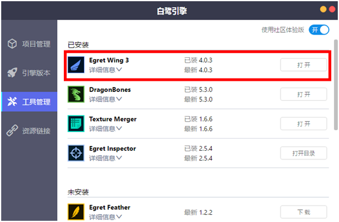
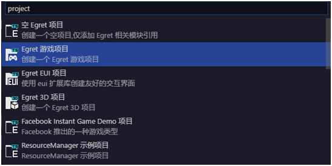

### Install the engine

Download [Egret Engine](http://www.egret.com/products/engine.html), (refer to: [Installation and Deployment] (../../../Engine2D/projectConfig/installation/README.md)).

### Install the development tools

Open Egret Launcher, switch to the Tools Management tab, and click Install Egret Wing, as shown below.

### Create project

1. Open the Egret Wing, click the menu ""File"" -> ""New Project"" to create the project, as shown below.

2. Select ""Egret game project"" to create a project with a game template, as shown below.

3. In the new project panel that pops up, set the basic configuration of the project, as shown below.

* Project name 
The name of the current project, such as HelloWorld.

* Project path
The file path to which the project is stored.

* Extension library selection
The system library to be used in the project.

* Stage width and height
 The height and width of the default game stage are in pixels.

* Engine version number
  	  
  The version of the Egret used by the current project.
  	  
* Stage background color
	
	The default background color displayed by the stage.

* Zoom mode
  The screen's adaptation mode. Here please choose showALL mode.For more information about the zoom mode, please refer to: [Zoom Mode and Rotation Mode Description] (../../../Engine2D/screenAdaptation/explanation/README.md)
	
* Rotatation settings
	
	The screen rotation mode, here please select auto mode. For more information about rotation settings, please refer to: [Zoom mode and rotation mode description](../../../Engine2D/screenAdaptation/explanation/README.md)

Click OK to create the Hello World project.

### Project structure

On the left side of Egret Wing, you can see the directory structure of the current project :

Description of each folder function
* bin-debug: When the project is debugged, the resulting files are stored in this directory.
* libs: library files, including Egret core libraries and other extension libraries, which is stored in this directory.
* promise: promise support library files are stored in this directory.
* resource: The project resource file is stored in this directory.
* src: The project code file is stored in this directory.
* template: The project template file is stored in this directory.

* egretProperties.json: The project's configuration file.For the instructions on specific configuration, please refer to: [EgretProperties Description](../../../Engine2D/projectConfig/configFile/README.md)
* tsconfig.json: typescript compiles the configuration file.
* wingProperties.json: Egret Wing project configuration file.
* index.html: entry file.For the instructions on specific configuration, please refer to: [Entry document description](../../../Engine2D/projectConfig/indexFile/README.md)

### Run the project

Click on the menu ""Project"" -> ""Build"", compile the project, as shown below.

After the construction is completed, click the menu "Project" -> "Debug", run the project, as shown below.

