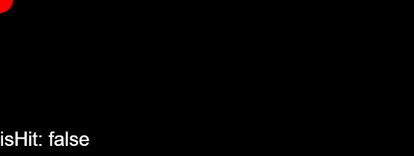

The pixel collision detection is to judge whether or not the pattern (non-transparent area) of the display object intersects with one point.Also use the `hitTestPoint ()` method, with the usage as follows:

```
var isHit:boolean = shp.hitTestPoint( x: number, y:number, true:boolean );
```

Compared with the rectangular collision detection, the third parameter `true` is added to indicate the use of pixel collision detection.

* Example code 1:

```
var shp:egret.Shape = new egret.Shape();
shp.graphics.beginFill( 0xff0000 );
shp.graphics.drawRect( 0,0,100,100);
shp.graphics.endFill();
shp.width = 100;
shp.height = 100;
this.addChild( shp );

var isHit:boolean = shp.hitTestPoint( 10, 10, true );
this.infoText.text = "isHit: " + isHit;
```

The effect of the code after operation is the same as that of the rectangular collision detection, as shown in Figure:


* Example code 2:

```
var shp:egret.Shape = new egret.Shape();
shp.graphics.beginFill( 0xff0000 );
shp.graphics.drawCircle( 0, 0, 20);
shp.graphics.endFill();
shp.width = 100;
shp.height = 100;
this.addChild( shp );

var isHit:boolean = shp.hitTestPoint( 25, 25, true );
this.infoText.text = "isHit: " + isHit;
```

After compiling and debugging, the effect is as follows:

  

The result of the collision returned in the text is displayed as `false`, indicating that no collision has occurred and is different from the result of rectangle collision detection.

This is because the rectangular collision detection is to judge whether or not the bounding box of the display object intersects with one point, and the pixel collision detection determines whether or not the pattern (non-transparent area) of the display object intersects with one point.

> Massive use of pixel collision detection will consume more performance