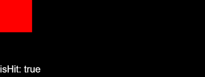

Collision detection, which determines whether the display object intersects with one point.

Rectangle collision detection is to determine whether the bounding box of the display object intersects with one point.

Egret provides the `hitTestPoint ()` method for collision detection, and the usage of rectangular collision detection is:

```
var isHit:boolean = shp.hitTestPoint( x: number, y:number );
```

`shp` is the display object to be detected, and (x, y) is the position of the point to be detected.If a collision occurs, the method will return `true`; it will return` false` if no collision occurs.

* Example code 1:

```
class HitTest extends egret.DisplayObjectContainer
{
   public constructor()
   {
       super();
       this.addEventListener(egret.Event.ADDED_TO_STAGE,this.onAddToStage,this);
   }

   private onAddToStage(event:egret.Event)
   {
       this.drawText();

       var shp:egret.Shape = new egret.Shape();
       shp.graphics.beginFill( 0xff0000 );
       shp.graphics.drawRect( 0,0,100,100);
       shp.graphics.endFill();
       shp.width = 100;
       shp.height = 100;
       this.addChild( shp );

       var isHit:boolean = shp.hitTestPoint( 10, 10 );
       this.infoText.text = "isHit: " + isHit;	 + isHit;

   }

   private infoText:egret.TextField;
   private drawText()
   {
       this.infoText = new egret.TextField();
       this.infoText.y = 200;
       this.infoText.text = "isHit";	;
       this.addChild( this.infoText );
   }
}
```

After compiling and debugging, the effect is as follows:



The result of the collision returned in the text is displayed as `true`, indicating that a collision has occurred.

* Example code 2:

```
class HitTest extends egret.DisplayObjectContainer
{
   public constructor()
   {
       super();
       this.addEventListener(egret.Event.ADDED_TO_STAGE,this.onAddToStage,this);
   }

   private onAddToStage(event:egret.Event)
   {
       this.drawText();

       var shp:egret.Shape = new egret.Shape();
       shp.graphics.beginFill( 0xff0000 );
       shp.graphics.drawCircle( 0, 0, 20);
       shp.graphics.endFill();
       shp.width = 100;
       shp.height = 100;
       this.addChild( shp );

       var isHit:boolean = shp.hitTestPoint( 25, 25 );
       this.infoText.text = "isHit: " + isHit;	 + isHit;
   }

   private infoText:egret.TextField;
   private drawText()
   {
       this.infoText = new egret.TextField();
       this.infoText.y = 200;
       this.infoText.text = "isHit: ";	;
       this.addChild( this.infoText );
   }
}
```

After compiling and debugging, the effect is as follows:


The result of the collision returned in the text is displayed as `true`, indicating that a collision has occurred.

> Note: This point does not intersect with the red circle, but intersects with the bounding box of the red circle.
