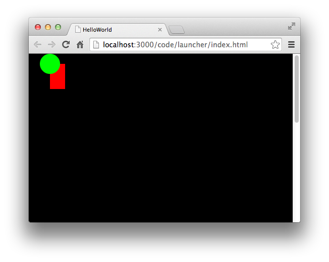

## 说明

* 矩形遮罩，即呈现出来的是方形显示区域而非不规则显示区域。

* 代码定义，将一个矩形数据赋值给显示对象的 `mask` 属性。

~~~
shp.mask = new egret.Rectangle(20,20,30,50); 
~~~

> 如果 rect 发生变化，需要重新将 rect 赋值给 shp.mask。

## 示例
下面一个示例中绘制了两个 Shape 对象，我们对其中一个 Shape 使用矩形遮罩，另外一个 Shape 当做参考。

代码如下：

~~~
class Test extends egret.DisplayObjectContainer
{
    public constructor()
    {
        super();
        this.addEventListener(egret.Event.ADDED_TO_STAGE,this.onAddToStage,this);
    }

    private onAddToStage(event:egret.Event)
    {
        var shp:egret.Shape = new egret.Shape();
        shp.graphics.beginFill( 0xff0000 );
        shp.graphics.drawRect( 0,0,100,100);
        shp.graphics.endFill();
        this.addChild( shp );

        var shp2:egret.Shape = new egret.Shape();
        shp2.graphics.beginFill( 0x00ff00 );
        shp2.graphics.drawCircle( 0,0, 20);
        shp2.graphics.endFill();
        this.addChild( shp2 );
        shp2.x = 20;
        shp2.y = 20;
    }
}
~~~

编译运行后我们可以在浏览器中看到如下效果：

现在对 `shp` 添加遮罩，具体代码如下：

~~~
var rect:egret.Rectangle = new egret.Rectangle(20,20,30,50);  
shp.mask = rect;
~~~

编译并运行，我们可以在浏览器中看到如下效果：

可以从上图中看到效果，原先红色的正方形添加了遮罩后只显示了(20,20,30,50)这部分的图像，其他地方的图像都被隐藏掉了。而未添加遮罩的 `shp2` 依然显示完整
