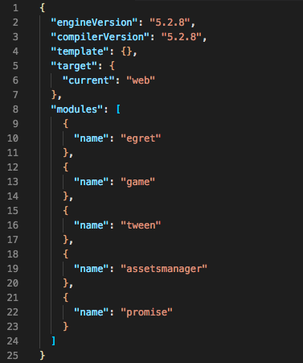

Project under the root folder of famous for `egretProperties.json`  configuration files, configuration are stored in the engine.

### The overall structure



### EngineVersion field

Egret engine version of the project currently used to run the game,

### CompilerVersion field
Project currently used egret command line version, such as performing  `build`,`publish` commands, such as each version is slightly different

### Template field
If this field is present, the release  `Html5` project, will use `template/web/index.html` file for entry. [click to see more details](../tempfile/index.html)

### Target field
Perform  `build` and  `publish`  command of the target type.

* `web`：It compiles into Html5 projects
* `wxgame`：It compiles into a WeChat mini-game project
* `bricks `：Can compile QQ to play a game of items
* `android `：Will compile into an android project
* `iOS`： It compiles into an iOS project

### Modules field

Defines all library files referenced in the project.
Each library is shaped like a  ```{ "name":"moduleName" , "path":"modulePath"}``` configuration information.
```name``` field is the library name.```path``` field is the library file storage path, if there is no this field, take the default values```${EGRET_DEFAULT}```

``` json
{
	"egret_version":"5.2.6",
	"modules":[
		{
			"name":"egret",
		},
		{
			"name":"tween",
			"path":"${EGRET_APP_DATA}/4.0.3"
		},
		{
			"name": "particle",
			"path": "../libsrc"
		},
		{
			"name": "promise",
			"path": "./promise"
		}
	]
}
```

```path``` field can include library file version number

```path``` field corresponds to the path of the possible in the project, can also be outside the project.

*  if you are in a project, the project runtime directly loads the library corresponding to this path.
* If outside the project, the engine compile this path is first library copy of the corresponding to the project's  `libs/modules` folder, and then load the library in this folder.

After modify the configuration of the content, you need to perform  `egret clean` command to build, to ensure that the changes to take effect.
[click to see more](../modelconfig/index.html)

### UrlParams field (supported above 3.1.6)

* For ```egret run```command add URL parameter,

```
{
	"urlParams":{
		"okok":12,
		"id":455464564
	}
}
```
The above configuration, for example, in the execution `egret run`  will open in the browser address:

`http://10.0.4.63:3000/index.html?okok=12&id=455464564`
