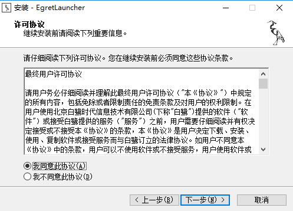
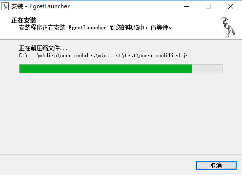
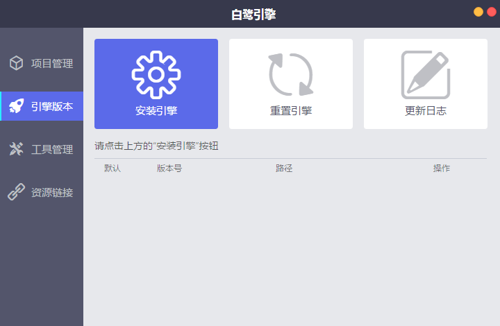
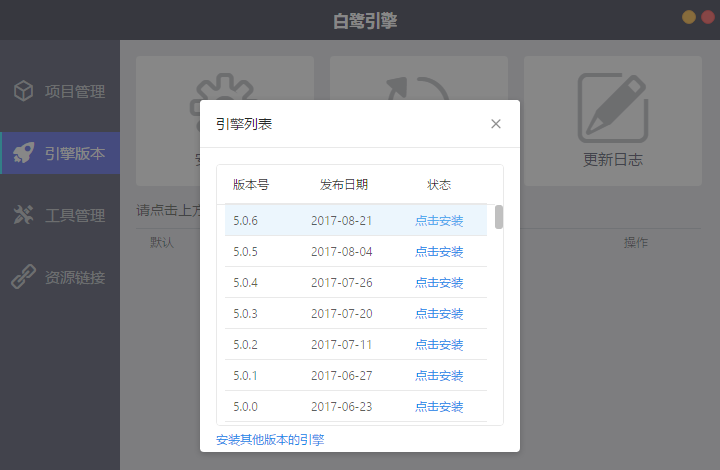
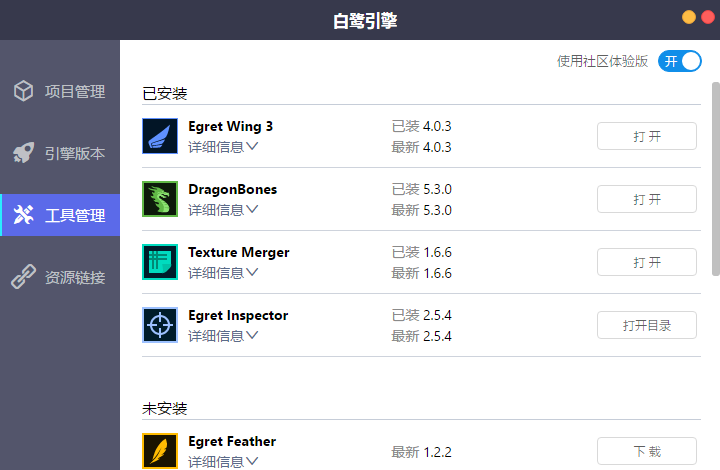

Egret Engine version is divided into two categories: "stable version" and "community experience version". The community experience version is released on a bi-weekly iterative basis.
The following shows the installation and deployment process with Egret Engine v5.0.6.

## Install the engine library management tool (EgretLauncher)

### 1. Download the installation package

Download the Egret one-click installation package corresponding to the operating system from the Egret website [Download Center] [http://egret.com/downloads/engine.html].

### 2. Install under Windows system

EgretLauncher-v0.6.3 downloaded with double-click.

> If warning pops up, please allow it to run

The installation interface is shown below. Click the Next button.

Select "I agree with this agreement", then click the Next button, as shown below:

Click the Next button as shown below:

Click the Install button to start the installation, as shown below:

EgretLauncher starts to install.

After the EgretLauncher installation is completed, click the Finish button.

### 3. Install under Mac OS X system

Download directly after installation, as shown below

## Install the engine and tools

Open EgretLauncher, select the "Engine version" tab, as shown below.

Select the 5.0.6 version of the engine, click Install, as shown below.

The engine has been installed.

Select the "Tools Management" tab to download and install the development tools, as shown below.

