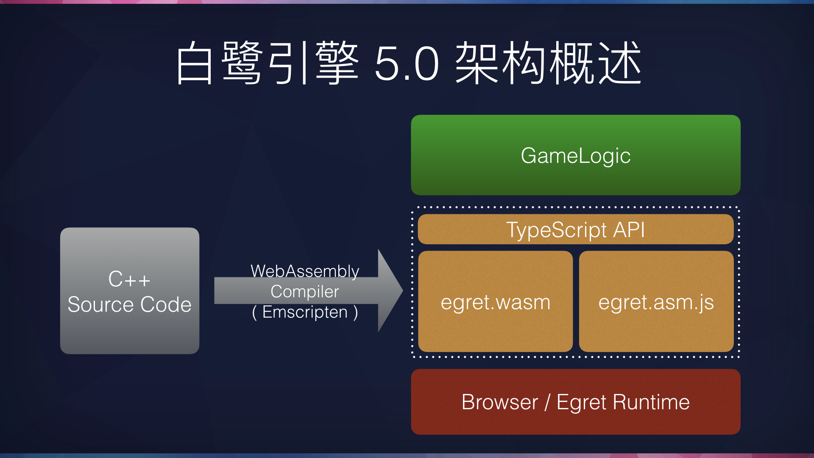

## WebAssembly Intro

WebAssembly is whole new format with portable, small, fast-loading and Web-compatible features, also a new specification established by W3C community group consisting of mainstream browser companies.

Currently, WebAssembly use C++ as development language, and publish it as .wasm format through Emscripten SDK. Codes that runs in this format will have a significant performance boost than traditional js files.

## Browser Support

In March, 2017, the four major mainstream browser companies announce that their latest version browsers all support WebAssembly, which are Chrome 57、FireFox 52、Safari TP and Microsoft Edge.

If your browser does not support WebAssembly, you can publish C++ codes as asm.js format through Emscripten SDK, this format is able to run in all browsers and has a better performance than traditional .js files.

For now there is a BUG in Android Chrome 58, which leads to a running crash for most of .wasm programs, please install Chrome 57 or Chrome 60 for test.

## Egret Engine and WebAssembly

Considering that most of the Egret Engine developers are JavaScript developer，Egret Engine 5.0 is designed to take the engine core as a .wasm library, with TypeScript API providing at the upper layer, developers are able to use TypeScript to develop instead of directly contacting C++ logic.

The release of WebAssembly does not mean that the Egret Engine has abandoned 4.x based JavaScript version renderer. For the next six months, we will provide the same support effort to JavaScript version and WebAssembly version to ensure that the existing 4.x-based games can still receive technical support from the Egret Engine without update the renderer.

## Usage of Egret Engine WebAssembly Version

* Download and install Egret engine 5.0 new launcher through [Here](https://www.egret.com/products/engine.html).
* Install engine 5.0 version and set it as default version after downloading the launcher.
* Click to create new project in project management, and select WebAssembly demo project in project type selection.
* Egret Wing will auto started after successful creation, and you can directly run this project.

## Development Suggest

* Currently since the operating environment of WebAssembly is not popular in China, and except Chrome’s latest browser, all projects created with the WebAssembly version will fall back to the asm.js mode. However, comparing to JavaScript renderer performance of Egret Engine 4.x, they has a lot of performance improvements.
* WebAssembly currently reports an error when creating an object at a static variable declaration of a class. For example, `public static display = new egret.DisplayObject();` such code will report an error. We recommend you to write the assignment of this static variable to an initialization function and call the initialization function in the constructor of the document class.

## Memory Management
* WebAssembly will request a memory block at Egret engine starts, and all WebAssembly objects are maintained in this memory block. And you can configure the size of the requested memory in runEgret’s wasmSize parameter of inde.html, the default size is 128MB. We recommend you to set based on the actual project situation, if the WebAssembly memory is insufficient, the program will have an instant crash.
* We add dispose method for object destruction in display objects and filters in WebAssembly. Since the WebAssembly side object must be actively released, so you need to actively call the dispose method when you want the object to garbage collected.

