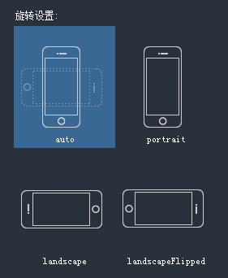
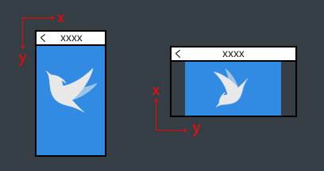

Screen adaptation includes scaling adaptation and rotation adaptation.

## 1. Zoom mode

Different scaling modes may be required. depending on the specific project requirements. 

Egret currently supports the following modes: `showAll`, `noScale`, `noBorder`, `exactFit`, `fixedWidth`, `fixedHeight`, `fixedNarrow` and `fixedWide`.

There are two ways to set the zoom mode:

1. Modify the `data-scale-mode` attribute in the index.html file.

2. Modify in the project code at any time, with the modification method as follows:

```
this.stage.scaleMode = egret.StageScaleMode.SHOW_ALL;
```

As shown below, the meaning of various zoom modes is illustrated with the following figure.

This example uses a 600 * 600 image emmad.jpg.The original image shows:


In the index.html file, modify the default stage size to 600 * 600:

```
data-content-width="600"	600
data-content-height="600"	600
```

### 1.1 showAll mode
In the index.html file, set ```data-scale-mode =" showAll "```
Or write in the project code
```
this.stage.scaleMode = egret.StageScaleMode.SHOW_ALL;

```

The display effect of showAll adaptation mode:


showAll mode schematic diagram:


The showAll mode is to keep the aspect ratio, showing the entire contents.After scaling, the contents of the application fill the player window in a narrower direction, so the two sides of the other direction may be left with black borders because they are not wide enough.
In this mode, the stage size (stage.stageWidth, stage.stageHeight) is always equal to the content size of the application introduced externally.

showAll is a common pattern.

### 1.2 noScale mode
In the index.html file, set ```data-scale-mode="noScale"```
Or write in the project code
```
this.stage.scaleMode = egret.StageScaleMode.NO_SCALE;
```

The display effect of noScale adaptation mode:


noScale mode schematic diagram:


The noScale mode does not scale any of the content, keeps the original 1:1 ratio, and then aligns the stage directly to the top left corner of the browser.Even if you change the player window size, it remains the same.If the player window is smaller than the content, some cropping may be made.
In this mode, the stage size (stage.stageWidth, stage.stageHeight) always matches the size of the player window.

### 1.3 noBorder mode
In the index.html file, set ```data-scale-mode="noBorder"```
Or write in the project code
```
this.stage.scaleMode = egret.StageScaleMode.NO_BORDER;
```

noBorder mode display:


noBorder mode schematic diagram:


The noBorder mode will scale the content according to the size of the screen. After scaling the contents of the application to fill the player window in a wider direction, there will be no black edges, and the two sides of the other direction may be cut if they are beyond the player window. Only the middle part will be shown.
In this mode, the stage size (stage.stageWidth, stage.stageHeight) is always equal to the content size of the application introduced externally.

### 1.4 exactFit mode
In the index.html file, set ```data-scale-mode="exactFit"```
Or write in the project code
```
this.stage.scaleMode = egret.StageScaleMode.EXACT_FIT;
```

The display effect of the exactFit mode:


exactFit pattern schematic diagram:


The exactFit mode does not zoom in/out the application content by keeping the original aspect ratio. After the scaling, the application contents just fill the player window.In short, it is directly stretched not in accordance with the proportion of the original content, with violence filled on the entire screen.
In this mode, the stage size (stage.stageWidth, stage.stageHeight) is always equal to the content size of the application introduced externally.

### 1.5 fixedWidth mode
In the index.html file, set ```data-scale-mode="fixedWidth"```
Or write in the project code
```
this.stage.scaleMode = egret.StageScaleMode.fixedWidth;
```

The display effect of fixedWidth mode:


fixedWidth Schematic diagram:


The fixedWidth mode is to scale application content by keeping the original aspect ratio. After scaling, the application content fills the player window both horizontally and vertically. However, it only keeps the original width of the application content unchanged and the height may change.
In this mode, the stage width (stage.stageWidth) is always equal to the width of the application content introduced externally.The stage height (stage.stageHeight) is determined by the current zoom ratio and the player window height.

### 1.6 fixedHeight mode

In the index.html file, set ```data-scale-mode="fixedHeight"```
Or write in the project code
```
this.stage.scaleMode = egret.StageScaleMode.fixedHeight;
```

The display effect of fixedHeight:


fixedHeight mode schematic diagram:


The fixedHeight mode is to scale application content by keeping the original aspect ratio. After scaling, the application content fills the player window both horizontally and vertically. However, it only keeps the original height of the application content unchanged and the width may change.
In this mode, the stage height (stage.stageHeight) is always equal to the height of the application content introduced externally at the time of initialization.The stage width (stage.stageWidth) is determined by the current zoom ratio and the player window width.

### 1.7 fixedNarrow mode
In the index.html file, set ```data-scale-mode =" fixedNarrow "```
Or write in the project code
```
this.stage.scaleMode = egret.StageScaleMode.fixedNarrow;
```

fixedNarrow mode display:


Scale the contents of the application by maintaining the original aspect ratio. After scaling, the application content fills the player viewport horizontally and vertically, and the narrower orientation of the application content may be filled because it is not wide enough.
In this mode, the stage height (Stage.stageHeight) and the stage width (Stage.stageWidth) are determined by the current zoom ratio and the player viewport width.

### 1.8 fixedWide mode
In the index.html file, set ```data-scale-mode="fixedWide"```
Or write in the project code
```
this.stage.scaleMode = egret.StageScaleMode.fixedWide;
```

fixedWide mode display:


Scale the contents of the application by maintaining the original aspect ratio. After scaling, the application content fills the player viewport horizontally and vertically, and the two sides of the wider orientation of the application content may be cut because it is beyond the player viewport.
In this mode, the stage height (Stage.stageHeight) and the stage width (Stage.stageWidth) are determined by the current zoom ratio and the player viewport width.

> fixedNarrow mode and fixedWide mode, which can be understood as the advanced package of fixedWidth and fixedHeight, have similar display effect similar to that of the latter two modes. However, the direction determining the zoom ratio is not fixed, instead, it is determined by the distance from the content to the edge of the screen.In these two modes, UI layout can be made easily.

## 2. Rotation mode

By setting the rotation mode, you can change the content according to the requirements when the browser rotates due to gravity sensing.



You can modify the `data-orientation` attribute in the body section of index.html

You can also modify in the project code at any time. For example:
```
this.stage.orientation = egret.OrientationMode.AUTO;
```

There are currently four kinds of rotation modes.

### 2.1.auto mode


auto mode: regardless of horizontal or vertical screen, content is displayed from top to bottom.

### 2.2. portrait mode

portrait mode: the display of content always starts from the upper left corner of the phone in the vertical state

### 2.3. landscape mode

Similar to that of the portrait mode, the landscape mode always displays content from the upper right corner of the phone in the vertical state.

### 2.4.landscapeFlipped mode

landscapeFlipped mode is more special, which has the same starting point as that of landscape in the horizontal screen state, but has different starting point from that of landscape in the vertical state, changing from the top right into the lower left.

landscape and landscapeFlipped, the two models, are generally used for horizontal screen games, but need to prompt the user to turn off the gravity sensor lock, so as to lock the screen direction.