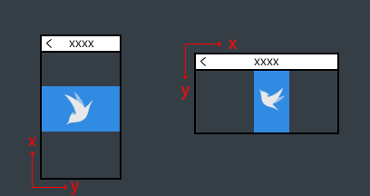

## 2.Rotation Mode

By setting the rotation mode, the content of screen will change when the browser rotates due to gravity.


You can modify the  `data-orientation` property in the body section of index.html

It can also be modified at any time in the project code, such as:
```
this.stage.orientation = egret.OrientationMode.AUTO;
```

There are currently 4 rotation modes.

### 2.1.Auto mode


auto mode: whether it's landscape or portrait screen, the screen content is displayed from top to bottom.

### 2.2.Portrait mode

Portrait mode: it always display content by taking the upper left corner of the phone as start point in portrait mode.

### 2.3.Landscape mode

The landscape mode is similar to the portrait mode, it always display content by taking the upper right corner of the phone as start point in portrait mode.

### 2.4.LandscapeFlipped mode

the landscapeFlipped mode is relatively special, the start point in landscape screen mode is same with landcape, but the start point in portrait screen is opposite to the landscape, it changes from the upper right to the lower left.

The landscape and landscapeFlipped modes are generally used for landscape screen games, but you need to prompt user to turn off the gravity sensor lock and lock the screen orientation.