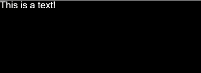
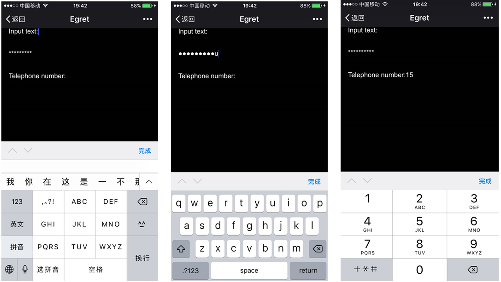
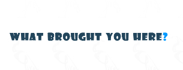

Egret offers three different text types.

## 1. Plain text

Ordinary text is the type of text used to display standard text content.

The `egret.TextField` class represents the text type, using the following example:

```
var label:egret.TextField = new egret.TextField(); 
label.text = "This is a text!"; 
this.addChild( label );
```

Running result:



The `egret.TextField` class contains the` text` attribute, which is the display content of the current text.

## 2. Enter the text

The input text is a text type that allows the user to enter.

Set the text box to following code that can be entered:

```
var txInput:egret.TextField = new egret.TextField;
txInput.type = egret.TextFieldType.INPUT;
txInput.width = 282;
txInput.height = 43;
txInput.x = 134;
txInput.y = 592;
txInput.textColor = 0x000000;
/// Note: _container is a pre-built display container, ie egret.Sprite, and has been added to the display list
this._container.addChild(txInput);
```

The key code is to set its type to `INPUT`.

* `setFocus()` method

The input text has the `setFocus ()` method, which is designed to make the input text to get the focus, using the following method:

```
var textIput:egret.TextField = new egret.TextField();
textIput.type = egret.TextFieldType.INPUT;
this.addChild(textIput);

var button:egret.Shape =  new egret.Shape();
button.graphics.beginFill(0x00cc00);
button.graphics.drawRect(0,0,100,40);
button.graphics.endFill();
button.y = 50;
this.addChild(button);
button.touchEnabled = true;
button.addEventListener(egret.TouchEvent.TOUCH_BEGIN,(e) => {
        textIput.setFocus();
    }, this);
```

Here you create an input text and a button. In the button's touch event callback function,  call the `setFocus ()` method of the input text.

* Set the input style

There are three input styles for input text: ordinary text (default), password and phone number. Set different types of input styles, the popup panel on the mobile phone is different. When setting the password style input, password is displayed. When setting phone number style input, the digital input panel is popped up on the mobile phone.

To set the input text style, first set the `TextFieldType` of `egret.TextField` to the `INPUT` type. And then set the `inputType` attribute of `egret.TextField`.

```
var text:egret.TextField = new egret.TextField();
text.type = egret.TextFieldType.INPUT;
//Set the style of the input text as text
text.inputType = egret.TextFieldInputType.TEXT;
text.text = "Input text:";
text.width = 300;
this.addChild(text);

var pass:egret.TextField = new egret.TextField();
pass.type = egret.TextFieldType.INPUT;
//set the input text to be displayed as password
pass.inputType = egret.TextFieldInputType.PASSWORD;
//set the password display
pass.displayAsPassword = true;
pass.text = "Password";
pass.y = 100;
pass.width = 300;
this.addChild(pass);

var tel:egret.TextField = new egret.TextField();
tel.type = egret.TextFieldType.INPUT;
//set the input phone number style
tel.inputType = egret.TextFieldInputType.TEL;
tel.text = "Telephone number:"
tel.y = 200;
tel.width = 300;
this.addChild(tel);
```



The final effect is shown as above. Under the input text default style, the default input method pops up; under the password style, the English input method pops up; under the phone number style, the numeric keypad pops up.

## 3.Bitmap text

Bitmap text is a text type rendered based on the bitmap font.

`egret.BitmapText` class represents the bitmap text type.

The use of methods is as follows:
* Load the bitmap font file
* Assign the loaded font object to the `font` attribute of `egret.BitmapText`.

Example is as follows:

```
class Main extends egret.DisplayObjectContainer {

    public constructor() {
        super();
        this.once( egret.Event.ADDED_TO_STAGE, this.onAddToStage, this );
    }

    private onAddToStage( evt:egret.Event ) {
        RES.getResByUrl( "resource/cartoon-font.fnt", this.onLoadComplete, this, RES.ResourceItem.TYPE_FONT );
    }

    private _bitmapText:egret.BitmapText;
    private onLoadComplete( font:egret.BitmapFont ):void {
        this._bitmapText = new egret.BitmapText();
        this._bitmapText.font = font;
        this._bitmapText.x = 50;
        this._bitmapText.y = 300;
        this.addChild( this._bitmapText );
    }
}
```

Running result:



