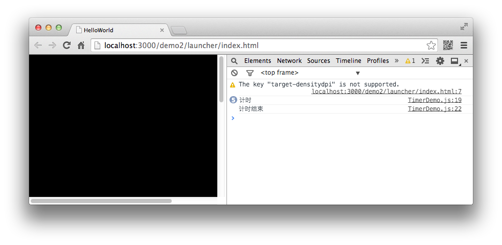
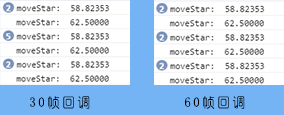

## 1. Timer 

Suppose there is such a need: the game design a countdown function, requiring players to operate the game within 30 seconds and to meet certain requirements before going to next step. 

In this requirement, a countdown function is required, and the timer `Timer` is provided in Egret to implement a similar function.

`Timer` has two attributes, three methods and two events.

The two attributes are `delay` and `repeatCount`, respectively representing the time of each interval (in milliseconds) and the number of executions (if the number of times is 0, then it represents continuous implementation).

The three methods are `start`, `reset` and `stop`.The role is to start timing, re-timing and pause timing.

The two events are `TimerEvent.TIMER` and `TimerEvent.TIMER_COMPLETE` respectively.They are triggered during the timing process and at the end of the timing.

Example demo:

```
class TimerDemo extends egret.DisplayObjectContainer
{
    public constructor()
    {
        super();
        //Create a timer object
        var timer:egret.Timer = new egret.Timer(500,5);
        //Register the event listener
            timer.addEventListener(egret.TimerEvent.TIMER,this.timerFunc,this);
        timer.addEventListener(egret.TimerEvent.TIMER_COMPLETE,this.timerComFunc,this);
        //Timing starts
        timer.start();
    }
    private timerFunc()
    {
        console.log("计时");
    }
    private timerComFunc()
    {
        console.log("Timing ends");	);
    }
}
```

Run after compilation, with the effect shown as below:



## 2. Ticker heartbeat

`startTick` (stop corresponding to `stopTick`) global function will callback function at the rate of 60 frames.It is different from the `ENTER_FRAME` event. As`ENTER_FRAME` is the callback per frame, change of frame rate will change the callback speed; as `startTick` is the timing callback, change of frame rate will not affect the callback speed.

Sample code:

```
class startTickerTest extends egret.DisplayObjectContainer {
    public constructor() {
        super();
        this.once(egret.Event.ADDED_TO_STAGE,this.onLoad,this);
    }

    private star:egret.Bitmap;
    private speed:number = 0.05;

    private time:number = 0;
    
    private onLoad(event:egret.Event) {
        var star:egret.Bitmap = new egret.Bitmap(RES.getRes("star"));
        this.addChild(star);
        this.star = star;
        this.time = egret.getTimer();
        egret.startTick(this.moveStar,this);
    }

    private moveStar(timeStamp:number):boolean {
        var now = timeStamp;
        var time = this.time;
        var pass = now - time;
        console.log("moveStar: ",(1000 / pass).toFixed(5));

        this.time = now;
        return false;
    }

}
```



The `startTick` function has two incoming parameters. The first parameter is a callback function that requires a return value. If `true` is returned, it will be redrawn immediately after the callback function is executed. If `false` is returned, it will not be redrawn.The second parameter is `this` object, which is usually passed in `this`.

Modify the code in the callback function, shown as below:
```
private moveStar(timeStamp:number):boolean {
    var now = timeStamp;
    var time = this.time;

    var pass = now - time;

    console.log("moveStar: ",(1000 / pass).toFixed(5));

    this.star.x += this.speed * pass;
    if(this.star.x > 300)
        egret.stopTick(this.moveStar,this);

    this.time = now;
    return false;
}
```

Will get the effect similar to the above.The callback function of the `startTick` function will take a parameter, which is the time it takes to execute.

> Also it needs to noted that the global function `getTimer()`  in the above code can obtain the time (in milliseconds) for starting the global Egret frame.

## 3. Frame events

The frame event `ENTER_FRAME` is called at the beginning of the next frame.So its callback rate is related to the frame rate.The following code tests the performance at different frame rates:

```
class startTickerTest extends egret.DisplayObjectContainer {
    public constructor() {
        super();
        this.once(egret.Event.ADDED_TO_STAGE,this.onLoad,this);
    }
    private timeOnEnterFrame:number = 0;
    
    private onLoad(event:egret.Event) {
        this.addEventListener(egret.Event.ENTER_FRAME,this.onEnterFrame,this);
        this.timeOnEnterFrame = egret.getTimer();
    }
    
    private  onEnterFrame(e:egret.Event){  
        var now = egret.getTimer();
        var time = this.timeOnEnterFrame;
        var pass = now - time;
        console.log("onEnterFrame: ", (1000 / pass).toFixed(5));
        this.timeOnEnterFrame = egret.getTimer();
    }
}
```

When it is modified to different frame rates, the results are different:


A simple animation effect can be completed just by modifying the parameter of the display object in the callback function of `ENTER_FRAME`.

First, prepare and configure the following material in the resource management:


Sample code:

```
private star:egret.Bitmap;
//set the moving speed of the animation
private speed:number = 0.05;
private timeOnEnterFrame = 0;

private onLoad(event:egret.Event) {

    var star:egret.Bitmap = new egret.Bitmap(RES.getRes("star"));

    this.addChild(star);

    this.star = star;

    this.addEventListener(egret.Event.ENTER_FRAME,this.onEnterFrame,this);
    this.timeOnEnterFrame = egret.getTimer();
}

private  onEnterFrame(e:egret.Event){

        var now = egret.getTimer();
        var time = this.timeOnEnterFrame;

        var pass = now - time;
        //console.log("onEnterFrame: ", (1000 / pass).toFixed(5),pass);
        this.star.x += this.speed*pass;
        this.timeOnEnterFrame = egret.getTimer();

        if(this.star.x > 300)
            this.removeEventListener(egret.Event.ENTER_FRAME,this.onEnterFrame,this);
}
```

>Achieving displacement by calculating time interval will make the animation look more smooth, because the time interval of each frame is not fixed.
