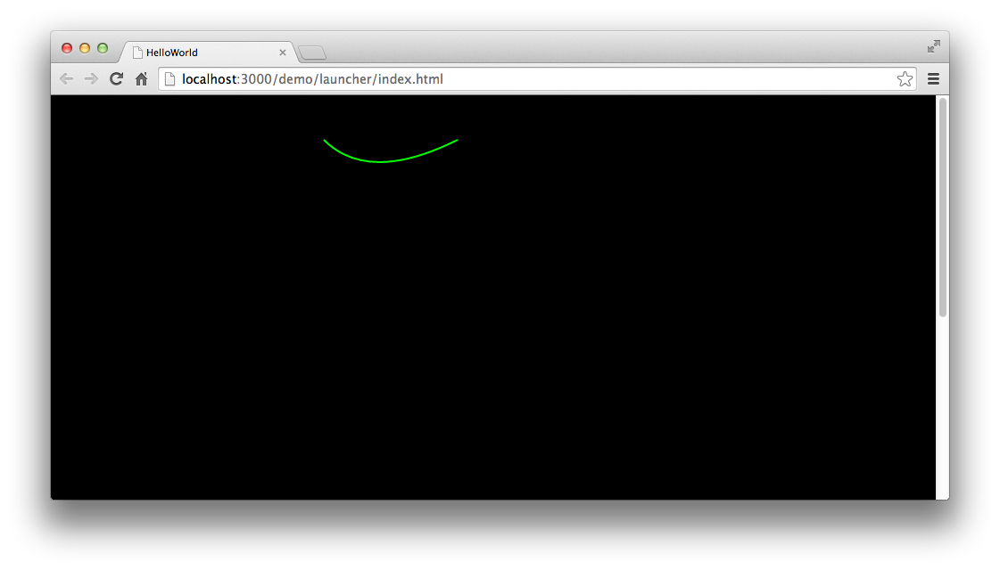
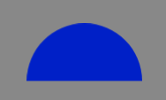
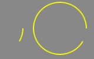
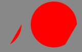
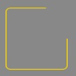

The Egret encapsulates  `Graphics` class implements vector drawing function, can draw a rectangle, circle, line, curve, arc, etc. The basic and advanced USES of the vector drawing feature are described below.

## 1.Draw a rectangle

`Graphics` class encapsulation methods cannot be used directly, but need to use in the display object.And some display objects（such as  `Shape` and `Sprite` ）has been included in the drawing method, so it can be shown directly calling these methods for drawing objects.

The following code to  `Shape` object, for example, draw a rectangle:

```
class GraphicsTest extends egret.DisplayObjectContainer
{
    public constructor()
    {
        super();
        this.addEventListener(egret.Event.ADDED_TO_STAGE,this.onAddToStage,this);
    }
    private onAddToStage(event:egret.Event)
    {
        var shp:egret.Shape = new egret.Shape();
        shp.graphics.beginFill( 0xff0000, 1);
        shp.graphics.drawRect( 0, 0, 100, 200 );
        shp.graphics.endFill();
        this.addChild( shp );
    }
}
```

Run after compilation, the effect is as follows:


The core drawing code in this code is the following three lines:

```
shp.graphics.beginFill( 0xff0000, 1); 
shp.graphics.drawRect( 0, 0, 100, 200 ); 
shp.graphics.endFill();
```

Visit `shp`   `graphics` property returns a  `Graphics` object, this object operation method of drawing the drawing can be realized.

All  `beginFill()` method set the fill color of the rectangle, it sets the fill color to red (color value 0 xff0000), at the same time will `alpha`  is set to 1, said completely opaque.

Call `drawRect()` method to set the size and location of the rectangle, the former two parameters respectively, the top left corner of the rectangular X and Y coordinates （relative to the  `shp` anchor point calculation), after the two parameters for the width and height of the rectangular respectively, here at point (0, 0) to draw a rectangular 100 * 200.

Call `endFill()` method over the current draw () operation.

If you want to add stroke to rectangular, need to set the style of line, through `lineStyle()` method.

The first parameter of this method is the line width of the stroke, and the second parameter is the color of the stroke.

Add a line to the drawing code:

```
shp.graphics.lineStyle( 10, 0x00ff00 );
```

The modified code is as follows:

```
class GraphicsTest extends egret.DisplayObjectContainer
{
    public constructor()
    {
        super();
        this.addEventListener(egret.Event.ADDED_TO_STAGE,this.onAddToStage,this);
    }
    private onAddToStage(event:egret.Event)
    {
        var shp:egret.Shape = new egret.Shape();
        shp.x = 20;
        shp.y = 20;
        shp.graphics.lineStyle( 10, 0x00ff00 );
        shp.graphics.beginFill( 0xff0000, 1);
        shp.graphics.drawRect( 0, 0, 100, 200 );
        shp.graphics.endFill();
        this.addChild( shp );
    }
}
```

Compile and run, the effect is as follows:


## 2.Draw a circular

The method of drawing circle is similar to drawing rectangle, you just need to change `drawRect()` methods to `drawCircle()` methods。

```
drawCircle( x:number, y:number, radius:number): void
```

methods like  `drawCircle()`  method takes three parameters, the first argument for the X coordinate of the center of the circle the second parameter for the Y coordinate of the center of the circle radius is the third parameter.

>Note：the X axis and Y axis of center position is relative to the `Shape` calculated anchor point of the object.

The following code example draws a circle with a radius of 50 pixels:

```
class GraphicsTest extends egret.DisplayObjectContainer
{
    public constructor()
    {
        super();
        this.addEventListener(egret.Event.ADDED_TO_STAGE,this.onAddToStage,this);
    }
    private onAddToStage(event:egret.Event)
    {
        var shp:egret.Shape = new egret.Shape();
        shp.x = 100;
        shp.y = 100;
        shp.graphics.lineStyle( 10, 0x00ff00 );
        shp.graphics.beginFill( 0xff0000, 1);
        shp.graphics.drawCircle( 0, 0, 50 );
        shp.graphics.endFill();
        this.addChild( shp );
    }
}
```

Compile and run, the effect is as follows:


## 3.Draw a straight line

Using Graphics drawing a straight line need to use two methods: `moveTo()` and  `lineTo()`，they input parameters is a sitting values.`moveTo()` is responsible for drawing a straight line starting point,`lineTo()` is responsible for drawing the end of the line.

```
moveTo( x:number, y:number): void
lineTo( x:number, y:number): void
```

Before drawing a straight line, need to set the style of line, set `lineStyle()` method:

```
shp.graphics.lineStyle( 2, 0x00ff00 );
```

Then use the `moveTo()` to set the starting point of line, use `lineTo()` to set the end of the line. The complete code is as follows:

```
class GraphicsTest extends egret.DisplayObjectContainer
{
    public constructor()
    {
        super();
        this.addEventListener(egret.Event.ADDED_TO_STAGE,this.onAddToStage,this);
    }
    private onAddToStage(event:egret.Event)
    {
        var shp:egret.Shape = new egret.Shape();
        shp.graphics.lineStyle( 2, 0x00ff00 );
        shp.graphics.moveTo( 10,10 );
        shp.graphics.lineTo( 100, 20 );
        shp.graphics.endFill();
        this.addChild( shp );
    }
}
```

Run after compiling, the effect is as follows:


It is also possible to draw a number of straight lines end to end continuously to form a broken line. The code is as follows:

```
var shp:egret.Shape = new egret.Shape();

shp.graphics.lineStyle( 2, 0x00ff00 );

shp.graphics.moveTo( 68, 84 );

shp.graphics.lineTo( 167, 76 );

shp.graphics.lineTo( 221, 118 );

shp.graphics.lineTo( 290, 162 );

shp.graphics.lineTo( 297, 228 );

shp.graphics.lineTo( 412, 250 );

shp.graphics.lineTo( 443, 174 );

shp.graphics.endFill();

this.addChild( shp );
```

>Draw the line, without repeated use `moveTo()` method， continuous use `lineTo()` method.

Run after compilation, the effect is as follows:


## 4.Draw the curve
The curve drawing in Egret is the "quadratic Bessel curve", and the diagram below is the structure diagram of the "quadratic Bessel curve", in which P0 is the starting point, P1 is the control point and P2 is the terminal point.


In the curve plotting, need to use  `Graphics`    `curveTo()`  method.

```
curveTo( x1:number, y1:number, x2:number, y2:number ): void
```

`curveTo()` method to set up the four parameters, the first two parameters are the position of the control points (P1), after the location of the two parameters is the finish (P2).

First, when performing a drawing using `moveTo()` method specifies the starting point, curve and then use the `curveTo()` specified curve control points and the finish. When the program is drawing, the drawing process is as follows:


Sample code:

```
class GraphicsTest extends egret.DisplayObjectContainer
{
    public constructor()
    {
        super();
        this.addEventListener(egret.Event.ADDED_TO_STAGE,this.onAddToStage,this);
    }
    private onAddToStage(event:egret.Event)
    {
        var shp:egret.Shape = new egret.Shape();
        shp.graphics.lineStyle( 2, 0x00ff00 );
        shp.graphics.moveTo( 50, 50);
        shp.graphics.curveTo( 100,100, 200,50);
        shp.graphics.endFill();
        this.addChild( shp );
    }
}
```

 Run after compilation, the effect is as follows:



## 5.Draw the arc

In the closed circular arc using  `Graphics`    `drawArc()`   method。

```
drawArc( x:number, y:number, radius:number, startAngle:number, endAngle:number, anticlockwise:boolean ):void
```

The first two parameters arc center position of the path,`radius`arc radius. `startAngle` is the Angle of the arc starting point, from the x axis, in radians, `endAngle` is the Angle at the end of circular arc,`anticlockwise` Control the drawing direction. If true, draw the arc counterclockwise; otherwise, draw clockwise.

The following example will draw an arc from zero to PI:

```
class GraphicsTest extends egret.DisplayObjectContainer
{
    public constructor()
    {
        super();
        this.addEventListener(egret.Event.ADDED_TO_STAGE,this.onAddToStage,this);
    }
    private onAddToStage(event:egret.Event)
    {
        var shp:egret.Shape = new egret.Shape();
        shp.graphics.beginFill( 0x1122cc );
        shp.graphics.drawArc(200,200,100,0,Math.PI,true);
        shp.graphics.endFill();
        this.addChild( shp );
    }
}
```

Compile and run, the effect is as follows:



Here the endAngle use `Math.PI` to represent radian π, and you can check it in math-related API.

http://developer.egret.com/cn/apidoc/index/name/global.Math

## 6. Draw arc advanced use

### 6.1.Draw arc

~~~
var shape:egret.Shape = new egret.Shape();
shape.graphics.lineStyle(2, 0xffff00);
shape.graphics.drawArc(50, 50, 50, 0, Math.PI / 180 * 30, false);
shape.graphics.endFill();
~~~



### 6.2. Painting arch

~~~
var shape:egret.Shape = new egret.Shape();
shape.graphics.beginFill(0xff0000);
shape.graphics.drawArc(50, 50, 50, 0, Math.PI / 180 * 60, false);
shape.graphics.endFill();
~~~



> The difference between arch painting and arc painting is that arch painting requires filling graphics and arc painting does not require filling graphics.

### 6.3.Painting fan

 A fan is a closed area between the center of a circle and the two ends of an arc.

~~~
var r:number = 50;
var shape:egret.Shape = new egret.Shape();
shape.graphics.beginFill(0xff0000);
shape.graphics.moveTo(r, r);//Plot the point move (r, r) point
shape.graphics.lineTo(r * 2, r);//Draw a line to the beginning of the arc
shape.graphics.drawArc(50, 50, 50, 0, 260 * Math.PI / 180, false);//Draw an arc clockwise from the starting point to the end point
shape.graphics.lineTo(r, r);// Draw a line from the end to the circle. A fan-shaped enclosed area is formed
shape.graphics.endFill();
~~~


### 6.4.Draw curved progress bars

~~~
private getArcProgress():egret.Shape {
    var shape:egret.Shape = new egret.Shape();
    var angle:number = 0;
    egret.startTick(function (timeStamp:number):boolean {
        angle += 1;
        changeGraphics(angle);
        angle = angle % 360;

        return true;
    }, this);

    function changeGraphics(angle) {
        shape.graphics.clear();

        shape.graphics.lineStyle(2, 0x0000ff, 1);
        shape.graphics.drawArc(50, 50, 50, 0, angle * Math.PI / 180, false);
        shape.graphics.endFill();
    }
}
~~~

About code  `egret.startTick` usage, reference [Timer  Timer](../../timeControl/timer)

### 6.5.Sector the progress bar

~~~
private getSectorProgress():egret.Shape {
    var shape:egret.Shape = new egret.Shape();

    var angle:number = 0;
    egret.startTick(function (timeStamp:number):boolean {
        angle += 1;
        changeGraphics(angle);
        angle = angle % 360;

        return true;
    }, this);
    
    return shape;

    function changeGraphics(angle) {
        shape.graphics.clear();

        shape.graphics.beginFill(0xff0000);
        shape.graphics.moveTo(50, 50);
        shape.graphics.lineTo(100, 50);
        shape.graphics.drawArc(50, 50, 50, 0, angle * Math.PI / 180, false);
        shape.graphics.lineTo(50, 50);
        shape.graphics.endFill();
    }
}
~~~

### 6.6.Draw an irregular border progress bar

Below is an example, through a combination of  (`mask`and fan bezel progress bar to simulate the progress of the show. About `mask` specific usage, refer to [mask](../../mask/rectangleMask)

* First, provide a fully enclosed graph with only borders. Such as


* Use the pie bar described above, and make sure that the area of the circle identified by the pie can completely cover the border diagram. Aim the center of the fan at the center of the bezel.

* Will border `mask` set to fan the progress bar, thus a simple frame progress bar has been completed. You can modify the masked figure to make a progress bar that fits the project, such as the figure is not a border, but a gray box filled graph.


* Code:

~~~
private drawBorderProgress():egret.DisplayObjectContainer {
    var container:egret.DisplayObjectContainer = new egret.DisplayObjectContainer();
    var w:number = 100;
    var h:number = 100;
    var r:number = Math.max(w, h) / 2 * 1.5;
    var bitmap = new egret.Bitmap(RES.getRes(key));
    container.addChild(bitmap);
    bitmap.width = w;
    bitmap.height = h;

    var shape:egret.Shape = new egret.Shape();
    shape.x = bitmap.width / 2;
    shape.y = bitmap.height / 2;

    bitmap.mask = shape;
    container.addChild(shape);

    var angle = 0;
    egret.startTick(function (timeStamp:number):boolean {
        angle += 1;
        changeGraphics(angle);
        angle = angle % 360;

        return true;
    }, this);

    return container;

    function changeGraphics(angle) {
        shape.graphics.clear();

        shape.graphics.beginFill(0x00ffff, 1);
        shape.graphics.lineTo(r, 0);
        shape.graphics.drawArc(0, 0, r, 0, angle * Math.PI / 180, true);
        shape.graphics.lineTo(0, 0);
        shape.graphics.endFill();
    }
}
~~~

* Rendering

   


> `mask` 's CPU consumption is very high, it is suggested that using less constantly modified `mask` ways to do animation.

## 7.Drawing of multiple shapes

The following code in a `Shape` draw four small grid ，next to each other, and the red and blue.

```
this.graphics.beginFill( 0x0000ff );
this.graphics.drawRect( 0, 0, 50,50 );
this.graphics.endFill();

this.graphics.beginFill( 0x0000ff );
this.graphics.drawRect( 50, 50, 50, 50);
this.graphics.endFill();

this.graphics.beginFill( 0xff0000 );
this.graphics.drawRect( 50, 0, 50,50 );
this.graphics.endFill();

this.graphics.beginFill( 0xff0000 );
this.graphics.drawRect( 0, 50, 50,50 );
this.graphics.endFill();
```

The`Shape` objects on the display list, compile operation, get the effect as shown in figure:


>Note: multiple shapes, are independent from each other, each drawing fill, must take the  `endFill()` end ，to start the next map.


## 8.Empty the drawing

Empty to drawing the image drawing operations is to have all to empty, can perform  `Graphics`    `clear()` method，the code is as follows:

```
shp.graphics.clear();
```
