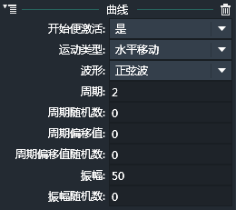
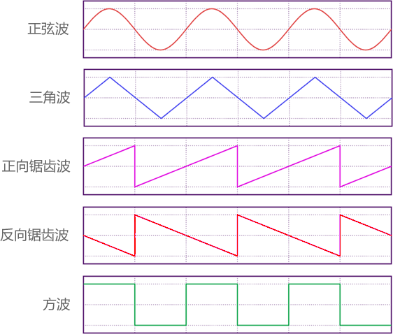
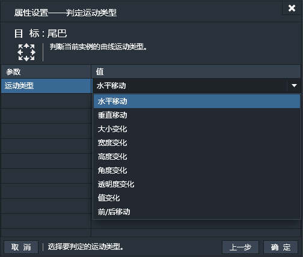
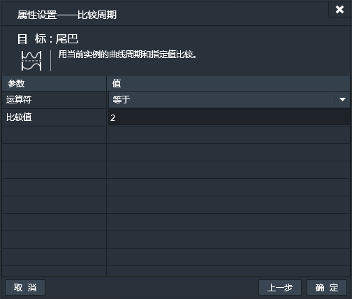
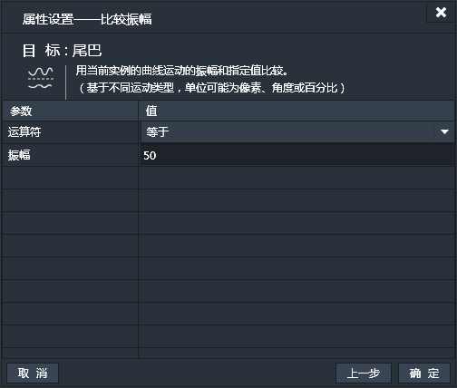
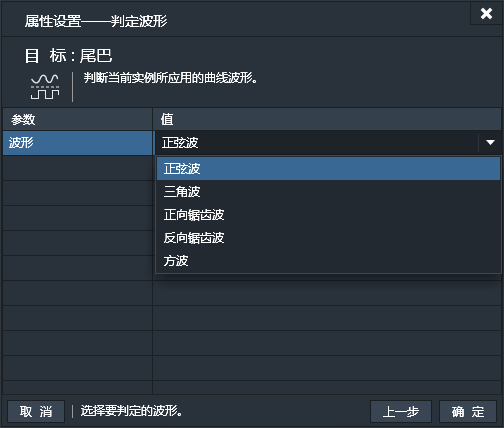
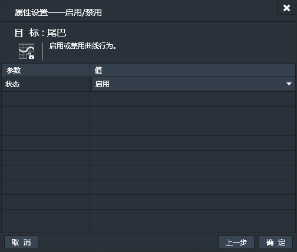
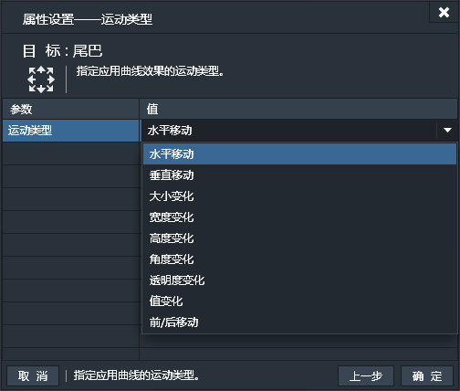
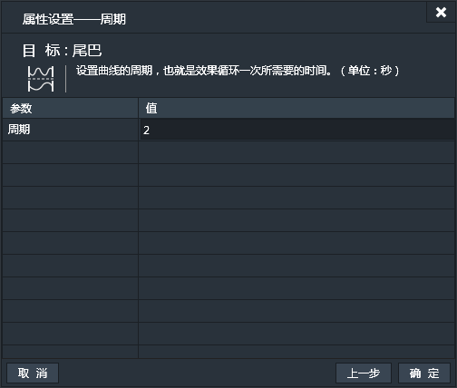
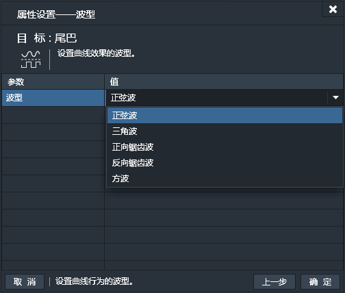

An instance applied curve behavior that can make specified motions or variations to apply curve effects to look more natural.

### Properties pane：

- Start to activate: Apply the curve effect immediately upon instance creation. Set to yes, the curve behavior is applied immediately after the instance is loaded. If you choose no, the event table can be enabled by action.
- Movement type: select the movement or change that applies the curve effect. Options are:
 - Horizontal movement: in the direction of the X-axis, the position of the instance moves left and right according to the curve.
 - Vertical movement: in the direction of the Y-axis, the position of the instance moves up and down according to the curve.
 - Size variation: the size of an instance varies according to the curve.
 - Width variation: the width of the instance varies according to the curve.
 - Height variation: the height of the instance varies according to the the curve.
 - Angle variation: the Angle of an instance varies according to the curve.
 - Transparency variation: the transparency of the instance varies according to the size of the curve.
 - Values variation：
 - Forward/backward movement: forward/backward movement is defined based on the Angle of the instance itself. For example, if the Angle of the example is 45 degrees, then the forward and backward movement is reciprocating along a 45 degree diagonal line.
- Waveform: the waveform of a curve. Options are:
 - Sinusoidal wave
 - Triangular wave
 - Direct sawtooth wave
 - Reverse sawtooth wave
 - square wave
Various waveforms are shown below：

- Period: sets the period of the curve, which is the time it takes for the effect to cycle once. (unit: seconds)
- Period random number: add a random number to the period time. (unit: seconds)
For example, if the period is 2 and the random number is 2, the actual period will be a random number between 2 and 4. The random value is generated during curve initialization and added to the set period value. After initialization, the actual period is fixed.
- Period offset: sets the offset of the curve in the X-axis direction. (unit: seconds)
For example, the curve amplitude is 1, the period is 2 seconds, and the default curve value starts from 0. Offset by 0.5 second, the curve value becomes 1.

- Random number of periodic offset value: random number of periodic offset value. (unit: seconds)
For example, if the offset is 0.5 and the random number is 1, the actual offset will be a random value between 0.5 and 1.5. The random value is generated during curve initialization and added to the set offset value. After initialization, the actual offset value is fixed.
- Amplitude: the amplitude of the curve is the vibration range of the curve, which determines the maximum and minimum values that can be obtained from the curve motion range of the example. (unit: related to exercise type)
- Random number of amplitude: random number of amplitude.
For example, if the amplitude is 1 and the random number is 2, the actual offset will be a random value between 1 and 3. The random value is generated during curve initialization and added to the set amplitude. After initialization, the actual amplitude is fixed.

------------

### Curve condition：

#### If enabled：
If the curve behavior is enabled.
This condition has no specific property setting window.

#### Determination of motion type：
It will be enabled if the curve movement type of the current instance is of the specified type. Options are as follows:

#### Comparable period：
It will be enabled if it compares the curve period of the current instance to the specified value and turns out to be true.

#### Comparable amplitude：
It will be enabled if it compares the curve amplitude of the current instance to the specified value and turns out to be true.

#### Determination of waveform：
It will be enabled if the curve waveform of the current instance is of the specified type. Options are as follows:

------------

### Curve movement：

#### Enable/Disable：
Enable or disable the curve behavior.

#### Movement type：
Sets the motion or change type of the instance which applies the curve effect. Options are as follows:

#### Period：
Set the period of the curve.

#### Amplitude：
Set the amplitude of the curve.

#### Waveform：
Set the waveform of the curve. Options are as follows:

#### Initialization：
Initialize the curve. Indicates that the curve starts to fluctuate from the origin of coordinates.
This movement has no specific property setting window.