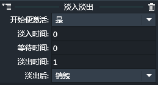
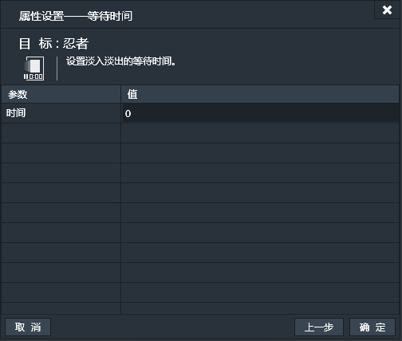
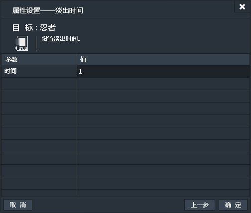

An example of fade in and fade out behavior is applied, which has the effect of fade in and fade out.An effect triggers a condition, the duration of which is specified by a property, condition, or action.

### Property Panel:

- Start activation: whether to fade in and out immediately when the instance is created.If yes is selected, the instance will fade in and out immediately after loading.If "no" is selected, the instance loads normally and the fade-in operation does not start until a specific action (fade-in action - start) is executed.
- Fade in time: the elapsed time of fade in process. The time taken for instance transparency to transition from 0% to 100%.
- Wait time: the period from the end of fade in to the beginning of fade out. During this time the instance remains 100% transparent and fully visible. If set to 0, the fade-in operation is performed immediately after fading in.
- Fade out time: the elapsed time of the fade out process. The time taken for instance transparency to transition from 100% to 0%.
- After fade out: sets whether the instance is destroyed immediately after fade out. You can set destroy or not destroy.

------------

### Fade in and out Condition:

#### When Fading in：
When the fade in action is complete.【one-time trigger】
This condition has no property setting window.

#### Waiting for Completion：
The wait time is over, the moment before the fade-out begins. [one-time trigger]
This condition has no property setting window.

#### When the Fade-out Is Complete:
When the fade-out action is complete. [one-time trigger]
This condition has no property setting window.

------------

### Fade in and out：

#### Start:
Start fading in and out. If an instance of the fade in and out behavior is applied and "start active" is set to "no",And the default transparency is 100%, so when I fade in I'm going to start with a 0% opacity,It then increases to 100% based on the fade in time, completes the fade in, passes the wait time, and then performs the fade out operation.

This action has no property setting window.

#### Fade in Time:
Set the elapsed time of fade in. (unit: seconds)

#### Waiting Time:
Sets the time between the end of fade in and the beginning of fade out. (unit: seconds)

#### Fade out Time:
Sets the time elapsed from fade-out.（unit: seconds）

#### Reset:
Resets the fade-in behavior and restarts the fade-in operation.If the fade-in and fade-out has been completed, it is performed again. If the fade in and out is happening,Then from the beginning of the fade in and fade out again.
This action has no property setting window.