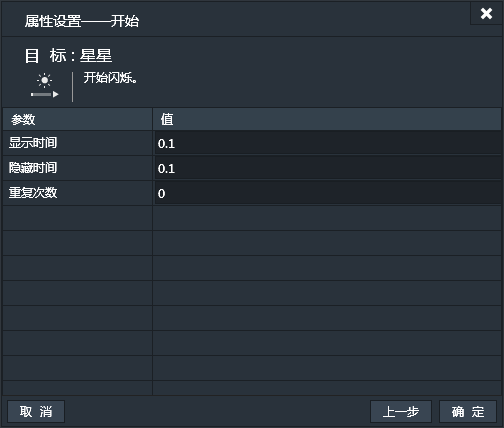

An example of flicker behavior is applied to achieve the flicker effect. Specific flicker parameters need to be set in the action.

### Property Panel:
There is no specific properties panel for flicker behavior.

------------

### Scintillation Conditions:

#### If Flickering:
If the instance is executing the flicker effect, the condition is true. [continuous trigger]
This condition has no property setting window.

#### Each Flicker:
Every time it flickers, it triggers. [one-time trigger]
Perform one display and one hide to complete one blink. Flicker is triggered once for every completion.
This condition has no property setting window.

#### Flicker Complete:
When the blink is complete. [one-time trigger]
Scintillation is completed when the number of scintillation repetitions set in the scintillation action is completed.
This condition has no property setting window.

------------

### Blinking Action:

#### Start:  
Set and start blinking.
- Display time: the time when the instance presents the display state during flicker.
- Hidden time: the time when the instance presents the hidden state during flicker.
- Number of repetitions: display once, hide once to finish flashing once.The number of repetitions to set for flicker will be executed several times.The default value is 0, which means it keeps repeating, which means it keeps flashing.But you can stop blinking by stopping down here.

#### Stop:
Stop blinking.
This action has no property setting window.