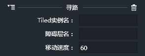
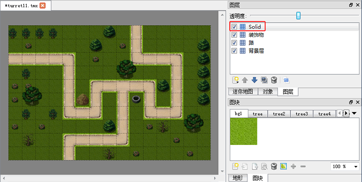
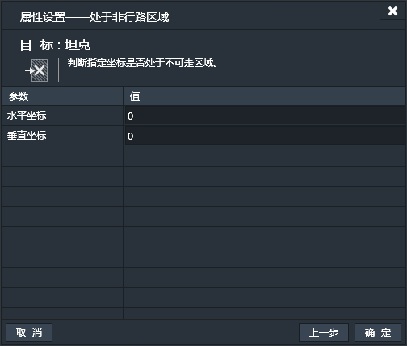
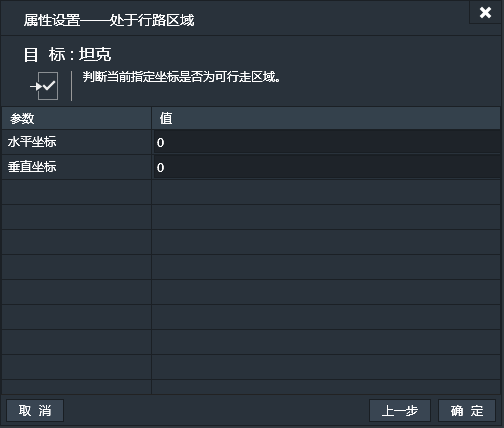
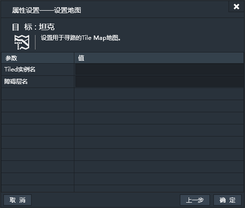
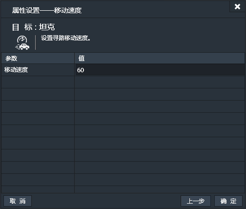
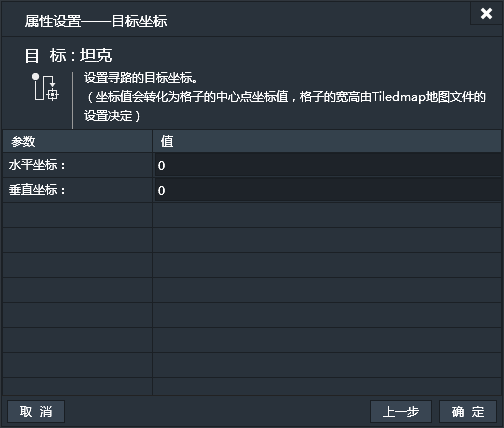

Added an instance of pathfinding behavior that automatically travels based on the path set in the specified Tiled map.

### Properties Pane

- Tiled instance name: the name of the Tiled component where the Tile map resides. Lakeshore pathfinding system is based on Tile Map produced by Tiled Map Editor software.Specify the TMX file of the Tiled Map Editor in the properties of the Tiled component to render the same Map effect in the LakeShore as in the Tiled Map Editor software.
- Obstacle layer name: the layer name of the Tile map that serves as the Tile layer. Objects bound to the pathfinding behavior will move around the obstacle layer during the pathfinding process.This layer name is taken from the layer name set in the Tiled map Editor software, and the obstacle layer is usually set using pure color blocks. The diagram below:

- Movement speed: the movement speed of pathfinding. The default value is "60". (unit: pixels/second)

------------

### Pathfinding Conditions

#### Initialization Complete

When pathfinding initialization is complete. [one-time trigger]
Initialization here refers to the completion of the network grid data load, can normally perform the pathfinding operation. In general,This condition is used when setting the pathfinding target point action, that is, after the pathfinding initialization is completed, the target point coordinates are set.
This condition has no property setting window.

#### It's in an off-Road Area
When the specified coordinate point is in an off-line region. [continuous trigger]
That is, to determine whether the specified coordinate is in an unwalkable region.

####  It's on the Road
When the specified coordinate point is in the traveling region. [continuous trigger]
That is, to determine whether the specified coordinate is in a walkable region.

#### When You're Ready to Find Your Way
When the instance is ready to start pathfinding. [one-time trigger]
When an instance binds the pathfinding behavior, it is triggered before the pathfinding begins.
This condition has no property setting window.

#### When the Pathfinding is Complete
 When instance pathfinding is complete. [one-time trigger]
Triggered when the instance stops moving after pathfinding.
This condition has no property setting window.

#### When the Segmentation is Complete
When object pathfinding is done in stages. [one-time trigger]
In general, a pathfinding may result in N nodes, so every time an instance reaches a node, it will be triggered.
This condition has no property setting window.

#### When Pathfinding is Going on
If you're looking for a path. [continuous trigger]
Determines whether the current instance is pathfinding.
This condition has no property setting window.

------------

### Pathfinding Action

#### Set the Map
Sets the Tile Map used for pathfinding.
- Tiled instance name: enter the name of the Tiled instance where the Tile Map will be placed.
- Obstacle layer name: enter the layer name as the obstacle layer.

#### Movement Speed
Sets the pathfinding movement speed. The default value is "60". (unit: pixels/second)

#### The Target Coordinates
Sets the coordinates of the pathfinding endpoint target.
The coordinate value will be converted into the center point coordinate value of the grid, and the width and height of the grid are determined by the setting of Tiledmap map file.

