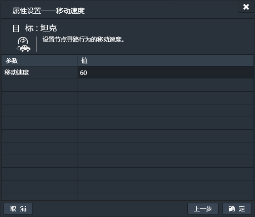
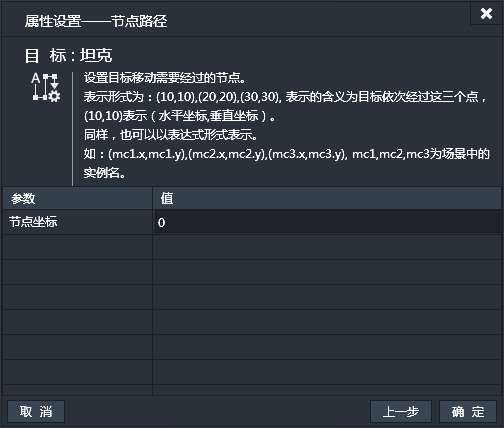

Added an instance of node movement behavior that can be moved according to the set node. The adjacent nodes move in a straight line.Unlike the pathfinding behavior, the user needs to specify the coordinates of each node in the movement, but no longer rely on the Tile Map.

### Properties Pane

- Speed of movement: set the speed of node movement. Default value 60. (units: pixels per second)

------------

### Node Movement Condition

#### When You're Ready to Move
When the instance is ready to move. [one-time trigger]
It can be seen as a state switch of the instance to the node movement behavior, that is, from the static state to the moving state, but at this time, the instance is still in the static state.。
This condition has no property setting window.

#### At the End
When the instance passes through all nodes and reaches the last node. [one-time trigger]
This condition has no property setting window.

#### At the Node
When the instance reaches each node on the path. [one-time trigger]
For example, if there are four nodes A, B, C and D in the path, then each node in A, B, C and D will be triggered when it reaches them.
This condition has no property setting window.

#### When the Movement is Going on
When an instance of a node movement is in a node movement. [continuous trigger]

------------

### Node Movement

#### Movement Speed
Sets the speed at which nodes move.

#### Node Path
Sets the coordinates of each node in the node movement.
The expression of the node can be divided into static and dynamic data.

- Static Data
Static data can be expressed as follows:
`(100,100),(150,200),(180,400)`
In this example, coordinate information of three nodes is set.Each parenthesis represents the coordinate information of one node, the first value in the parenthesis represents the horizontal coordinate, and the second value represents the vertical coordinate.
- Dynamic Data
Dynamic data can be expressed as follows:
`(mc1.x,mc1.y),(mc2.x,mc2.y),(mc3.x,mc3.y)`
In this example, the coordinate information of three nodes is also set. MC1, MC2 and MC3 respectively represent the names of three instances in the scene.Then the three coordinates are the positions of the three instances in the game. MC1. X is the horizontal coordinate of MC1, and MC1. Y is the vertical coordinate of MC1.

