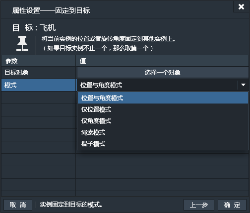

Instances that apply pin behavior can be pinned to a specified instance and follow the specified instance in different ways depending on the fixed mode.
### Property Panel:
Pin behavior has no unique properties.

------------

### Pin Condition:

#### Have Fixed Goals:
This condition is true if the current instance is fixed to another instance. [continuous trigger]
This condition has no property setting window.

------------

### Pin Movement:

#### Fixed to a Goal:
Fixes the currently selected instance to another instance.
- Target object: specifies the target instance to be fixed for the selected instance.
If there is more than one target instance, select the first as the fixed target.For example, when attacking enemy planes in an airplane, one of them appears at random positions every once in a while. They are created by the system based on the same instance.If an action is used to attach the flag instance to an enemy aircraft instance, it will only be attached to the first enemy aircraft.
- Mode: select which mode to pin to the target instance. The default is: position and Angle mode. Options are:
 - Position and Angle mode: the position and Angle of the selected instance will change with the target instance.
 - Location mode only: the location of the selected instance will change with the target instance, and the Angle will not change with it.
 - Angle mode only: the Angle of the selected instance will change with the target instance, and the position will not change with it.
 - Rope mode: the selected instance moves with the target instance as if it were attached to the target strength by a rope.The Angle does not follow the target instance unless the position changes.It is shown that the position change of the selected instance does not follow the target instance in real time. Only when the distance between the selected instance and the target instance is greater than the initial value, will the selected instance follow the target instance as if dragged by a rope.If the distance between the selected instance and the target instance is less than the initial value, the change in the target instance will not affect the selected instance. That is, the target instance can only pull the selected instance, but cannot push the selected instance.
 - Stick mode: the selected instance and the target instance are connected as if by a stick. The position of the selected instance follows the target instance and the Angle does not follow.Represents that the distance between the selected instance and the target remains unchanged at the initial value. The target instance can either pull the selected instance or push the selected instance.

