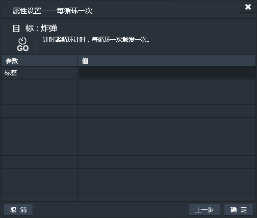
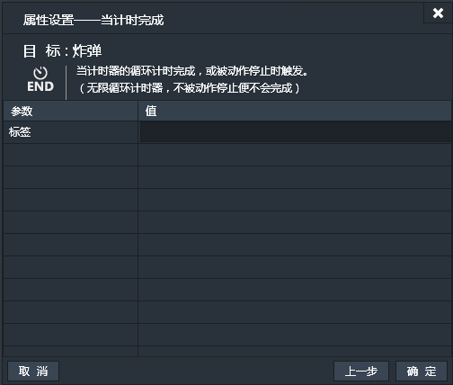
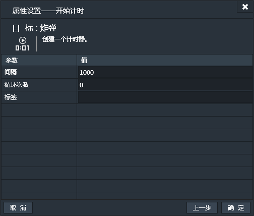
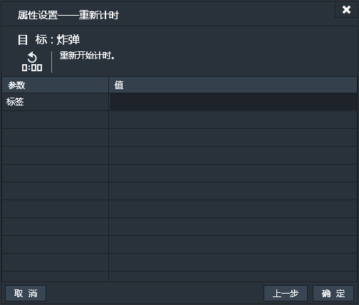
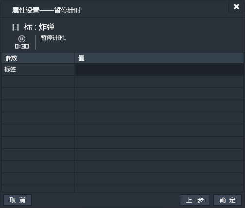
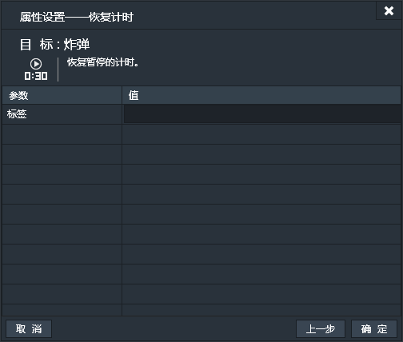

An instance with a timer behavior is able to create a timer inside the instance to implement the timing function. With this behavior, you will have a specific event to trigger a timer and trigger other events during timing or at the end of timing. For example, click the bomb and it starts counting down, and the countdown value of the bomb is reduced by one second after every second, the bomb explodes by the end of countdown, also the timer can be terminated by other events during this period.

### Property Panel
Timer behavior has no unique properties.

------------

### Timer condition

#### Per Cycle:
The timer clocks as cycling every X seconds and cycling a total of N times.  When the current condition is empty, it's triggered once every time a cycle completed. [one-time trigger]

"Label" is required item, because an instance with a timer behavior can create multiple timers, and each timer is distinguished by a "label" from each other. Only if a "label" is specified, the program knows which timer you are going to use or monitor.

#### When timing completed
It will set cycle times when the timer is created. When the cycle times completed, timing completed, and the current condition is triggered. [One-time trigger]

If we set the cycle times of timer as 0, it means an infinite loop. The timing will never be completed if the timer stop action is not used, and the current condition will never be triggered.
The current condition is also needed to specify a "tag".

------------

### Timer action:

#### Timing start
Create a timer on an instance with timer behavior applied. The timer clocks as cycling every X seconds and cycling a total of N times.  So we need to specify the time interval of each cycle, the total times of cycle, and also specify a label for the timer. The label is the identifier to recognize timer, label name is required when the timer is used.

#### Timing stop
Stop timing. In two scenarios the timer will stop, one is that it reachs the set cycle times, the other is that it's stopped by the action. The current action is able to stop a specified timer and we can specify the timer by filling the label.

#### Timing reset
Reset the timer. Re-specify the timer from the very first cycle. We are able to specify the timer that we are desired to reset by filling the label info, whether the timer is in timing cycle, or has been completed the timing.

#### Timing pause
Stop a timing timer temporarily, but here it has a necessary condition, you can only stop a timing timer when it finished its third cycle, then you are able to resume this timer's timing from its third cycle through the resume timing action below. Specify the timer that you are desired to stop by filling "label"info.

#### Timing resume
Resume a paused timer and continue to timing. The cycle times that you pause the timer timing,  it's also the resume point when timer continues timing. Specify the timer that you are desired to resume by filling "label" info.
