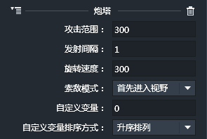
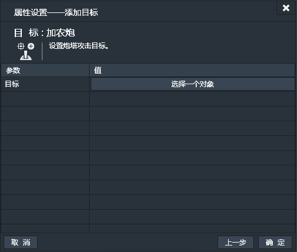
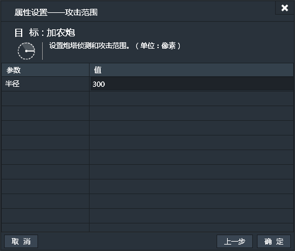
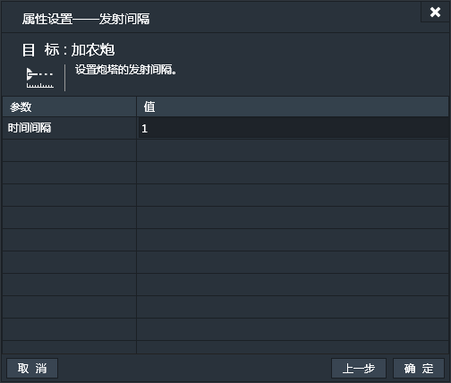
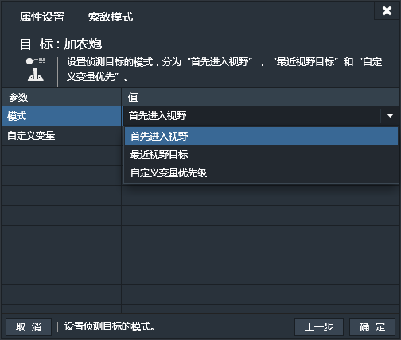
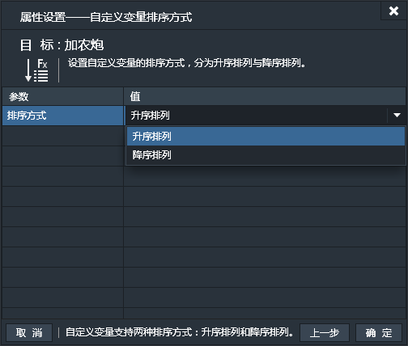

The instance that's added turret behavior, it will have functions such as automated enemy spotting and attack in turret game.

### Property Panel

- Attack Range: set the attack range of turret. The default value is "300". (Unit: Pixel)
- Launch Interval: Set the interval between each shot of the turret. The default value is "1". (Unit: second)
- Rotation speed: set the rotation speed of turret itself when it's in attack mode. The default value is "300". (Unit: degree / frame)
- Enemy spotting mode: set the priority level of target lock of turret. The default value is "first coming into view", the options are:
 - First coming into view: enemy that comes into the view of turret is the priority target. That means the turret will only lock the second target that comes into its view after the first one was destroyed.
 - Closest target in view: Turret will lock preferentially the closest traget around it. That means, during the attack, the turret will immediately alter its attacking target if a enemy is closer to it than the current target.
 - Custom Variables Priority: Set enemy spotting priority based on the target's custom variables.
- Custom Variables: You need to input the custom variables of target that's used to set priority, if you select "custom variable priority" enemy spotting mode. Assuming the target is "Tank" and its name is HP, then you need to add a custom variable to "tank" instance, and input HP here. If there are multiple targets, each target must have a custom variable with same name and also needed to input the name info here.

- Custom variable sorting order: set priority ordering of selected custom variables.
 - Ascending Sorting
 - Descending Sorting

------------

### Turret Condition

#### Shooting
When the turret shoots a cannonball. [one-time trigger]
This condition has no property setting window.

#### Target found
If the turret finds the target of attack. [continuous trigger]
This condition has no property setting window.
#### Target change
When the turret changed its attack target. [one-time trigger]
This condition has no property setting window.

------------

### Turret Action

#### Adding Target
Adding an attack target for turret.

#### Clearing Target
Clear an attack target from the turret's attack target list.

#### Clear all target
Clear all targets of the turret's attack target list.
This condition has no property setting window.
#### Attack range
Set turret's attack range. The default value is "300". (Unit: Pixel)

#### Shooting interval
Set the time interval of cannonball shooting of turret. The default value is "1". (Unit: second)

#### Rotation speed
Set the rotation speed of turret in enemy spotting mode. The default value is "10". (Unit: degree / frame)

#### Enemy Spotting
Set turret's enemy spotting mode.
- Mode: set enemy spotting mode. The default value is "First coming into view", and the options are:
 - First coming into view: enemy that comes into the view of turret is the priority target. That means the turret will only lock the second target that comes into its view after the first one was destroyed.
 - Closest target in view: Turret will lock preferentially the closest traget around it. That means, during the attack, the turret will immediately alter its attacking target if a enemy is closer to it than the current target.
 - Custom Variables Priority: Set enemy spotting priority based on the target's custom variables.
- Custom Variables: You need to input the custom variables of target that's used to set priority, if you select "custom variable priority" enemy spotting mode. Assuming the target is "Tank" and its name is HP, then you need to add a custom variable to "tank" instance, and input HP here. If there are multiple targets, each target must have a custom variable with same name and also needed to input the name info here.

#### Custom variable sorting order
We can set sorting order of custom variable, when enemy spotting mode is "custom variable priority". The default value is "Ascending Sorting", and the options are:
- Ascending Sorting
- Descending Sorting

