prites, buttons, text boxes, and most other instances have actions that we define as generic. These movements are the most basic and common ones.

**Quick Link:**

|General action||
|:-----|:-----|
| Angle                               |[clockwise rotation](#clockwise rotation：)，[counterclockwise rotation](#counterclockwise rotation：)，[rotation to specified Angle](#rotation to specified Angle：)，[rotation points to specified coordinates](#rotation points to specified coordinates：)，[set Angle](#set Angle：)，[set Angle according to specified coordinates](#set Angle according to specified coordinates：)|
|other|[made](#made：)，[destroyed](#destroyed：)，[enabled](#enabled：)|
|size and position|[move towards specified Angle](#move towards specified Angle：)，[move in its own direction](#move in its own direction：)，[coordinate](#coordinate：)，[relative to other instances coordinates/zoom](#relative to other instances coordinates/zoom：)，[zoom](#zoom：)，[zoom [level]](#zoom [level]：)，[vertical scaling](#vertical scaling：)，[size](#size：)，[horizontal coordinates](#horizontal coordinates：)，[horizontal coordinates](#horizontal coordinates：)|
|looks like|[mirror](#mirror：)，[hidden](#hidden：)，[transparency](#transparency：)|
|instance custom variable operations|[addition](#addition：)，[subtraction](#subtraction：)，[set value](#set value：)，[True/False](#True/False：)，[[switch](#[switch：)|
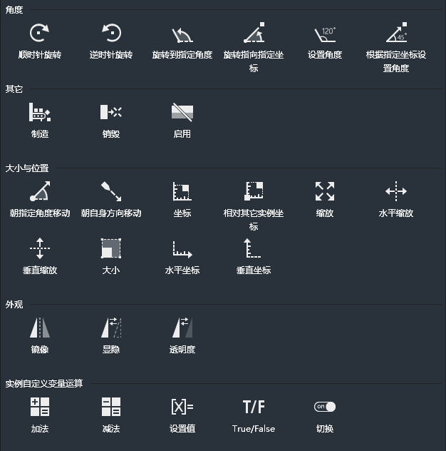
### The Angle
#### Clockwise rotation：
Rotates the current instance clockwise at the specified angular speed.
With a persistent trigger condition, the instance rotates clockwise at the specified Angle each time the trigger condition is triggered.
With a one-time trigger condition, the instance will only do a clockwise rotation at the specified Angle once.
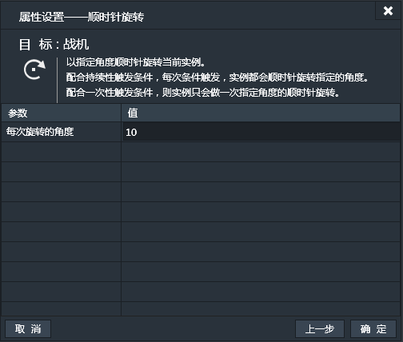

#### Counterclockwise rotation:
Rotates the current instance counterclockwise at the specified angular velocity.
With persistent trigger conditions, the instance rotates the specified Angle counterclockwise each time the condition is triggered.
With a one-time trigger condition, the instance will only do a counterclockwise rotation at the specified Angle once.

#### Rotate to the specified Angle:
Rotates to the specified Angle A at the specified Angle B.
The "target Angle" is the Angle A, and the "Angle selected each time" is the Angle B.
With the continuous trigger condition, each time the trigger condition is triggered, the instance will rotate the Angle B until the instance reaches the Angle A, and the instance will not continue to rotate.
With the one-time trigger condition, the instance will only do A rotation at the Angle of B once, even if the Angle A is not reached, it will not continue to rotate.
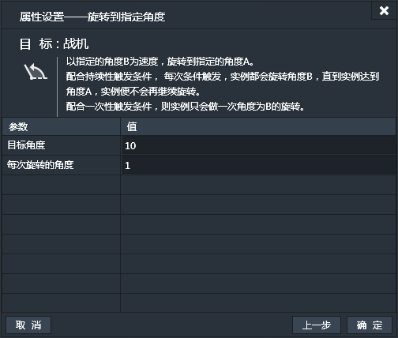

#### Rotation points to the specified coordinates:
Rotates the current instance at the specified Angle so that the X-axis of the instance itself points to the specified coordinates.
With the continuous trigger condition, each time the trigger condition is triggered, the instance will rotate the specified Angle until the X-axis of the instance points to the specified coordinate, and the instance will not continue to rotate.
With a one-time trigger condition, the instance will only rotate at the specified Angle once, and it will not continue to rotate even if the X-axis of the instance does not reach the specified coordinate.
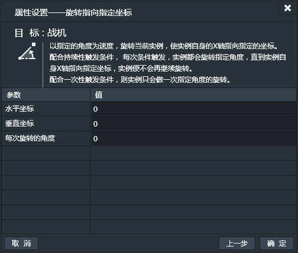

#### Set the Angle：
Sets the Angle of the current instance.
The instance jumps directly to the specified Angle, with no rotation.
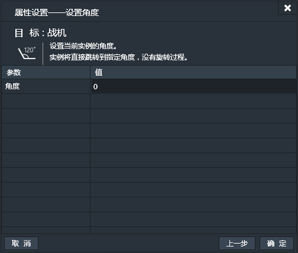

#### Set the Angle according to the specified coordinates:
Sets the current instance Angle so that its own X-axis points to the specified coordinate.
The instance will jump directly to the coordinates without the rotation process.
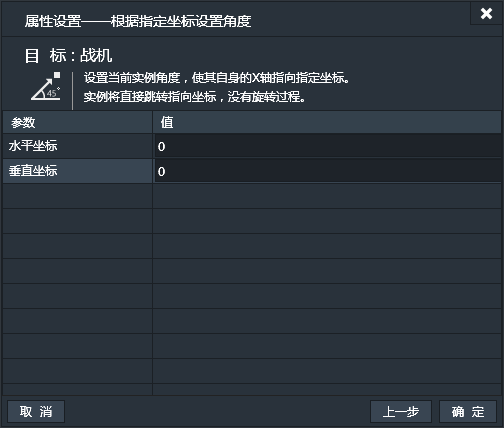

###  Other
#### Manufacturing:
Creates another instance at the current instance location.
 -  instance name: select the instance to be manufactured.
 -  layer number: the layer number placed on the resulting instance.
 - horizontal offset: the horizontal offset of the created instance relative to the instance that created it.
 - vertical offset: the vertical offset of a bad instance relative to the instance that made it.
 - dependent target Angle: sets whether the bullet running Angle of the generated instance depends on the target instance that made it (only valid for instances with bullet behavior)

The difference with the System action "create" is that "create" is an action issued by System and specific to System.And "manufacturing" is issued by an instance, is the general action of the instance, such as the aircraft to fire bullets, then the aircraft is the instance of "manufacturing" action, and the bullet is the instance of "manufacturing".
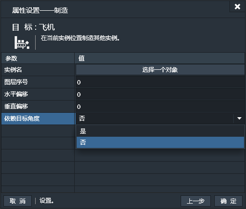

#### Destruction:
Destroy the current instance.
For example, the destroyed enemy plane in the game needs to disappear from the game screen, and it is no longer needed in the game data. At this time, the destruction action can be used.
This action has no specific property setting window.

#### Enable:
Sets whether the current instance is available.
Set to "yes" to operate normally. If set to no, the instance is no longer available and no action is accepted.
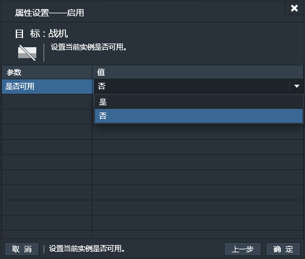

### Size and Location
#### Moves towards specified Angle:
Moves at a specified speed at a specified Angle.
With continuous trigger conditions, each time the condition triggers, the instance will move at a specified speed at a specified Angle and a specified distance.
With a one-time trigger condition, the instance will only move towards the specified Angle once, and the distance is equal to the specified speed.
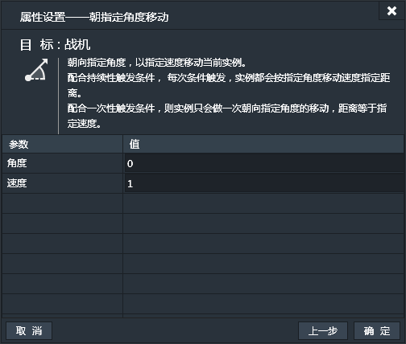

#### To move in one's own direction:
Moves at a specified speed in the direction of the current instance itself.
With continuous trigger conditions, each time the condition triggers, the instance moves in its own direction at a distance equal to the specified speed.
With a one-time trigger condition, the instance will only move in its own direction once, and the distance is equal to the specified speed.
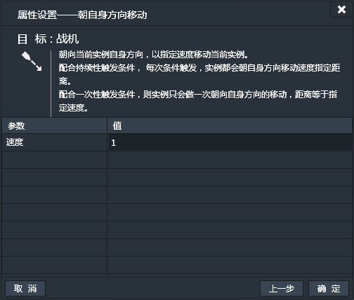

#### Coordinates:
Sets the coordinate value for the current instance.
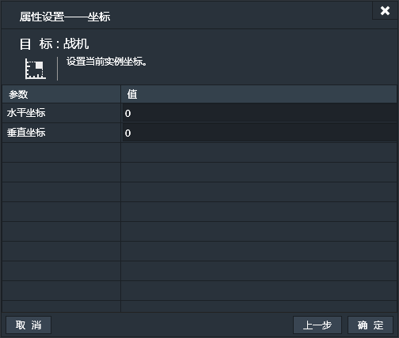

#### Relative to other instance coordinates:
Sets the coordinate value of the current instance relative to other instances.
That is, the relative position of the current instance is set according to the selected instance.
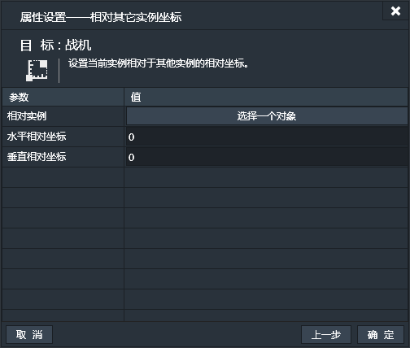

#### Zoom:
Sets the overall scaling of the current instance.
The default is 1, which is 100%. Set values greater than 1 if you want to zoom in and greater than 0 if you want to zoom out.
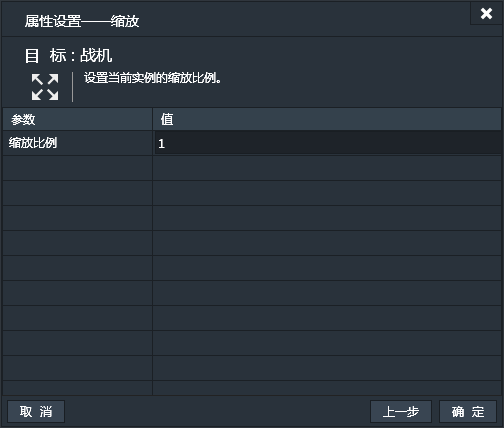

#### Horizontal scaling:
Sets the horizontal scaling of the current instance separately.
The default is 1, which is 100%. Set values greater than 1 if you want to zoom in and greater than 0 if you want to zoom out.
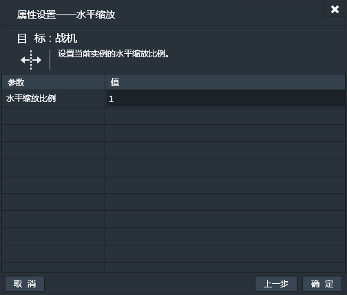

#### Vertical scaling:
Sets the vertical scaling of the current instance.
The default is 1, which is 100%. Set values greater than 1 if you want to zoom in and greater than 0 if you want to zoom out.
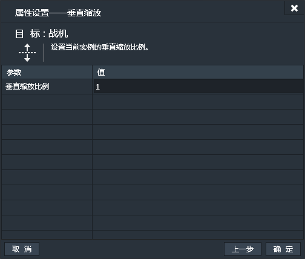

#### Size：
Sets the width and height of the current instance.
If you only want to set the width or height separately. For example, the instance named "warplane" wants to set the width to 100. The wide input box says "100" and the high input box says ".height ". For the same reason, type "width of the aircraft" into the width field. Width.
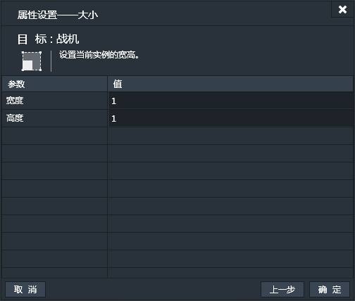

#### Horizontal coordinates：
Sets the horizontal coordinates of the current instance individually.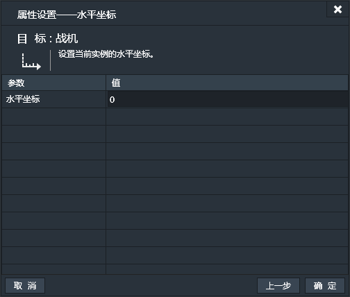
#### Vertical coordinates:
Sets the vertical coordinates of the current instance individually.

### Appearance
#### Mirror:
Sets whether the current instance is mirrored and the mirroring direction. Options are:
 - horizontal image
 - vertical mirroring
 - horizontal vertical mirroring
 - Close the mirror

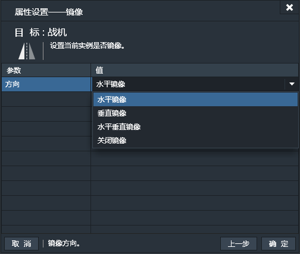
#### Show hidden:
Sets the current instance to show or hide.
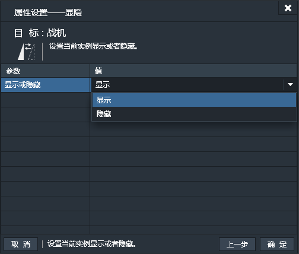

#### Transparency:
Sets the transparency of the current instance. Valid values can be set between 0 and 1. The default is 1, which means 100%, which is completely opaque. The minimum value can be set to 0 to indicate complete transparency.
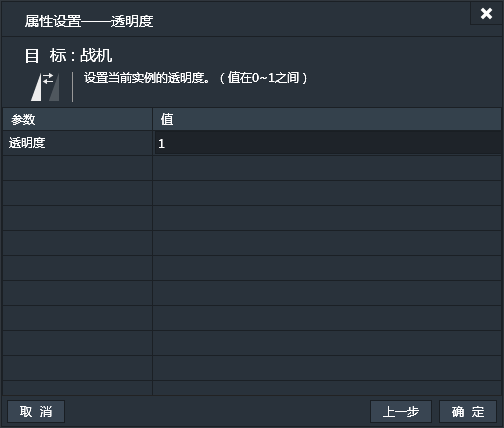

### Instance Custom Variable Operation
#### Add：
Selects a custom variable of the current instance to add. (if you do not specify a custom variable, the game may run incorrectly)
Each time the action is executed, the specified custom variable is added to the specified value.
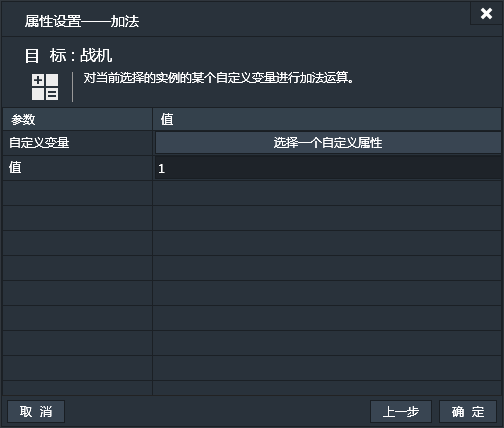

#### Subtraction：
Selects a custom variable of the current instance for subtraction. (if you do not specify a custom variable, the game may run incorrectly)
For each execution of the action, the specified custom variable is subtracted from the specified value.

#### Set value
Sets the custom variable specified in the current instance to the specified value.
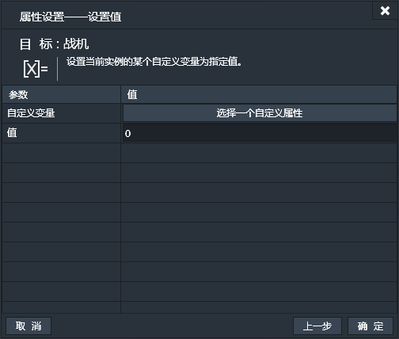

#### True/False：
Sets the value of a Boolean custom variable in the current instance to true or false.
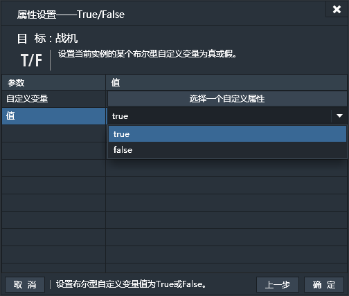

#### Switch:
Toggles the value of a Boolean custom variable for the current instance.
 (Switch to False if the original value is True and vice versa)
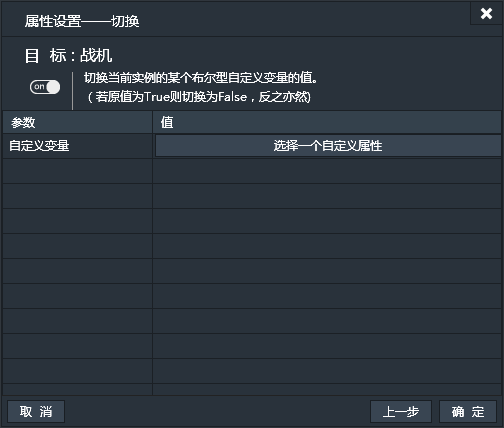