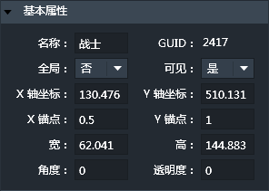
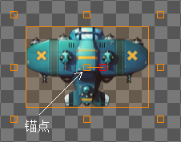
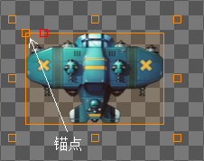
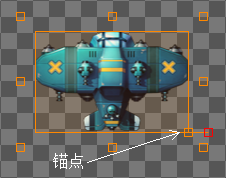
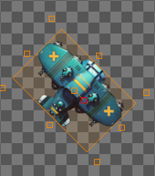

After the instance is selected in the scene, the right panel displays the basic properties.

*Note: adding sound, touch screen, array, WeChat, the instance generated after the function component only supports the "name" and "global" in the basic property, and does not support other properties.

- Name: the name of the instance.
- GUID: the internal ID of the instance. The only attribute in the base attribute that cannot be modified.
- Global: sets whether the instance exists globally. The default is no.
  If set to "no", the instance will be destroyed as the scene exits.If set to "yes", the instance will not be destroyed with the exit of the scene. After scene switching, the instance still exists and various properties of the instance remain unchanged.
- Visible: sets whether the instance is visible. The default is yes.
- X-axis coordinate: sets the X-axis coordinate of the instance in the scene, that is, the X-axis coordinate of the instance anchor point.
- Y-axis coordinate: sets the Y-axis coordinate of the instance in the scene, that is, the Y-axis coordinate of the instance anchor point.
- X anchor point: sets the position of the anchor point of the instance relative to the instance in the direction of X axis.The default value is "0.5," indicating that the anchor point on the X-axis is in the middle of the instance. If I set it to zero,
- Y anchor point: sets the position of the anchor point of the instance relative to the instance in the direction of Y axis.The default value is "0.5," indicating that the anchor point on the Y-axis is in the middle of the instance. If set to "0", it is at the uppermost edge of the instance. If "1" is set, it is at the bottom edge of the instance.
  For example:
  Anchor point X=0.5, anchor point Y=0.5
  
  Anchor X=0, anchor Y=0
  
  Anchor X=1, anchor Y=1
  
  If the anchor value is greater than 1 or less than 0, the anchor point is outside the scope of the instance itself.
- Width: the width of the instance.
- Height: the height of the instance.
- Angle: the Angle of the instance. The default value is "0". The angular rotation of the instance is centered on the anchor point.
  As shown below, Angle =45
  
- Transparency: sets the transparency of the instance. The default value is "1", which means the transparency is 100% and completely opaque. Set to "0" to indicate transparency of "0%" and full transparency.

