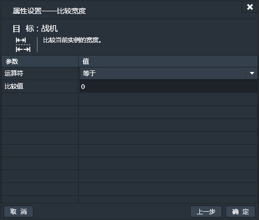
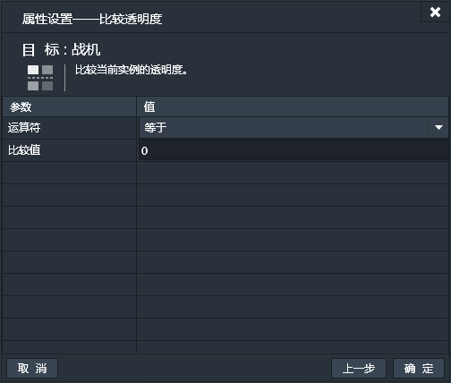
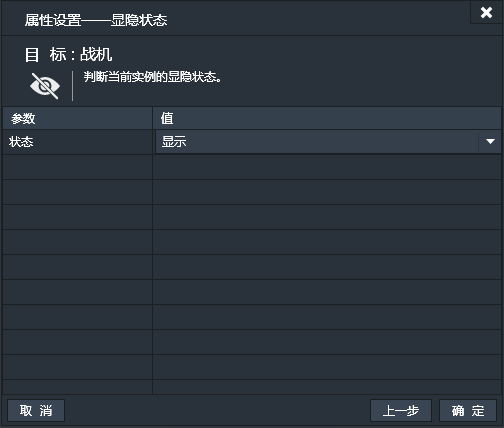
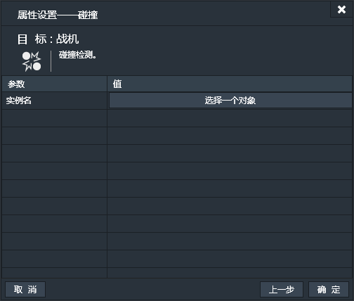
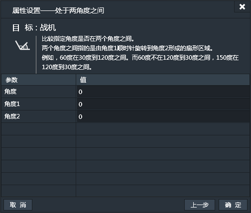

We define sprites, buttons, text boxes, that most of instances contain, as general conditions. These conditions are the most basic, most commonly used conditions.
#### Quick Links
|General Conditions||
|------:|:------|
|Other|[When the instance is created](#When the instance is created)|
|Network|[When the image is loaded](#When the image is loaded:)|
|Instance custom variable|[Custom variable comparison](#Custom variable comparison:)|
|Size and location|[Landscape coordinates comparison](#Landscape coordinates comparison:)，[portrait coordinates comparison](#portrait coordinates comparison:)，[Width comparison](#Width comparison：)，[Height comparison](#Height comparison：)，[Transparency comparison](#Transparency comparison:)，[Visible/hidden state](#Visible/hidden state:)，[is/not within screen](#is/not within screen:)|
|Collision|[collision](#collision:)|
|Angle|[clockwise rotation](#clockwise rotation：)，[between two angles](#between two angles：)|

#### When the instance is created：
It's triggered when the selected instance is created.【One-time trigger】
An instance is created when the scene that contains the selected instance in game is loaded. For example, the first scene of game is A, and the selected instance only exists in scene B, so when the game starts, the selected instance is not created. However, the selected instance will be created only after we switch to scene B, and trigger the "when the instance is created" condition. (At this time, the image resource in the instance has not completed loading), FYI, this condition has no unique property settings window.
#### When the image is loaded：
When the image resource of the selected instance is loaded. 【One-time trigger】
It's required to create instance first, then load its image resource. So "when the image is loaded" is necessarily later than "when the instance is created".
This condition has no unique property settings window.
#### Custom Variable Comparison：
Compare a custom variable of the current instance with the specified value. 【continuous trigger】
First we need to make sure that the current instance has added a custom variable, then we select one from the existing custom variables. (If you do not select any custom variable, project may run incorrectly)

#### Landscape coordinate comparison:
Compare a landscape coordinate of the current instance with the specified value. 【Continuous triggar】

#### Portrait coordinate comparison:
Compare a portrait coordinate of the current instance with the specified value.【continuous trigger】

#### Width comparison：
Compare the width of current instance with the specified value.【continuous trigger】

#### Height comparison：
Compare the height of current instance with the specified value. 【continuous trigger】

#### Transparency comparison：
Compare the transparency of current instance with the specified value.【continuous trigger】

#### Visible/hidden state:
Judge the visable/hidden state of current instance.【continuous trigger】
The options are “visible” and “hidden”.

#### is/not within screen:
Judge is/not within screen of the current instance. 【continuous trigger】
The options are “within screen” and “out of screen”.

#### collision:
If the current instance had a collision with a specified instance.【one-time trigger】
Select another instance in the property settings window to have a collision with the current instance for judgment. If a collision occurs, then condition is triggered if it’s true.

#### clockwise rotation:
Angle 1 and angle 2 comparison. 【continuous tirgger】
If the angle 2 has a clockwise rotation by no more than 180 degrees and meet angel 1’s degrees, then condition is established.
For example, assuming that angle 2’s degree is 30, and angle 1 is 120. Angle 2 starts a 90 degree clockwise rotation from 30 degree and its degree will reach 120, here the rotation angle does not exceed 180 degrees, so the condition is established.
Assuming that angle 2’s degree is 30, and angle 1’s 250, angle 2 starts a 220 degree clockwise rotation from 30 degree and its degree can reach 250, here the rotation angle 220 ＞ 180 degree, so the condition is not established.

#### between two angles:
Comparison that whether the specified angle degree is between two angle degree.【continuous trigger】
Between two angles refers to the sector area formed by the angle 1 rotates clockwise to angle 2.
For example, 60 degrees is between 30 degrees and 120 degrees, but it’s not between 120 degrees and 30 degrees, and 150 degrees is between 120 degrees and 30 degrees.

