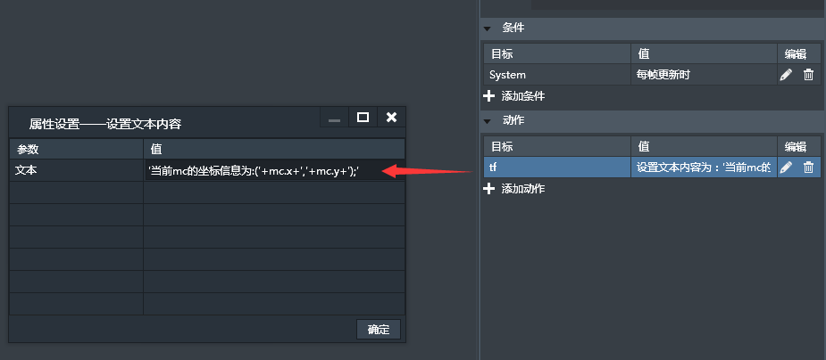
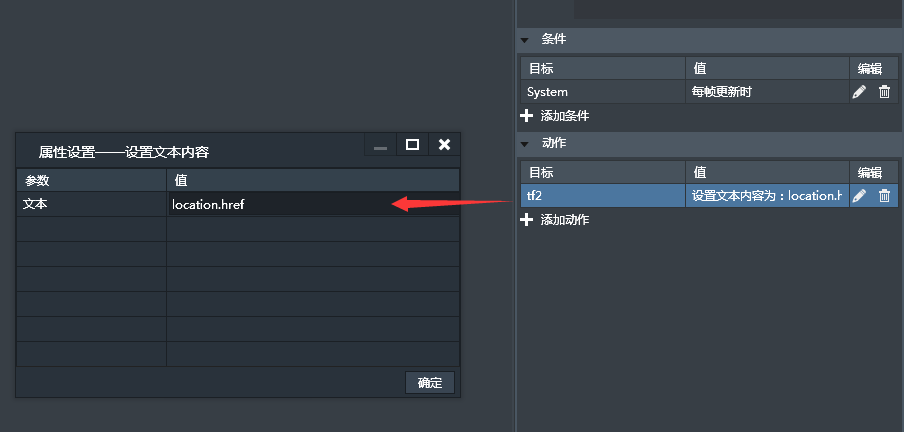
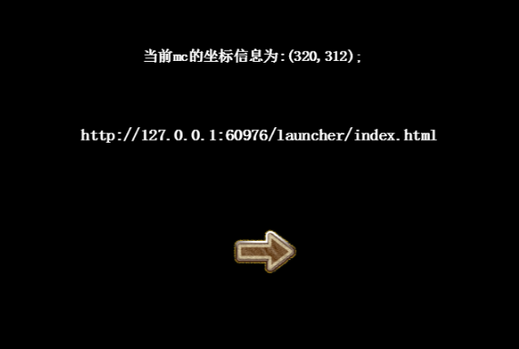

## Lakeshore Expression

What is expression?

An expression is a combination of numbers, [operators] (http://baike.baidu.com/view/271856.htm), numeric grouping symbols (brackets), free variables, and bound variables in a meaningful permutation method that can be used to find values. The bound value already has an assigned value in expression, but free variables can separately specify values out of expressions. The use of expressions in programming can maximum enhance logic operation. The commonly used expressions are arithmetic expressions and logical expressions.

* Arithmetic Expressions

Arithmetic expressions are the most commonly used expressions, also known as [numeric expressions]. (http://baike.baidu.com/view/703179.htm). It is a mathematical formula that operates through arithmetic operators. The commonly used arithmetic operations include the following table contents:


| Operator | Description |
| --- | --- |
| +	| Addition |  
| -	| Subtraction | 
| *	| Multiplication | 
| /	| Division | 
| %	| Reminder (keep integer) | 
| ++ | Accumulation | 
| -- | Degression | 

In lakeshore, the aforementioned expressions is supported. For example, if we want to make the object mc move to right at a speed of 1pixel/frame, we can do the following settings:


It can also be written as mc.x+1, the complete meaning is: mc.x=mc.x+1; it means that each frame adds 1 pixel to the landscape coordinate of mc, thus mc is able to form an animation moving to the right. Our careful developer users, you may notice that .x is used here, it represents the landscape coordinate properties of mc, which also can provide a lot of properties regarding to sprite.

The public properties list provided by sprite are shown as follow:

| Properties |	Description |	citation form |	demo（set mc2 as another object） |
| --- | --- |
| x |	landscape coordinate |	mc.x|	mc.x+1(complete form: mc.x=mc.x+1) |
| y |	portriat coordinate |	mc.y|	mc.y-1(complete form: mc.y=mc.y+1) |
| width |	width |	mc.width|	mc2.width*2(complete form: mc.y=mc2.wdith*2) |
| height |	height |	mc.height|	mc2.height*0.5(complete form: mc.height=mc2.height*0.5) |
| angle |	angle（0~360）between|	mc.angle|	mc.angle+=1(complete form: mc.angle=mc.angle+1) |
| alpha |	Transparency（0~1）between|	mc.alpha|	mc.alpha-1(complete form: mc.alpha=mc.alpha-1) |
| visible |	hidden/not（true/false)|	mc.visible|	mc2.visible(complete form：mc.visible=mc2.visible) |
| scale |	scaling ratio |	mc.scale|	mc.scale*=1.1(complete form：mc.scale=mc.scale*1.1) |
| scaleX |	landscape scaling ratio |	mc.scaleX|	mc.scaleX*=1.1(complete form：mc.scaleX=mc.scaleX*1.1) |
| scaleY |	portrait scaling ratio |	mc.scaleY|	mc.scaleY*=1.1(complete form：mc.scaleY=mc.scaleY*1.1) |
| anchorX |	landscape anchor |	mc.anchorX|	mc.anchorX |
| anchorY |	portrait anchor |	mc.anchorY|	mc.anchorY |
| name |	instance name |	mc.name|	mc.name |
| dt |	time difference between two successive frame（Unit: millisecond) |	mc.dt|	mc.dt |


**The public properties list provided by button component are shown as follow (assuming that button component name is btn)**


|properties|	description|	citation form|	demo（set mc2 as another object）|
| --- | --- |
|x|	landscape coordinate|	btn.x|	btn.x+1(complete form：btn.x=btn.x+1)|
|y|	portraitcoordiante |	btn.y|	btn.y-1(complete form：btn.y=btn.y+1)|
|width|	width|	btn.width|	mc2.width*2(complete form：btn.y=mc2.wdith*2)|
|height|	height|	btn.height|	mc2.height*0.5(complete form：btn.height=mc2.height*0.5)|
|angle|	angle（0~360）between|	btn.angle|	btn.angle+=1(complete form：btn.angle=btn.angle+1)|
|alpha|	transparency（0~1）between|	btn.alpha|	btn.alpha-1(complete form：btn.alpha=btn.alpha-1)|
|visible|	hidden/not（true/false)|	btn.visible|	mc2.visible(complete form：btn.visible=mc2.visible)|
|scale|	scaling ratio|	btn.scale|	btn.scale*=1.1(complete form：btn.scale=btn.scale*1.1)|
|scaleX|	landscape scaling ratio|	btn.scaleX|	btn.scaleX*=1.1(complete form：btn.scaleX=btn.scaleX*1.1)|
|scaleY|	portrait scaling ratio|	btn.scaleY|	btn.scaleY*=1.1(complete form：btn.scaleY=btn.scaleY*1.1)|
|anchorX|	landscape anchor |	btn.anchorX|	btn.anchorX|
|anchorY|	portrait anchor|	btn.anchorY|	btn.anchorY|
|name|	instance name|	btn.name|	btn.name|
|dt|	time difference between two successive frame（Unit: millisecond)|	btn.dt|	btn.dt|
|enabled|	Button enabled/not|	btn.enabled|	btn.enabled|
|touchX|	button’s relative landscape coordinate when it’s clicked|	btn.touchX|	btn.touchX|
|touchY|	button’s relative portrait coordinate when it’s clicked|	btn.touchY|	btn.touchY|
|touchStageX|	stage’s relative landscape coordinate when the button is clicked|	btn.touchStageX|	btn.touchStageX|
|touchStageY|	stage’s relative portrait coordinate when the button is clicked|	btn.touchStageY|	btn.touchStageY|
|touchPointID|	The unique identifier assigned to the button when it’s clicked|	btn.touchPointID|	btn.touchPointID|
|text|	button's text content|	btn.text|	btn.text|

**The public properties list provided by text component are shown as follow (assuming that text component name is tf):**

|properties|	description|	citation form| demo（set mc2 as another object）|
| --- | --- |
|x|	landscape coordinate|	tf.x|	tf.x+1(complete form：tf.x=tf.x+1)|
|y|	portrait coordinate|	tf.y|	tf.y-1(complete form：tf.y=tf.y+1)|
|width|	width|	tf.width|	mc2.width*2(complete form：tf.y=mc2.wdith*2)|
|height|	height|	tf.height|	mc2.height*0.5(complete form：tf.height=mc2.height*0.5)|
|angle|	angle（0~360）between|	tf.angle|	tf.angle+=1(complete form：tf.angle=tf.angle+1)|
|alpha|	transparency（0~1）between|	tf.alpha|	tf.alpha-1(complete form：tf.alpha=tf.alpha-1)|
|visible|	hidden/not|（true/false)|	tf.visible	mc2.visible(complete form：tf.visible=mc2.visible)|
|scale|	scaling ratio|	tf.scale|	tf.scale*=1.1(complete form：tf.scale=tf.scale*1.1)|
|scaleX|	landscape scaling ratio|	tf.scaleX|	tf.scaleX*=1.1(complete form：tf.scaleX=tf.scaleX*1.1)|
|scaleY|	portarit scaling ratio|	tf.scaleY|	tf.scaleY*=1.1(complete form：tf.scaleY=tf.scaleY*1.1)|
|anchorX|	landscape anchor|	tf.anchorX|	tf.anchorX|
|anchorY|	portrait anchor|	tf.anchorY|	tf.anchorY|
|name|	instance name|	btn.name|	tf.name|
|dt|	time difference between two successive frame（Unit: millisecond)|	tf.dt|	tf.dt|
|textField|	citation of text rendering class in text component |tf.textField|	Generally we do not cite this, we cite various properties of text based on it.|
|type|	Display that text is dynamic type or importable type|	tf.textField.type|	btn.touchX|
|text|	Display the text content of text|	tf.textField.text|	btn.touchY|
|bold|	Display whether the text is bold or not|	tf.textField.bold|	btn.touchStageX|
|fontFamily|	Display text font|	tf.textField.fontFamily|	btn.touchStageY|
|textColor|	display text color|	tf.textField.textColor|	btn.touchPointID|
|size|	display text size|	tf.textField.size|	btn.text|
|textAlign|	Display text’s landscape alignment method|	tf.textField.textAlign|	tf.textField.textAlign|
|verticalAlign|	Display text’s portrait alignment method|	tf.textField.verticalAlign|	tf.textField.verticalAlign|
|italic|	Display whether the text is italic or not|	tf.textField.italic|	tf.textField.italic|
|border|	Display whether the text has border or not|	tf.textField.border|	tf.textField.border|
|borderColor|	Display text border color|	tf.textField.borderColor|	tf.textField.borderColor|
|background|	Display whether text has background or not|	tf.textField.background|	tf.textField.background|
|backgourndColor|	Display text’s background color|	tf.textField.backgourndColor|	tf.textField.backgourndColor|
|maxChars|	Display the maximum characters number of text|	tf.textField.maxChars|	tf.textField.maxChars|
|displayAsPassword|	Display whether the text is displayed as password form or not|	tf.textField.displayAsPassword|	tf.textField.displayAsPassword|

What we talked about aforementioned is a simple expression, sometimes we may need to add some characters, such as to display the dynamic coordinate info of mc, and we need to define it by the following directions:



The final display result is:


For the aforementioned expression, it contains non-dynamic info as well as dynamic info. For correct display, we need to put single quotes on non-dynamic info. For example, ‘current mc coordinate info is: (‘ is non-dynamic info, and we can directly cite dynamic info, such as mc.x, also we can use eval(mc.x) to cite, here the + is link character). However, there is more complex expressions, such as the expression of WeChat is shown as follow:

```
'I killed'+eval(gameover.tank1+gameover.tank2+gameover.tank3+gameover.tank4)+'ttanks，'+'Defeated globally'+eval(((gameover.tank1+gameover.tank2+gameover.tank3+gameover.tank4)/91*100).toFixed(1))+'% players，come to challenge me！！'
```

Our careful developer users may find that there is a toFixed function aforementioned. In fact, this is a JS built-in number that’s used to take the specified decimal point. Here it means take a one decimal place number from the result of (gameover.tank1+gameover.tank2+gameover.tank3+gameover.tank4)/91*100. In order to use the expression more flexibly to meet the needs of the game, here we also support the commonly used function API of javascript provided, such as mathematics functions, for more details please refer to the tutorial provided by the W3CSchool website: [http://www.w3school.com.cn/jsref/jsref_obj_math.asp](http://www.w3school.com.cn/jsref/jsref_obj_math.asp).

Another example is to obtain the address of current website:



The prview is shown as follow:



For more support to Javascript syntax, please refer to the Javascript syntax info.