##  Lakeshore WeChat Shares Tutorials

Lakeshore currently supports WeChat sharing and provides WeChat sharing with the following features:

To do WeChat sharing, there might be a lot of holes for newcomers, and you might have to write server code,Such as PHP, c #, or Java to provide needed to generate micro letter to share signature information, and the signature information to generate the development of micro letter provides detailed document, specific refer to micro letter official platform:[micro letter JS - SDK documentation](http://mp.weixin.qq.com/wiki/7/aaa137b55fb2e0456bf8dd9148dd613f.html)

This document provides step-by-step programming to generate WeChat signature information. Although the document provides detailed instructions, it may be a nightmare for many users, especially those who do not understand the back-end language, and there are too many holes in it.Among them the largest crater of users will encounter in the mobile page pops up`invalid signature (signature)`，Among them the largest crater of users will encounter in the mobile page pops up ` invalid signature (signature) `,There are many, many reasons for this signature error, and lakeshore is an H5 game development software for non-programming users.Therefore, lakeshore offers the ability to support WeChat sharing without programming. Here are three main steps:

1. [Apply for WeChat service number and configure](#申请微信服务号并配置)

1. [Application for domain name space](#申请域名空间)

1. [Use WeChat share function](#使用微信分享功能)

### Apply for WeChat Service Number and Configure

If you want WeChat to share, first you have to have a service number,WeChat provides three types of Numbers: service number, subscription number, and enterprise number.Individual WeChat users can apply for the subscription number, but the subscription number does not provide WeChat sharing support, service number and enterprise number only provide,The service number and enterprise number can only be applied for by enterprises, so this brings a certain threshold for individual developers.

Now let's apply for the service number first and open the WeChat home page:[https://mp.weixin.qq.com/](https://mp.weixin.qq.com/)

Click "register now" in the upper right corner of the page, as shown in the figure:

Click "register now" in the upper right corner of the page, as shown in the figure:

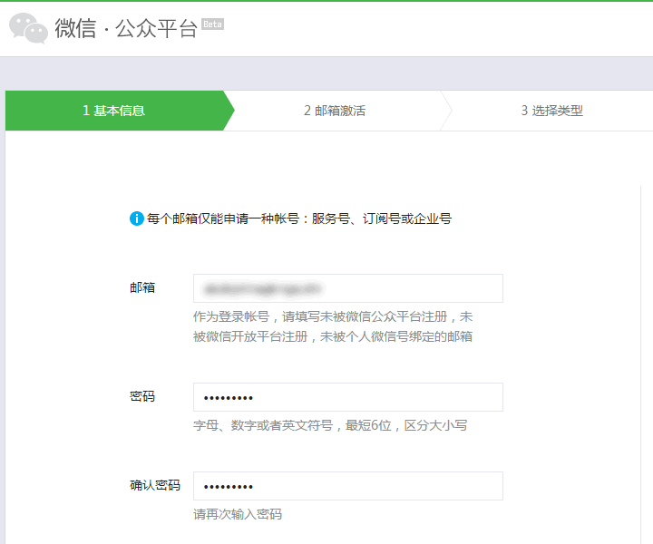

After filling in the correct information, click "register" and the "email activation" page will open, as shown in the figure:

Here, you can log in the email you filled in and activate it. After activation, the "select type" page will be opened, as shown in the figure:

Select the service number here. Remember, if you look closely at the text above, you can see, "once you've successfully created an account,This means that you can't change the account type in the future, that is, if you choose the subscription number now,Then, after the application is completed, the service number cannot be changed. Pay special attention to this!!

Click the "service number" option, there will also be a warning dialog box, select "ok", open the "information registration" page, as shown in the figure:

We select the "enterprise" type, fill in the relevant information of the enterprise, and click "continue" after filling in the information.The "public account information" page will be opened. The page is the public account information page you just applied for, as shown in the figure:

The left side of the figure above represents the menu bar of public number, where to support WeChat sharing,The most important are the "setup" and "developer center" menu bars. Click "developer center", as shown below:

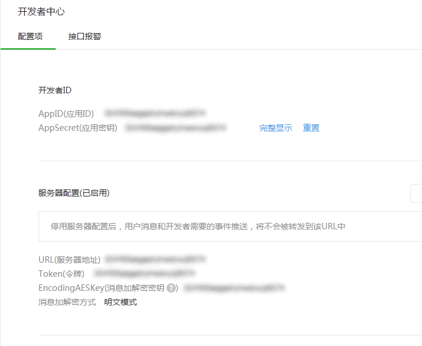

Can be seen in the image above`developer ID`some information,This includes: AppID and AppSecret. The information here is very important for WeChat sharing and will be used later.

Then click "WeChat authentication" in the left menu bar, we need to open the page as shown in the figure:

You have to be WeChat certified here. If it is a "subscription number", WeChat authentication cannot be opened. Notice that.

After the authentication, click "developer center" in the left menu bar to see whether the current sharing interface is obtained, as shown in the figure:

Sharing interface must be obtained, otherwise WeChat sharing cannot be carried out.

##  Application for Domain Name Space

Now a lot of platforms have provided domain name space application, here is sina cloud application for example.

Open the official website of sinacloud:[http://sinacloud.com/](http://sinacloud.com/)，and open the page as shown in the figure:

If you have a sina weibo account, you can log in directly. If you don't,We can apply for one sina weibo account. The process of application is not described here. After the application is completed, we log in.

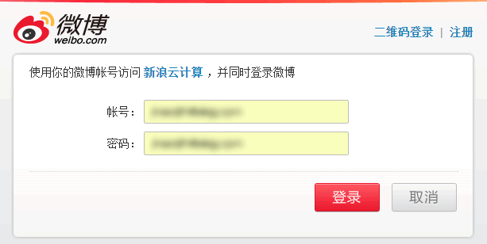

After logging in, it will enter the console page of sina cloud, as shown in the figure:

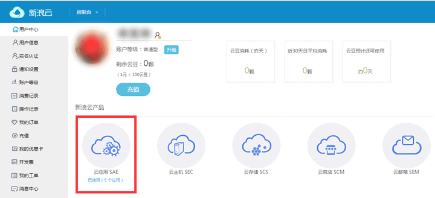

The "cloud application SAE" shown above will be used later.

For the newly applied sina cloud account, there is no real-name authentication.We need to carry out real-name authentication before WeChat sharing. Click "real-name authentication" in the left menu bar, and it will prompt you to enter name and id information for authentication, as shown in the figure:

**note: photos uploaded must follow the instructions above, otherwise they may not be authenticated. **

Below is the screenshot that I have approved:

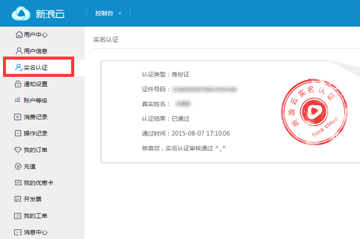

Normally, it takes a few days for us to authenticate our real names. After the authentication, we can set up our own subdomain name on sina cloud platform.

Next, move the mouse pointer to the "console" in the upper left corner of the page. A drop-down box pops up and select "cloud application SAE", as shown in the figure:

At this point, the "cloud application SAE" page will be entered, as shown in the figure:

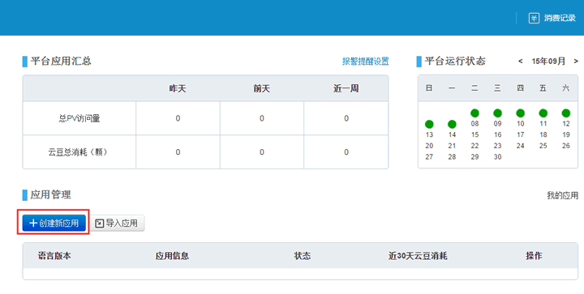

The figure above is my sina cloud console, free to create up to 5 applications, the default "application management" list of applications is zero, so we need to create a new application, click "create a new application", as shown in the page:

If your account is not verified by your real name, the dialog box as shown in the figure will pop up:

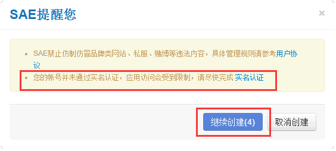

Prompt for real-name authentication as soon as possible, click ok and enter the domain name console Settings, as shown in the figure:

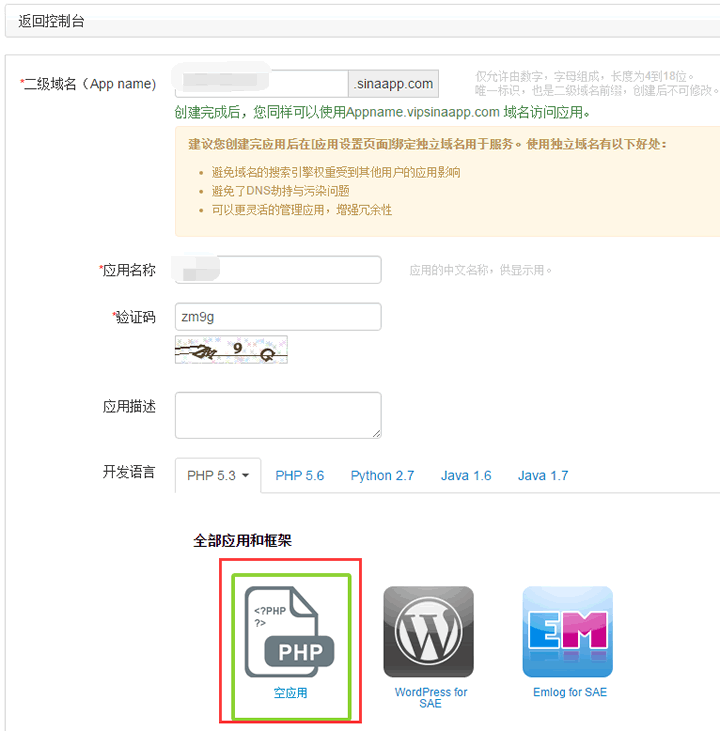

This domain name belongs to the secondary domain name, so if too many users register, they will be prompted to register.Therefore, you can use your own mobile phone number to fill in, so as to ensure the uniqueness.Other "application name" can be arbitrarily written, "verification code" fill in, select the development language as empty application, then click "create application" at the bottom of the page to create their own domain name space, after the creation, will switch to the page as shown in the figure:

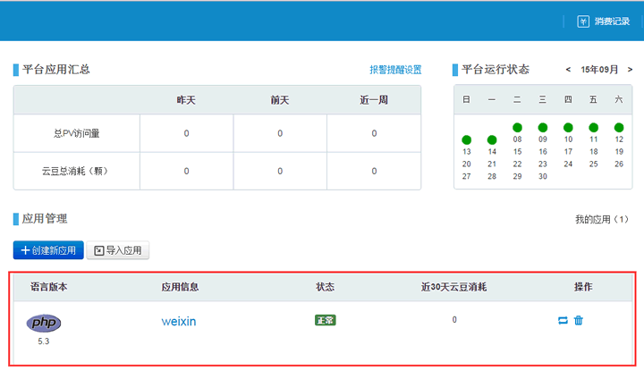

 At this point, we can see that the "application management" list already has one application that we just created. Click the "weixin" column of application information to enter the detailed list information page of the application, as shown in the figure:

Above we can see the application's secondary domain name information. Then click the "code management" TAB in the menu bar on the left side of the page and switch to the "code management" TAB, as shown in the figure:

Since the version management function is provided by nanglang cloud, it is necessary to enter 1 version number when creating the version, the default is 1, and click "ok", as shown in the figure:

After the creation, you will be prompted to enter "safe login" operation. At this time, you can enter the account password you just applied for again, as shown in the figure:

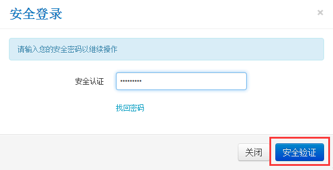

After "security verification" is completed, the page will switch to the currently created version information page, as shown in the figure:

Click the "operation" button and select "upload code package" in the pop-up list, as shown in the figure:

"Code upload" page pops up, as shown in the figure:

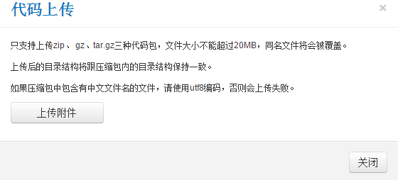

Support for three formats of code packages, here we provide the PHP version of WeChat to share the code package, [weixinShare_php.zip](http://sedn.egret.com/ueditor/20150908/55ee44b90ab24.zip)，After uploading, click "edit code" button, as shown in the figure:

The code edit page pops up, as shown in the figure:

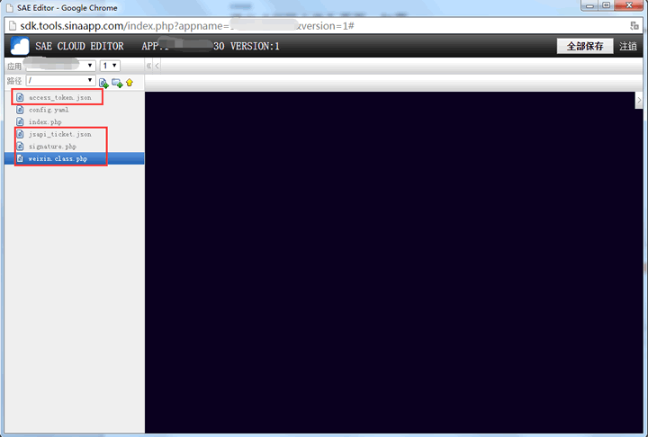

You will find four more files, open the file weix.class.php, and fill in the AppID and AppSecret, as shown in the figure:

Remember we talked about the developer ID of WeChat page before, as shown in the figure:

Fill in the AppID and AppSecret, then save the weix.class.php file, and go back to the SAE console page to get the WeChat signature address, as shown in the figure:

Mark live address for your domain name, then the signature information address in this domain based on your domain name http://.sinaap.com/signature.php,For example: I'm here to apply for the signature of the information for the address:http://cy3502398.sinaapp.com/signature.php，after this step,Back to WeChat page, we need to bind "JS interface security domain name", click "public number setting" in the left menu bar, and open the picture page:

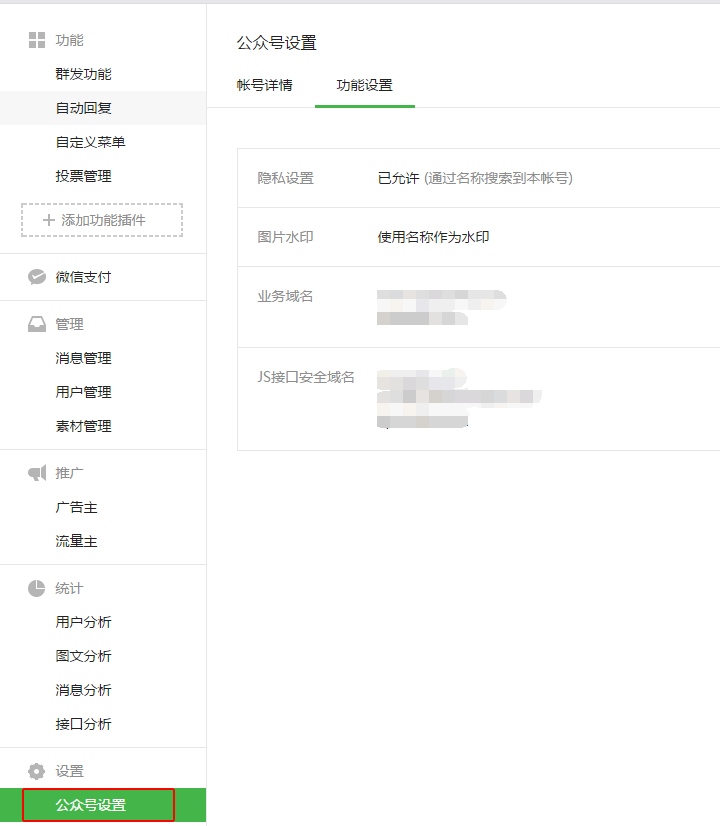

Set "JS interface security domain name", click "Settings", and the Settings page will pop up.

**（Note: the domain name set here must be registered, otherwise WeChat cannot be Shared.The sina cloud domain name that we apply for above needs to pass attestation only can, if be oneself, be in domain name space, so must want to put on record!! ）**

The domain name is written in the same way as qq.com. For example, what I fill in here is:

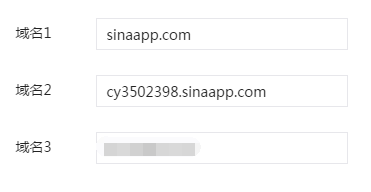

Your side fills in the sina cloud domain name that you just applied for.

At this point, all the preparatory work is done and we can use Lakeshore for WeChat share development.

### Use WeChat Sharing

Open Lakeshore 1.1, create the project, and name the project "weixinShare", as shown in the figure:

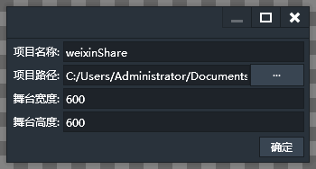

Then select the "components" column on the lower left side of Lakeshore, drag the "WeChat" component into the scene, and fill in the relevant information of WeChat, as shown in the figure:

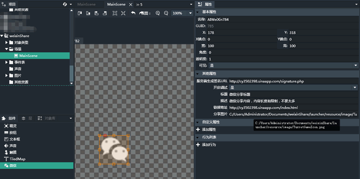

Server-side generated signature address: this address is the signature information address we just got.

Open debugging: if "yes" is selected, it indicates whether WeChat signature is valid when preview WeChat sharing on the mobile phone.As well as the sharing of picture information address and other popup dialog box, general debugging after passing, can be set to "no" to close this.

* Title: the Shared title that WeChat needs to display when sharing.

* Description: WeChat sharing needs to display the sharing content.

* Link address: WeChat share after clicking the Shared content will jump to the address.

*  Share pictures: WeChat share icon information displayed after sharing.

After filling in the information, we click "publish" button to publish. After publishing, we select all the documents and package them, as shown in the figure:

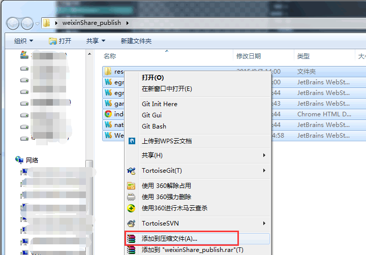

Click "add to compressed file (A)... ", pop up package, select "zip" format, as shown in the figure:

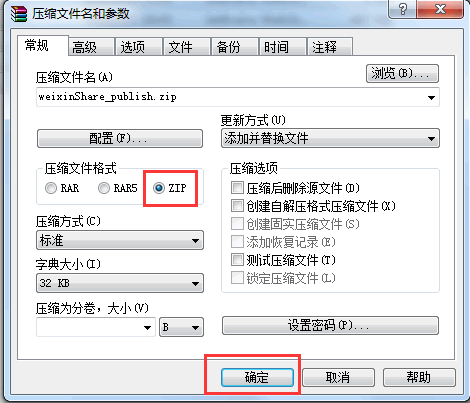

Click "ok" to complete the packaging, upload the packaged files to sina cloud, open the previous sina cloud console, and select "code management".Click "operation", select "upload code package", and upload the just packaged "weixinshare_publish.zip" file, as shown in the figure:

After uploading, click "edit code" button, and in the pop-up page, we find that the files we just packaged have been uploaded to sina cloud, as shown in the figure:

At this point, WeChat sharing function has been completed. Finally, we copy our game address into WeChat and send it to our friends. The game address is shown in the figure:

Address is on the basis of links with/index, HTML, and eventually form is:[http://xxx.sinaapp.com/index.html](http://xxx.sinaapp.com/index.html)

**Note: for users of sina cloud, if they do not open it, they will not be able to share authentication**， through WeChat. Go back to the console of sina cloud and find "storage and CDN service" - "Memcache" in the left menu, as shown in the figure:

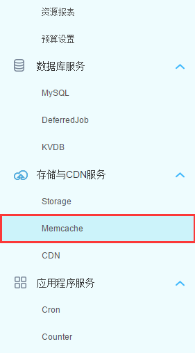

Click "Memcache" to open the Memcache page as shown in the figure:

As can be seen from the figure, we have not initialized the Memcache service. If we do not do this step, we cannot actually write data to sina cloud.However, WeChat needs to dynamically write data to the server, so we need to initialize Memcache. Sina cloud provides free space below 20M, otherwise, it needs cloud beans, but 20M is enough. Click "initialize Memcache" and the page pops up:

Enter 20, click ok, and the page appears:

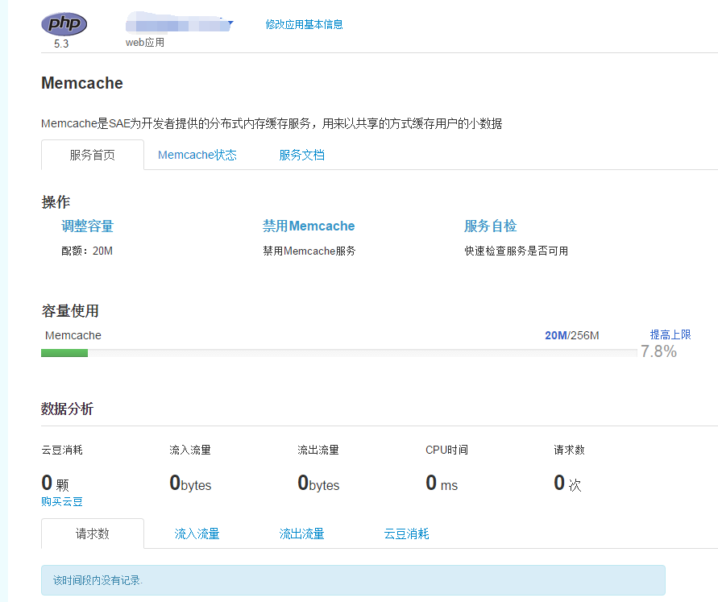

At this point, all the work has been finished~~~

Finally, open this address in WeChat to preview the game.Of course, in the game test at present, we did not add any other content to the game, we just added WeChat sharing function, so the page will show all black,If the debugging mode of WeChat is turned on in Lakeshore, many prompt dialog boxes will pop up when the page is finally opened. If the following prompt dialog box pops up, it indicates that WeChat sharing function has no problem, as shown in the figure:

After clicking "ok", click "... "Press the button to bring up the page as shown in the picture:

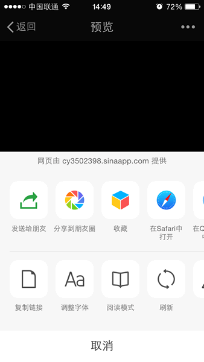

Click "send to friend" and the page as shown in the figure will pop up:

From the title, we can see that the previous content has appeared on the dialog box.Similarly, "share to friend circle", "share to mobile QQ" and "share to QQ space" are all represented in Lakeshore edited messages.

Until now, the WeChat sharing process made by Lakeshore has been completed, which is the basic function provided by Lakeshore for WeChat sharing. "send to friends", "share to friend circle", "share to mobile QQ" and "share to QQ space" are all the same title, description, link address and Icon for sharing pictures.But sometimes you want to be able to customize different sharing content for each of these, so Lakeshore offers dynamic updates by adding events and adding conditions and actions to the events, as shown in the figure:

In addition, callbacks are provided to some states in the WeChat sharing process, as shown in figure:

Through these conditions callback can do some interesting things, such as hope to use the game address to share the circle of friends, will be given a certain reward or to pass the next level of the game. More features are waiting to be discovered.
