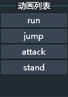
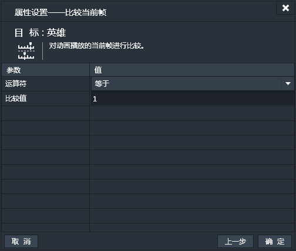
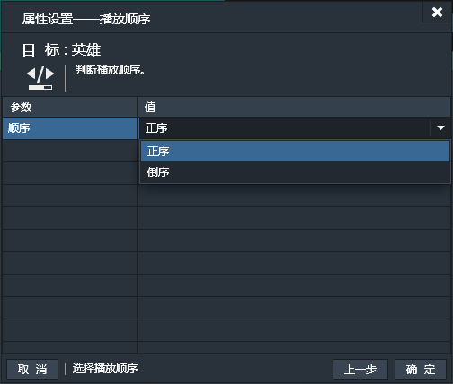
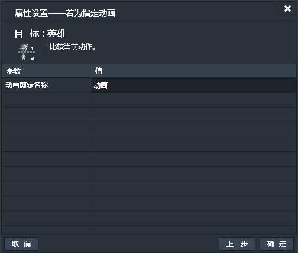
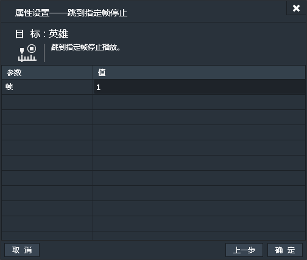
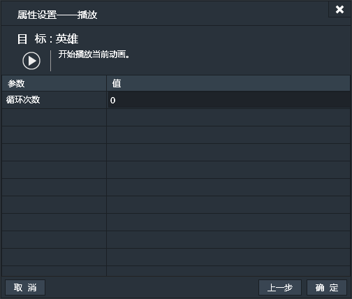
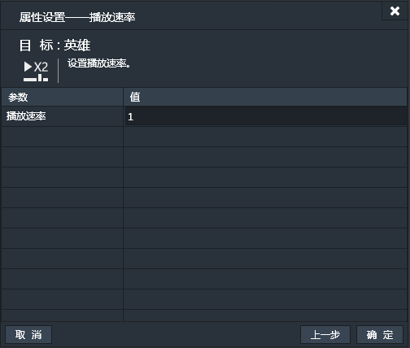
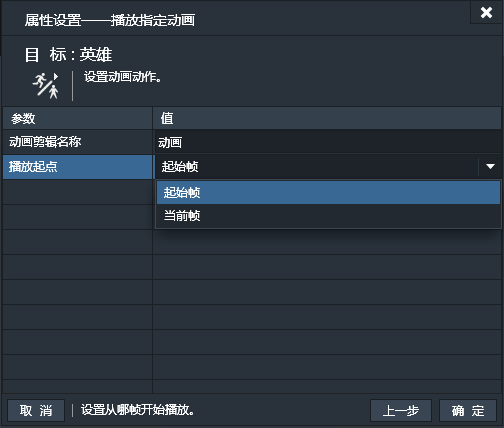

An animation component can be understood as a Sprite component that supports animation of sequential frames. It can achieve all the functions of the wizard, and support animation playback.

### Sequence Frame Panel
When the animation component is added and selected, the sequence frame panel is activated.

Click the "add frame" button to open the material library window. All available image files in the images directory in the project directory are listed in the footage library window.

You can also select all the images to be added by holding down the mouse drag box.** note: the default order of picture sequence in sequence frame is determined by the order selected and the order added. When added to the sequence frame panel, you can also drag and drop to change the sort. In the material library window, right-click and select "add picture material" to add pictures to the project material library.

**Note 1: currently, Chinese named picture files are not supported, and pictures named in Chinese cannot be displayed during the operation of the game.**

***Note 2: picture files that are not loaded and copied into the project material library directory cannot be displayed in the game.**

Add the picture to the sequence frame panel as shown below:

#### Sequence Frame Toolbar

From left to right, last frame, play/stop, next frame, frame frequency, number of loops, frame number, and duration

-  Last frame; Switch to the previous frame of the current frame. If the current frame is the first frame, click invalid.
- Play/stop: play or stop a sequence of frames in the current animation component.
- Next frame: switch to the next frame of the current frame. If the current frame is the last frame, click invalid.
- Frame rate: the number of frames per second played, also known as FPS. The default value is 6.
- Cycle times: set the cycle times of sequence frame animation, the default is 0, which means infinite cycles.
- Frame number: the total number of frames in the current sequence.
- Length: the playing time of the current sequence frame calculated according to the set frame frequency and the total number of frames.

#### Sequence Frame Animation List

Animation list lists animation clips in all current animation components.

- an animation component can contain multiple animation clips, each of which corresponds to a set of sequence frames.
For example, a character in a horizontal clearance game may have many actions, such as running, jumping, attacking, standing, etc., each action corresponds to an animation clip, and each action is an animation sequence frame composed of multiple pictures.
- The default animation clip name is animation, and right-click the animation list to add animation clip.
- Right-click an animation clip to add animation, rename the current animation clip, copy the current animation clip, and delete the current animation clip.
- Animation clips cannot be deleted when there is only one animation clip in the animation list.
-  In the game, the first animation clip is played by default after the animation component is initialized.

### Specific Attribute

- Participate in the collision: sets whether the animation instance participates in the collision. The default value is no.

### Animation Conditions
In addition to specific conditions, animation components are subject to all general conditions. See:[general conditions](../../../../Lakeshore/manual/commonElements/conditions/README.md)

#### All Played
Check whether all the current animations have finished playing. 【 one-time trigger 】
The animation might loop through multiple times, but this is the last time it's played. This condition is always false for animations that set an infinite loop.
This condition has no property setting window.

#### End of Single Run
Checks if the current animation has finished playing a single time. 【 one-time trigger 】
The animation may loop multiple times, triggering each time the loop is completed. For example, an animation that loops 10 times will trigger 10 times.
This condition has no property setting window.

#### There is
If animation is playing, if condition is true, trigger. 【 continuous trigger 】
This condition has no property setting window.

#### Compare Current Frame
Compares the size relationship between the current frame and the specified frame in the animation playback. 【 continuous trigger 】

#### Compare Playback Rates
Compares the size of the current animation's playback rate to the specified rate. 【 continuous trigger 】

#### Play the Order
Determines the playback order of the current animation clip. 【 continuous trigger 】
Default is "positive order", optional

- positive sequence
- Reverse

#### Number of Comparison Cycles
Compares the size of the current animation clip's number of loops to the specified number. 【 continuous trigger 】

####  If is the Specified Animation
If the currently playing animation clip is the specified animation clip, the condition is true and the trigger is triggered.[Persistent trigger]

### Animation
In addition to specific actions, animation components are applicable to all general actions. See:[general actions](../../../../Lakeshore/manual/commonElements/action/README.md)

#### Jumps to the Specified Frame to Play
Jumps to the specified frame of the current animation clip and starts playing at the specified number of loops.

####  Jumps to the Specified Frame Stop
Jumps to the specified frame of the current animation clip, and then stops playing. The screen stops at the specified frame.

#### Play
Plays the current animation clip as many times as specified.

#### Stop
Stop playing the current animation clip.
This action has no property setting window.

#### On a Frame
Jumps to the previous frame of the current animation clip.
This action has no property setting window.

#### The Next Frame
Jumps to the next frame of the current animation clip.
This action has no property setting window.

#### Cycles
Sets the number of playback loops for the current animation clip.

#### Play the Order
Sets the playing order of the current animation clip, which is positive by default.
Options are:

- positive sequence
- Reverse

#### Play Speed
Sets the playback rate of the current animation clip.

#### Play the Specified Animation
Plays the specified animation clip for the current animation component.
- animation clip name: specifies the name of the animation clip.
- play starting point:
 - start frame: starts at the first frame of the animation clip.
 - current frame; Starts playing from the current frame number of the current animation clip.

