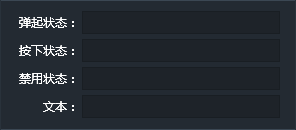
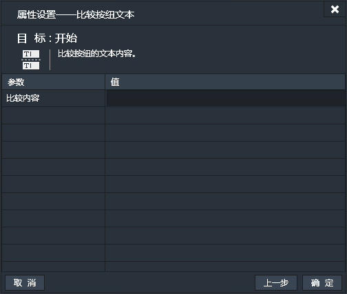
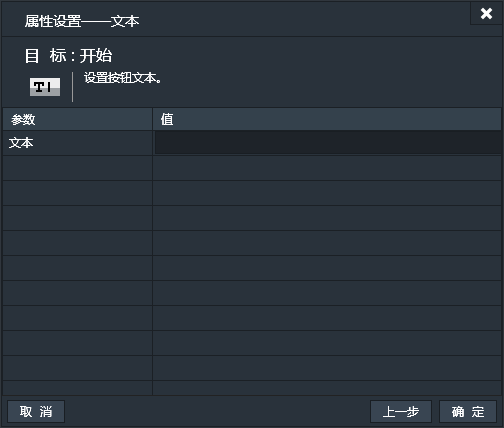
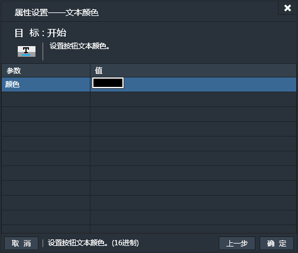
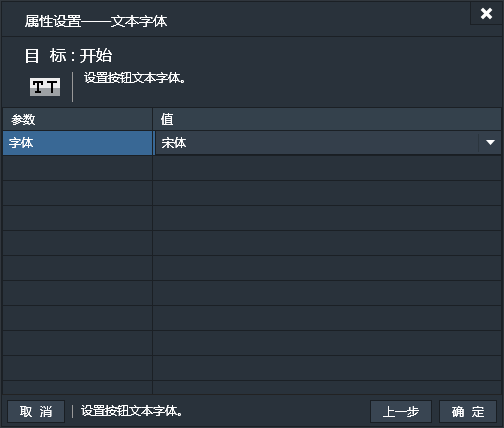
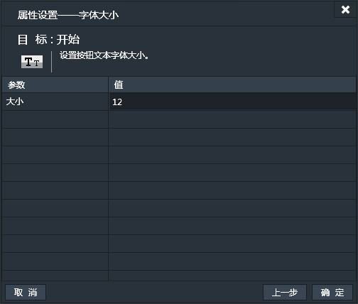
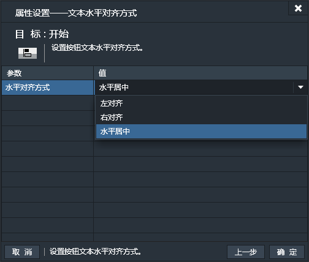

The button component can implement the click function. The button in the game menu, the instance that needs to accept click event alone in the game can be realized with the button.

### Specific Attribute

- Up state: sets the address of the picture displayed when the button is up state.
- Press state: sets the address of the picture displayed when the button is pressed.
- Disable state: set the address of the picture displayed when the button is disabled.
-  Text: sets the default text content displayed on the button.。

*Note 1: the address of the picture in each state shall be specified separately. If it is empty, the corresponding state will not be displayed by the picture.

*Note 2: buttons do not support collisions.

------------

### Sets the Font Size on the Button
In addition to specific conditions, some general conditions are also applicable to button components (buttons do not support "collision" related conditions). See:[general conditions](../../../../Lakeshore/manual/commonElements/conditions/README.md)

####  While holding down the
When the button is pressed. 【 continuous trigger 】
As long as the button is in the pressed state, the condition is true and the action is always triggered.
This condition has no property setting window.

#### When pressed
When the button is pressed. 【 one-time trigger 】
When the button is pressed, the condition is true and is triggered only once.
This condition has no property setting window.

#### When the bounce
When the button is up. 【 one-time trigger 】
The moment when the button changes from pressed state to up state, the condition is true and the value is triggered once.
This condition has no property setting window.

#### When I hold it down
Press the button and move it. 【 one-time trigger 】
When the button is in the pressed state and the mouse/touch finger moves, the condition is true and only triggers once.It is triggered once for the presence of movement, so if the mouse/touch finger keeps moving while the button is in the pressed state, it will keep triggering.For example, if the mouse holds down the button and swipes left and right, the condition will continue to fire and the action will be executed forever.
This condition has no property setting window.

#### When the button is released outside
When the button is in the pressed state and the mouse/touch finger is moved out of the button and then the button is released. 【 one-time trigger 】
This condition has no property setting window.

#### Compare button text
If the button's text content is the same as the specified text content.【 continuous trigger 】
Compare text content, if the same, condition is true, will always trigger action.

#### If available
If the button is currently available. 【 continuous trigger 】

------------

###  Button action
In addition to specific actions, the button component can also be used for some general actions (the button does not support "collision" related actions).See：[general actions](../../../../Lakeshore/manual/commonElements/action/README.md)

#### The text content
Sets the text content on the button.

#### Text color
Sets the text color on the button.

####  The text font
Sets the text font on the button.

####  The font size
设置按钮上的字体大小。

####  Horizontal alignment of text
Sets the horizontal alignment of text on the button. Default is "horizontal center". Options are:
- the left
- right-aligned
- center level

####  Vertical alignment of text
Set the vertical alignment of winn on the button. The default is "vertical center", with options:
- Aligned on a -
- the alignment
- center vertically

