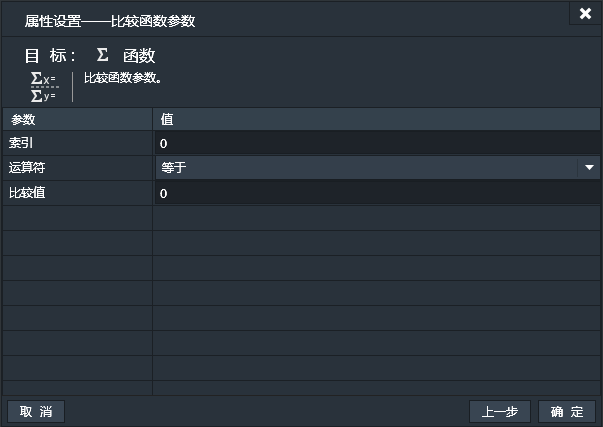
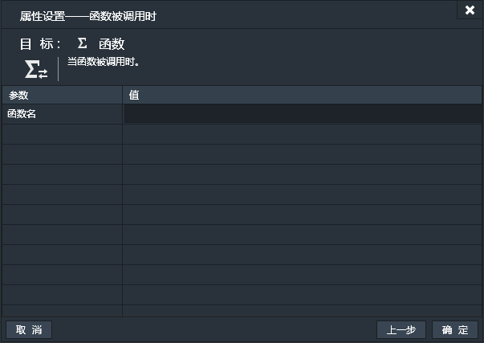
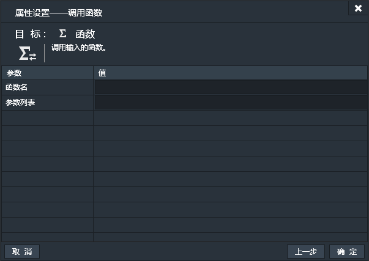

When a function component is added, multiple actions can be placed within the function, which is equivalent to calling multiple actions within the function when the function is called.When multiple actions need to be called repeatedly in the event table, the use of functions can greatly improve efficiency.

*Note: function components do not support basic properties other than "name" and "global". Collision is not supported. The addition of a function component does not result in a visible instance in the game run scene.

### Specific Attribute
Function components have no unique properties.

------------

###  Function Condition

#### Compare Function Parameters
When a function is called, it passes a list of arguments, a list of arguments. The current condition is used to compare the values of these parameters.
- Index: the index of the parameter in the parameter list. 0 for the first parameter, 1 for the second, and so on.
- Comparison value: the value used for comparison.

#### When a Function Is Called
Fired when a function is called.
This condition means creating a function. Specifies the name of the function that you want to create.
A series of actions in a conditional event are the actions to be performed when the function is called.

------------

### Function Action

####  Call a Function
 Calls the specified function.
-  Function name: the name of the function to be called.
- Parameter list: the list of parameters passed at the same time as the call. Separate the parameters with a,.

